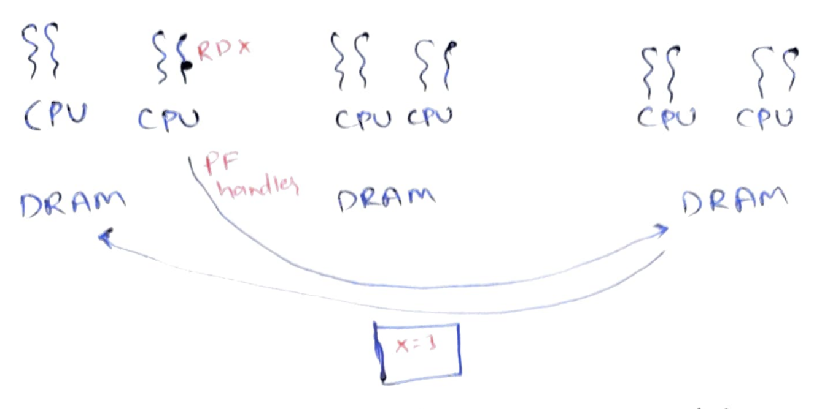
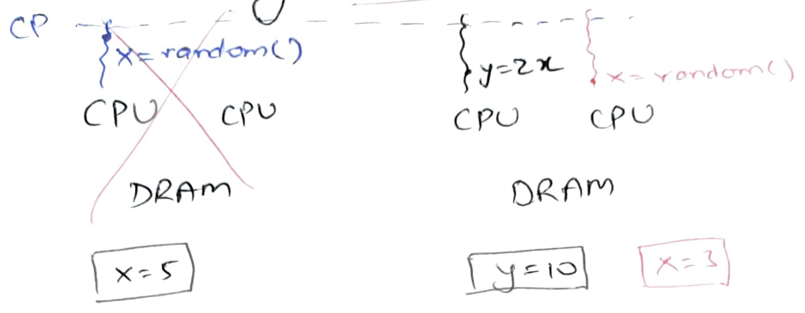
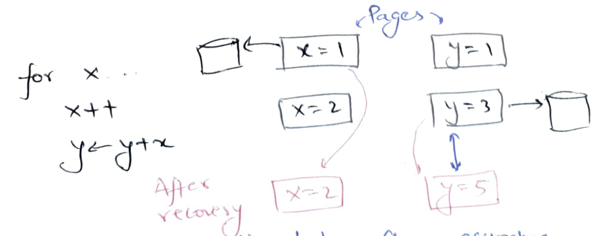

# Distributed shared memory

DSM implementations were the early attempts to do distributed computation as we
realized that Moore's law will not be forever. We could pack multiple CPUs
within a single machine but the number of CPUs we can pack will be limited as
the memory bus will start becoming a bottleneck. Distributed computations runs a
program over multiple independent machines containing their own private CPUs,
caches, and DRAMs. These machines are connected to each other over a network.

The idea of DSM is to expose a unified logical view of memory to threads running
across multiple machines. There are many proposed DSM realizations that are
hardware-based, compiler-based, and OS-based. Let us look at a typical OS-based
realizations of DSM: paging-based DSM. The cool thing about this is that it can
be implemented very easily without requiring any new hardware support and
without modifying existing programs. Some of you can implement it as a course
project :-)

### A quick primer on demand paging

Read-write requests originating from CPUs contain virtual addresses. Virtual
addresses are of the form [virtual page number, offset]. Virtual page number is
first looked up in Translation Look-aside Buffer (TLB). TLB is just a table,
implemented in hardware, that maps virtual page numbers (VPNs) to physical page
numbers (PPNs). If the VPN is not present in the TLB, the hardware walks over
the page table to locate PPN for the VPN.

Page table is just a hierarchical in-memory data structure to again map VPNs to
PPNs. Each VPN is associated with a page table entry (PTE). A PTE contains the
PPN and many bits. The one of interest is the present bit. If the present bit is
not set, the hardware raises a page fault. The execution jumps into operating
system's page fault handler. The OS may have previously swapped out the page
from memory to disk. It would have typically saved the location on disk within
the PTE itself. At page fault, the OS copies the page back from disk to memory
and updates PTE. When we return from the page fault handler, the hardware retries
the faulting instruction and this time it finds the present bit set and can find
the PPN to translate the virtual address.

### Paging-based DSM

We can easily extend demand paging to realize a paging-based DSM: page fault 
handler can bring the page from a remote machine instead of from disk. To bring
the page, it can interrupt the remote CPU to service the page or, with modern
hardware, use RDMA to get the page by directly talking to the remote network
controller.

So essentially, we have the following view. Our program is just a regular
multi-threaded program. But, the threads of the program are spread across
different CPUs in different machines. When a thread tries to read a variable
`x`, the OS page fault handler brings the page containing `x`.

DSM is quite nice because we were able to take existing multi-threaded programs
and run them in a distributed manner! The programmer is completely oblivious of
distributed computation. From their point of view, the number of available CPUs,
and aggregate cache+memory, just grows when we run the same program on a
distributed setup.

Because of the identical virtual address space visible to all threads, migrating
threads from one machine to another is straightforward. We can just migrate the
thread's context (registers) and that's it! Easy migration is helpful for load
balancing and planned shutting down of machines for maintenance. The system can
also decide to sometimes move computation closer to data instead of moving data
closer to computation.

Unfortunately, there are serious issues with DSM.

# Problems with DSM

### Memory coherence

Some pages like code and global variables may be required by almost all threads.
If we keep just one copy of each page, such heavily shared pages keep bouncing
around the system and the overall performance will be significantly slower than
when the program is run on a single machine.

For such pages, we can create multiple copies spread on many workers. For code
pages, this is probably ok since code is typically read-only. But, if there are
writeable pages for global variables, we need a memory coherence protocol.
Broadly, there are two coherence protocols:

1. Write-update: A write is not complete until all copies have been written to.
This substantially slows down writes: all writes are remote writes.

2. Write-invalidate: If there are other copies in the system, they are first
invalidated. Subsequent writes (when their are no other copies) are local writes.

Coherence slows things down, but programmer probably expects writing to shared
global memory to be slow (since they have to typically take locks and locks can
be slow).

### False sharing

But DSM program may run slower in unexpected ways. Let us say two threads
running on workers W1 and W2 are respectively modifying two independent
variables `x` and `y` which happen to be on the same physical page, initially
present with W2. 

When W1 tries to rw `x`, it generates a page-fault. The page-fault handler
snatches the page from W2 and continues. When W2 tries to rw `y`, it similarly
generates a page-fault. W2's page-fault handler again snatches the page from W1
and continues. So, at almost each rw of `x` and `y`, we are getting a page fault
and snatching the page. This is called ping-pong effect where page is
ping-ponging between workers.

While using multiple CPUs on a single machine, we also see false sharing among
cache lines and a similar ping-pong effect over cache lines. However, pages are
much bigger than cache lines so the probability of false sharing is much higher
in DSM.  An attempt to solve ping-pong effect was to lock a page on the worker
for a fixed time period after it gets downloaded. The worker who got it can
continue to make progress without page faults while the page is locked. However,
if this timeout is high and if the worker is no longer using the page, the other
worker is unnecessarily stalled. Another approach to reduce false sharing is to
reduce the size of the pages. This creates issues in locating the page.

### Locating the page

Page fault handler needs to locate the page corresponding to the faulting
address. The most straightforward approach is to statically map VPNs to workers
by using a hashing function. But this makes dynamically adding and removing
workers difficult. It also makes load balancing difficult. Different programs
memory access patterns may be different and hence different hashing functions
are expected to be required for proper load balancing.  It also makes most reads
and writes remotes since we are no longer downloading the page; we get page
fault on each access.

Another design choice is to tell the owner that we are locking the page,
download the page locally, do reads and writes, and send the page back when
done. At this point, owner unlocks the page. How does OS know that the program
is done with the page?

Another option is to let pages move around freely in the system. Page fault
handlers can query a central server about the current location of a page. It can
then download the page from the owner and update the central server about the
new page location. 

If we reduce page size to reduce false sharing, we end up with too many pages.
The central server itself might start becoming a bottleneck. At this point, we 
might want to shard the page location servers.

## Fault and stragglers

The key difficulty in DSM comes from faults and stragglers. If one of the page
location server crashes, we might not be able to get a subset of pages.  This
can be solved via replication; in distributed storage section, we will see how
one can make fault tolerant key-value stores.

But if one of the worker crashes, we might lose its pages and its threads
forever. Or if the worker is slow in handing out its pages, it will slow down
all other workers.

### Checkpointing
To get fault tolerance, we can create checkpoints.  Periodically, a program
"controller" (also called a "master") can ask all workers to stop whatever they
are doing. After all workers are stopped, the controller asks them to create
checkpoints.  Each worker writes all its pages and the register states of all
its threads to other workers' disk.  If one worker crashes, its checkpointed
pages and threads can be recovered from other workers' disk.  When all workers
have finished creating the checkpoint, the controller can resume all the
workers. 

After a crash, can we resume the pages and threads of only the crashed worker,
say W1, and rerun these threads on a new worker W1'? Unfortunately not! Other
threads on other workers may have already used the values in pages of W1 to
write to new pages. Upon rerunning crashed threads on W1', the values in pages
of W1' may diverge from what was there in W1 and we may end up with impossible
program states.

Stopping all work on all workers synchronously and then waiting for all workers
to create a checkpoint is slow. Can we create a checkpoint *asynchronously*? Can
the program controller ask all workers to create a checkpoint and we let workers
create a checkpoint at their own pace whenever they hear from the controller?
When a worker is done creating its own checkpoint, it resumes execution without
waiting for other workers to finish creating their checkpoints. In other words,
can we create a checkpoint without stopping the whole program?

Unfortunately, this also does not work. We demonstrate a simple example where we
are running just a single thread and asynchronously checkpointing two pages
while the thread is running. Here, an older value `x=1` and a newer value `y=3`
got saved into the checkpoint. When the program resumes running the loop, we get
`x=2` and `y=5` which was not a possible program state!  We call this an
*inconsistent checkpoint*.

### Replication
Since checkpointing and recovering from checkpointing is slow, we can also do 
replication. Whenever a worker writes, the writes are sent to all the copies to
keep all copies up-to-date. The advantage is that we never lose a page and hence
may not need to rollback to an older state. However, this significantly slows
down all writes. 

The bigger problem is how to recover the thread contexts? Shall we replicate
thread context after every instruction? That will be even slower :( We don't
want to do that. Can we just restart the thread after a crash? Let us say the
thread was simply doing `x++; y--`. After incrementing `x` it crashes.  If we
restart the thread from beginning on another worker and start using another copy
of pages holding `x` and `y`, we will end up incrementing `x` twice and
decrementing `y` only once!

There are two ways to get around this:
* The execution is somehow made *idempotent*. If `x++` is done already, then
re-executing it should be a no-op. Idempotence in this context means that the
effect of running something N times is the same as the effect of running it
once.
* The execution is somehow made *transactional*. We shouldn't have been able to 
increment `x++` without doing `y--` in the first crashed execution. Transactions
are atomic: "all-or-nothing", i.e, either all writes succeed or none succeed.

## Summary
DSM is a very attractive programming model since (at least in theory), it can
take existing multi-threaded programs and run them in a distributed manner. The
programmer can remain completely oblivious to distributed computation. Workers
can be managed since threads can be easily migrated in and out of workers.

However, there are significant hurdles like false sharing, locating the page, 
fault tolerance, and straggler mitigation. Last two are particular killers. For
fault tolerance, we are forced to create synchronous checkpoints otherwise we
end up with inconsistent checkpoints. We are also forced to restart all threads
from the last checkpoint after any crash. Another approach to FT is replication
that does not lose pages. But replication slows down writes. Under the
replication scheme, how to restructure threads so that they can be restarted?
Their execution needs to be idempotent or transactional.

We will study all of this aspects in distributed computing. We will give up
supporting general-purpose programs and build different abstractions more
suitable for distributed computing.
