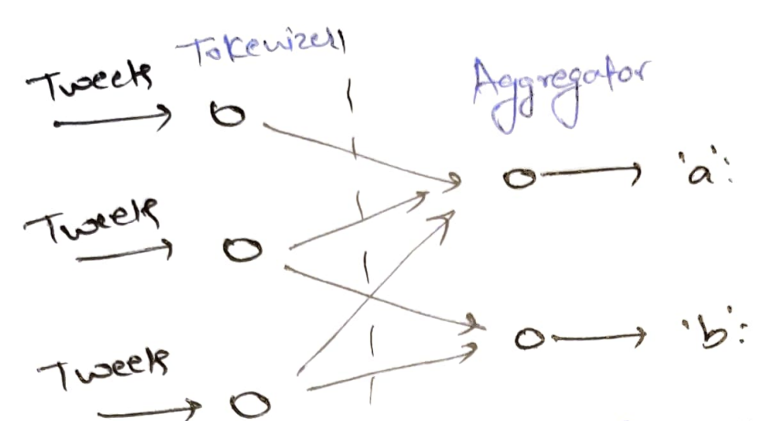
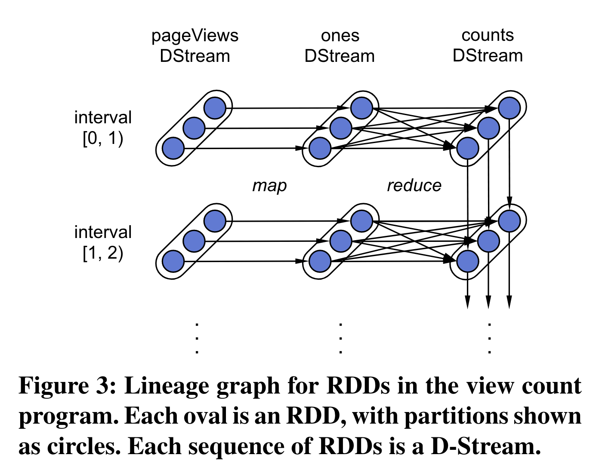
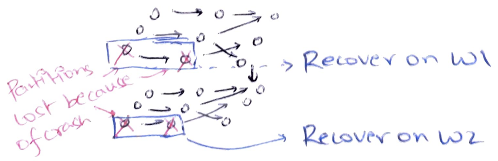
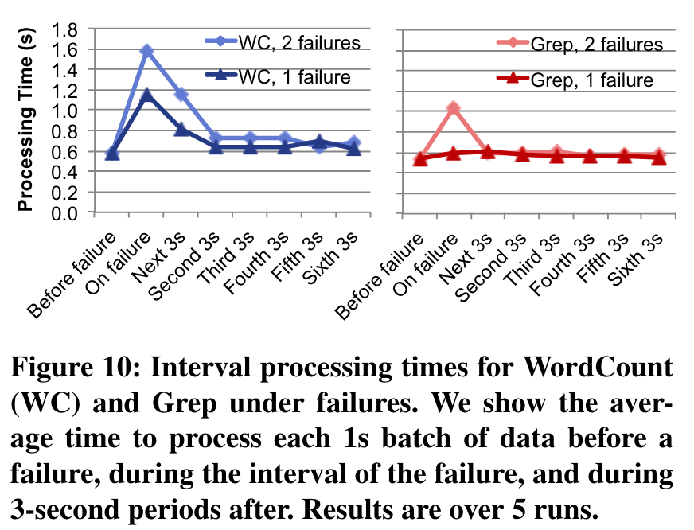

# Streaming computation

So far, we have learned "batch computation" where we had lots of data that we
wanted to process quicker than the runtimes possible with a single machine.
Batch jobs typically run for hours before producing a result. There is interest
in another class of computations called *streaming computation* where data keeps
coming in forever and we want to gather insights out of this data.  Some
examples are:

* real-time decision making: is this credit card transaction fraud?
* live analytics: 
  * what are the trending topics in Twitter?
  * how many visitors are there on my web page right now?
  * how may cars are on each traffic junction?

In addition to the concerns of scalability, fault tolerance, and straggler
mitigation, we are concerned about freshness: time from data in to results out.
If we tell users what was trending on twitter last week, it is no longer
interesting.

Let us see why mapreduce/spark do not obviously translate into good streaming
systems. Let us say we are interested in finding trending topics on twitter.  We
will implement it using a streaming word-count: if a word appears in more
tweets, it is trending.

The issue with implementing it in MapReduce is that because the input is
infinite, tokenizer (map) never finishes and therefore the aggregator (reduce)
can never start. Another approach is the pipeline model, also called continuous
operator model.  Each tokenizer / aggregator task is pinned to a worker;
tokenizer forwards words to aggregators. Now, aggregator can keep the counts and
emit the counts at user-defined intervals, e.g, every 5 minutes.

However now, the aggregator has become *stateful*. Our fault tolerance/straggler
mitigation approach was to *rerun* failed/slow tasks on a different worker. We
assumed that tasks were stateless, i.e, they just depended on their inputs, and
that tasks were deterministic and idempotent. However, now we cannot simply
restart aggregator at a new worker since the new worker will not know the
existing word-counts.

## Some approaches to handle stateful tasks

One idea for fault tolerance is to keep the aggregator's state as a *replicated
state machine*. There is a primary worker and a replica worker with
*uncorrelated failures*, i.e, they are on different racks with different power
supply, network switches, etc. Because of uncorrelated failures, hopefully,
both workers will not fail at the same time.

The general idea of replicated state machine is that the *state machine* is
maintained in-sync on both primary and replica. Let us say both primary and
replica had a count of "a" as 41. When primary receives `"a":1`, it forwards to
replica, replica updates its count to 42, sends an acknowledgement to primary,
primary updates its count to 42 and finally emits word count of "a": 42. If
primary crashes at any time, replica can take over and become new primary.

This approach is costly: it requires 2x resources for each stateful task. It
runs as slow as the slowest replica. Note that replica is not allowed to fall
behind.  Imagine if primary thought "a":42 and replica thought "a":32. Now, if
primary crashes, and we failover to replica, the new counts of "a" will be
wrong.

Another similar approach is to keep the word counts in a fault-tolerant
replicated storage and make the workers stateless. Because of stateless workers,
we can easily restart tasks at new workers if old worker crashes. Millwheel
VLDB'13 Section 8.1 shows that 50th (95th) percentile latency increases from
3.6ms (30ms) to 33.7ms (93.8ms) when writing to such a storage. 

## Discretized streams
Spark streaming suggests a "mini-batch" approach: break down a stream into small
batches. Each mini-batch is processed using Spark. The following figure shows
the lineage graph of a page view count computation. `pageViews` stream is
discretized every 1 second. Within each interval, `pageViews` is an RDD with
three partitions. We first do a `map` and then reduce into `counts`. `counts` of
interval $[1, 2)$ depends on counts of interval $[0, 1)$. Each RDD partition is
immutable. Each task on the lineage graph's edge is deterministic and stateless.

If a worker crashes, we can just rerun failed tasks just like in Spark. Just as 
in Spark, recovery can be done in parallel on different workers.

The paper shows results for word-counts and grep on 20 four-core nodes with 150
map tasks and 10 reduce tasks. The discretization delay is 1 second and the
checkpointing interval is 10 seconds. So on each CPU core, there are two tasks
and the checkpoint is created every 10 intervals. The plot shows processing time
for each interval in the presence of failures. We see that in steady case, the
interval can be processed in less than 1 second. Recovering lost RDD partitions
from failure requires re-executing. In word-count, later intervals require the 
results of older intervals (word counts) and therefore it has to re-execute
more. Word-count sees higher processing times than grep but both of them get
back to steady state quickly.

One might be concerned that the state can become very large. For example, one
RDD partition of aggregator might have millions of word counts. But due to
Spark's locality-aware scheduling, the next interval of word count is calculated
locally thereby avoiding a network transfer. RDDs are checkpointed occasionally;
old RDDs are GC'ed from memory.

This approach works well but it does not provide good freshness in the common
case as it adds a 0.5-2 seconds of discretization delay. For many usecases, like
trending topics in Twitter, this is ok. But, when you want to make real-time
decisions like approving credit-card transactions, this is not ok.

## Naive checkpointing approach

Continuous operator model provided low latency in the common case. Let's try
another approach to do fault tolerance of stateful operators by creating
checkpoints. A checkpoint, also called a snapshot, is a *cut* in the timeline of
events that separates past events (in the checkpoint) from future events (not in
checkpoint).

One approach to create an asynchronous global checkpoint could be to let the 
*checkpoint coordinator* pre-decide a global timestamp $T + \Delta$. Each
worker checkpoints its state at this pre-decided timestamp. Mappers checkpoint
their "cursor": which ID of the stream did they process last, and reducers
checkpoint their word counts.

Does this work? No, this simple approach loses in-flight messages. We also need
to checkpoint message that were sent before the checkpoint but received after
the checkpoint time. But, now how do we know that a checkpoint is *complete*?
Reducers might get a pre-checkpoint message at any time.

One simple algorithm is to maintain a "deficit" count at the checkpoint
coordinator. For example, the mappers can remember how many messages it sent
before the checkpoint time. And the reducers can remember how many messages it
has received from before the checkpoint time. Checkpoint coordinator can
maintain "deficit = sent - received". When deficit hits zero, we know that the
checkpoint is complete.

Upon crash, all workers and channels revert to the last checkpoint: mappers
rewind to the saved cursor, in-flight messages are put in the receive buffers of
reducers, reducers roll back to the saved word counts.

However unfortunately, the pre-decided timestamp approach does not work because
it is not possible to have perfectly synchronized clocks. We will see how clock
drifts can lead to creation of inconsistent checkpoints.