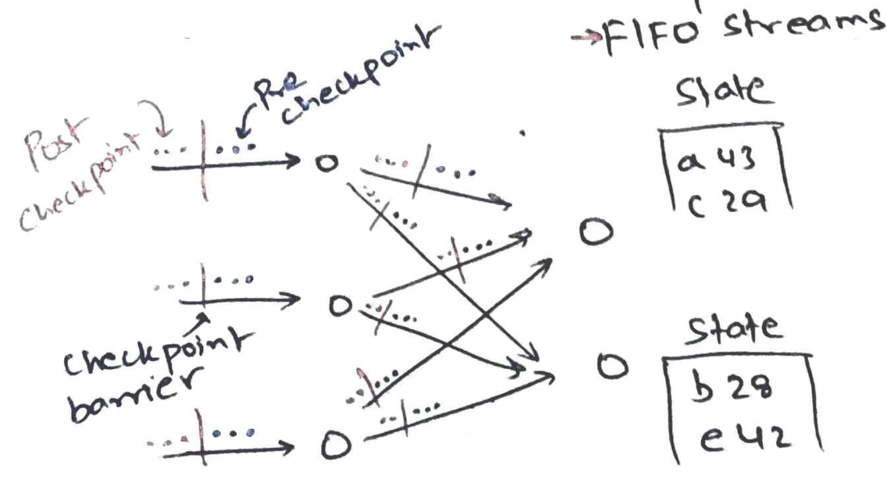
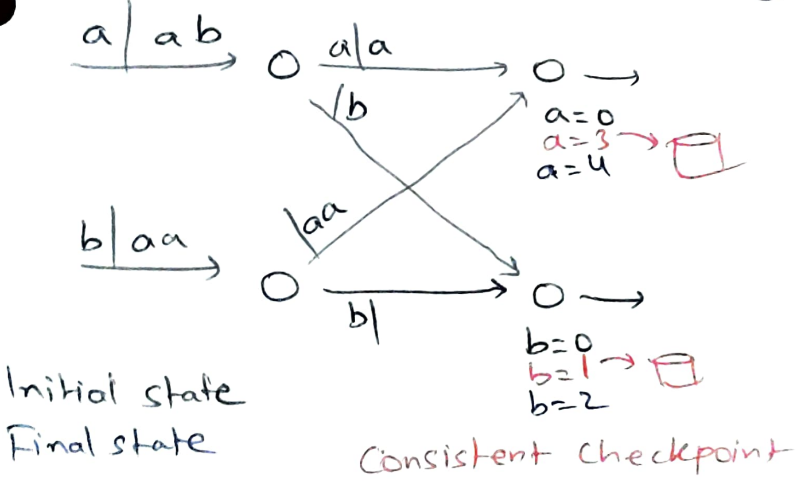
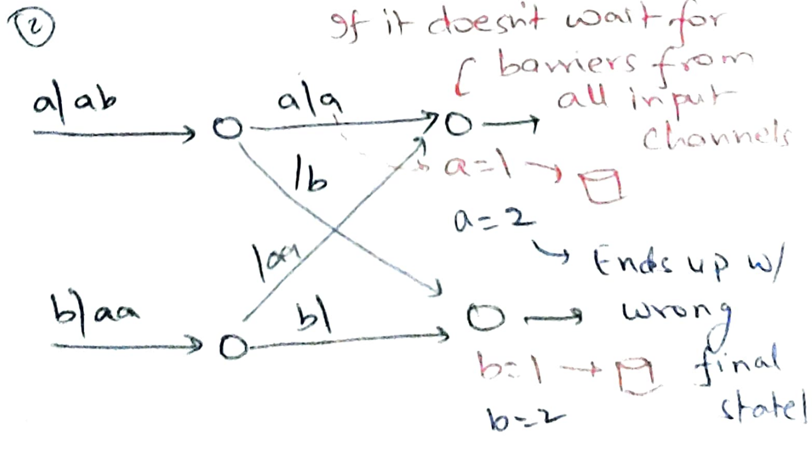

# Lightweight asynchronous checkpointing in Flink

We saw a general-purpose asynchronous checkpointing algorithm based on vector
clocks. The algorithm works with any number of processes and channels for
arbitrary distributed programs. We defined a checkpoint as a *cut* in the event
timeline that separates past (in the checkpoint) from future (not in the
checkpoint).

*Consistent checkpoints* capture a global state where future events (not in the
checkpoint) do not affect past events (in the checkpoint). Since global time is
unknown, we redefine past and future in terms of *causality*.

In continuous operator streaming computations, we *know* a few things about the
structure of the computation which we can use to simplify the algorithm. We know
that the dataflow graph is structured as a DAG with FIFO channels. We assume
that the input streams are durable and rewindable via a cursor.

We just need to separate "pre-checkpoint" inputs from "post-checkpoint" inputs.
Every worker should checkpoint *after* it has consumed all the pre-checkpoint
inputs and *before* it has consumed any post-checkpoint inputs. We can separate
pre-checkpoint inputs from post-checkpoint inputs by inserting a checkpoint
barrier in all the input streams.

When a worker receives a barrier, it 
* blocks the channel and waits for barriers from all input channels;
* after receiving barriers from all input channels, checkpoints local state;
* put barriers on all output channels; and
* continues processing input.

The following shows an example of Flink creating a checkpoint:

Blocking the channel and waiting for barriers from all input channels is done so
that the worker sees *all* the pre-checkpoint messages and *none* of the
post-checkpoint messages when it creates the checkpoint. If we do not wait for
barriers from all input channels, we might end up with inconsistent checkpoints:

The advantage of this algorithm is that we *never* checkpoint any in-flight
messages. Since the barriers are aligned and since channels are FIFO, we know
that we will no longer see any pre-checkpoint message after we have seen
barriers from all input channels. Finding termination of checkpoint creation is
also straightforward: when the last operators have successfully created 
checkpoints, we know that we are done.

Creating asynchronous checkpoints empowers Flink to do fault tolerance
(straggler mitigation) by replacing failed (slow) workers and then recovering
from last completed checkpoint. Due to this capability, Flink is able to support
real-time streaming with stateful operators. Flink does not add discretization
delays in the mini-batching approach introduced by Spark.

Since streaming computations can potentially run forever, on-the-fly
code/topology updates may be necessary. For example, we might want to switch an
ML model in a credit card fraud detection pipeline; or in the word-count
pipeline, we might want to make three aggregator workers instead of two since
some workers are running out of memory in keeping word counts. We can easily
restart pipelines with new configuration from the last completed checkpoint.

The paper also talks about incremental checkpoints and dealing with cycles in
the dataflow graph.