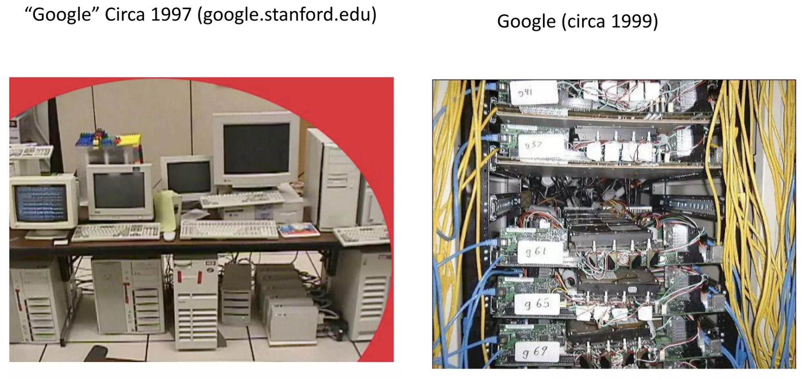
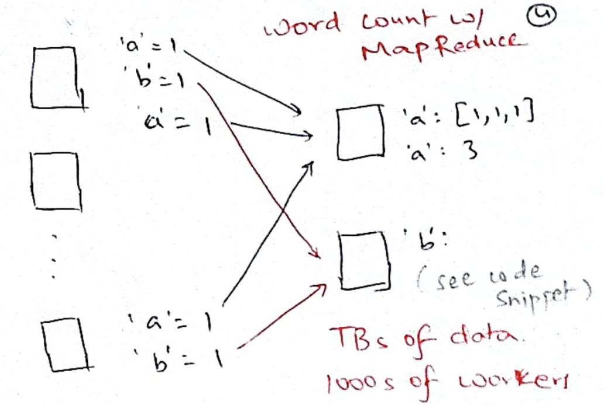
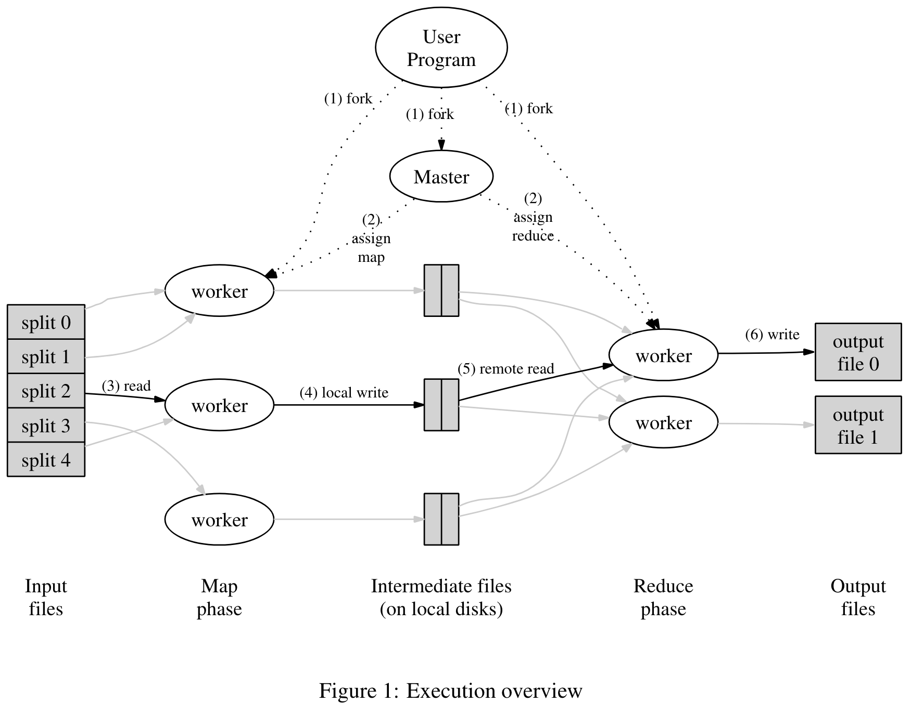
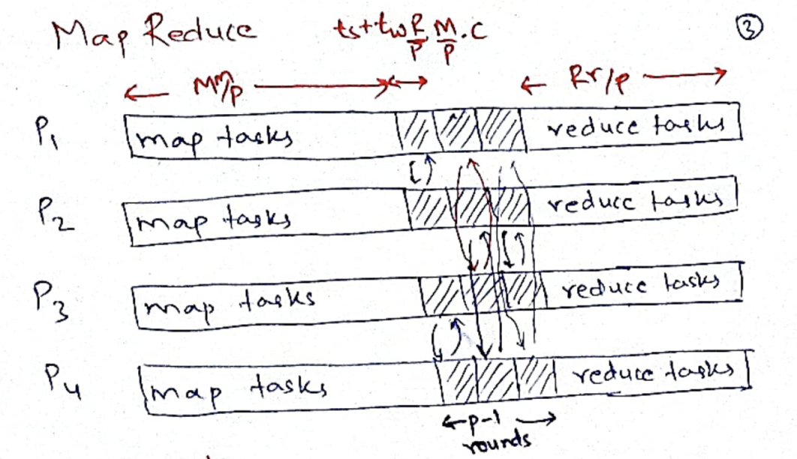
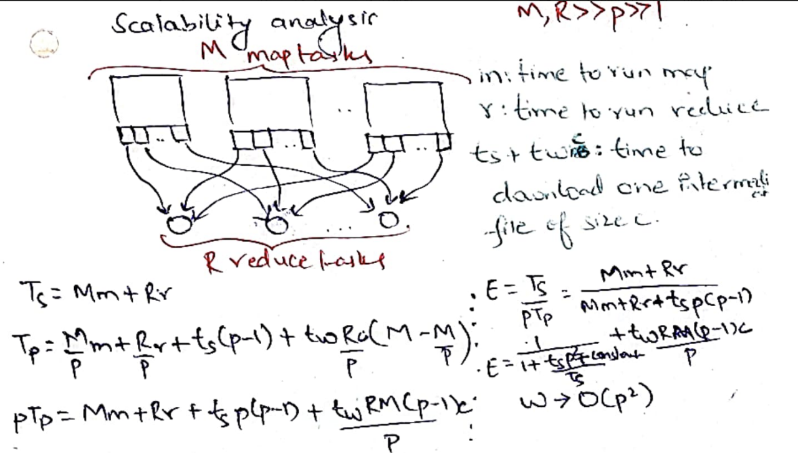

# MapReduce

### Context
POSIX threads became a standard in 1995; OpenMP became a standard in 1997. But
doing parallel programming remained hard. Programmer has to worry about
efficiently using available processors, locking to prevent race conditions,
deadlocks and so on. 

For Google, input data size (TBs) grew well beyond the memory (4GB) and disk
(16GB) of a single commodity computer. One approach to work with such large
inputs was to buy and use a supercomputer. For example in early 2000, the
fastest supercomputer in the world was Intel's ASCI RED which costed ~10M USD
and had 1.2 TB of aggregate DRAM and 9298 processors. But, relying on a
supercomputer would lock you in with a vendor; it is difficult to purchase one
since not everyone is buying/selling; upgrading needs another big investment 
into a larger supercomputer; moving programs from one supercomputer to another
will be extremely disruptive. Google rejected the approach of using a
supercomputer and built a cluster of commodity computers. 



Since now they need 1000s of commodity computers to process terrabytes of data,
faults become common.

> Most such computations are conceptually straightforward. However, the input
data is usually large and the computations have to be distributed across
hundreds or thousands of machines in order to finish in a reasonable amount of
time. The issues of how to parallelize the computation, distribute the data, and
handle failures conspire to obscure the original simple computation with large
amounts of complex code to deal with these issues.

This paper tries to take away all this headache away from the programmer by
providing a different programming model.

## MapReduce

MapReduce takes just two functions from the programmer: a `map` and a `reduce`.
For example, to count the occurence of each word in a large number of webpages
(documents), the programmer can write:

```
map(String key, String value): 
	// key: document name 
	// value: document contents 
	for each word w in value: 
		EmitIntermediate(w, "1"); 
		
reduce(String key, Iterator values): 
	// key: a word 
	// values: a list of counts 
	int result = 0; 
	for each v in values: 
	result += ParseInt(v); 
	Emit(AsString(result));
```

It will execute in the following manner. There are a number of map tasks. Each
task takes a document and emits "1" for each occurence of each word in the
document. The word is hashed to find its appropriate reduce task; reduce task
sums up all the occurences for each word.



MapReduce is interesting because it could solve a large number of problems for
Google such as counting access frequencies of URLs using the word count above,
grepping in large files, (map: output matching lines, reduce: identity), and
finding reverse web-link graphs, i.e, find which documents point to me. For
this, map parses each website (document) to find all outgoing links and emits
"target, source" tuple. target is hashed to find its reduce task which just
appends all the sources to find "target, list of sources".

## Execution

When user submits a program, it forks a master worker (or program controller),
and a number of workers. The job of controller is to monitor and orchestrate the
execution of the program, i.e, it will assign the `M` map and `R` reduce tasks to
appropriate workers.

The input is typically taken from Google File system (GFS), which we will study
later in the course. GFS stores very large files (e.g, log files from the entire
cluster) as 64MB chunks spread across different servers. Each chunk is
replicated 3 times for tolerating disk failures. These chunks are shown as
"split 0", "split 1" etc in the figure 1. Typically, there would be one map task
for one chunk.



The controller remembers the status of each task and does locality-aware
mapping. It tries to assign a map task for a chunk on the same worker that holds
the chunk in its local disk.  After getting a map task, the worker runs the task
and lets the controller know that it is done with the task. When done, the map
task stores `R` output files in its local file system. These `R` output files
will be pulled and used by the `R` reducer tasks.

Task | Status | Intermediate files
-----|--------|--------------------
M1 | in-progress on worker W1 | 
M2 | completed on W2 | R file locations and sizes
M3 | waiting to be scheduled | 
.. | .. | ..
R1 | in-progress on W2 |
R2 | waiting to be scheduled |
.. | .. | ..

When reduce tasks have pulled all their inputs, they can proceed and run the
user-defined reduce function. The output of the reduce is written back to the
Google File system.

Note that there is a very careful separation of the "data plane" and the
"control plane". Data never flows through the program controller. This way the
controller itself never becomes the bottleneck.

## Analysis

MapReduce program with `M` map tasks and `R` reduce tasks shows the following
timeline across `p` workers. Under ideal conditions, there is a "map phase"
where each worker is busy doing `M/p` map tasks. Then in the "shuffle phase",
each worker needs to download files corresponding to `R/p` reduce tasks that
they will be running. Each worker has to download `M/p` intermediate files from 
each of the other workers. This "all-to-all communication" can be done in `p-1`
rounds. After shuffle phase finishes, workers can start the "reduce phase" where
each worker runs `R/p` reduce tasks.



We see that in ideal conditions and with `M, R >> p`, MapReduce has no idling
workers! Doing the scalability analysis, shows that under ideal conditions,
MapReduce has a good iso-efficiency `W = O(p*p)`.



MapReduce design takes locality and load-balancing into account. Controller does
best-effort scheduling to assign map tasks on workers that are close to the
chunk for the map task. It also assigns tasks only to idle workers to achieve
load balancing. 

Since, `M, R >> p`, we get good opportunities to do dynamic load balancing and 
use workers effectively. Consider the case where `W2` is much faster than `W1`
which is faster than `W3`. In such a scenario, `W2` will naturally be made to 
finish lot more tasks than `W1` and `W3`.

```mermaid
gantt
		title Dynamic load balancing
		dateFormat HH:mm
		axisFormat %H:%M
		section W1
				M1          : 18:00, 2m
				M2          : 18:02, 2m
		section W2
				M3          : M3, 18:00, 1m
				M4          : M4, after M3, 1m
				M5          : M5, after M4, 1m
				M6          : after M5, 1m
		section W3 
				M7          : 18:00, 5m
```



But when we are coming close to completion of the job, some final tasks can
remain stuck on slow workers elongating the job completion times.

```mermaid
gantt
		title Stragglers elongate job completion times
		dateFormat HH:mm
		axisFormat %H:%M
		section W1
				R1          : 18:30, 2m
		section W2
				R3          : R3, 18:30, 1m
				R4          : after R3, 1m
		section W3 
				R2          : 18:30, 5m
```



To deal with such situations, the program controller runs *backup tasks*, i.e,
it starts the slow task on another worker, such as task `R2` on worker `W2`.
Both workers are made to race with each other; the task is marked completed when
either has finished.

## Fault tolerance

The approach to fault tolerance is similar to that of straggler mitigation. Upon
detecting a crashed worker, the controller re-executes the worker's tasks. The
controller keeps periodically pinging all the workers. These pings are also
called *heartbeats* and are used in most distributed systems to detect crashes.
If the worker misses a few consecutive heartbeats, the controller thinks that
the worker is dead and marks all done, in-progress map tasks as waiting to be
scheduled. This is because the output of map tasks were in the local disks of
the crashed workers. The reduce tasks completed by crashed worker need not be
re-executed as their output is in the fault-tolerant GFS.

Let us say a map task `M` had finished on worker `W1` and wrote two files
`W1R1.txt` and `W1R2.txt` corresponding to two reduce tasks. `R1` working on
`W3` is able to pull its file and complete the task `R1`. `R2` working on `W4`
could not pull its file since `W1` crashed. Now, `M` will be re-executed on a
new worker, on say `W2` which again writes `W2R1.txt` and `W2R2.txt`. `W4` will
pull `W2R2.txt` to complete `R2`.

If map tasks are *deterministic*, `W1R2.txt` and `W2R2.txt` will be identical.
Otherwise, the two files may be different. So `R1` worked on `W1R1.txt` and `R2`
worked on `W2R2.txt` which were two different diverging map task executions.
Programmer needs to be aware of this possibility and should write
**deterministic** tasks.

Since map and reduce tasks may get executed multiple times due to faults and
stragglers, side-effects made by the tasks should be made **idempotent**. For
example, if a task was adding some rows to a database, programmer needs to
ensure that the task does not add the same rows twice when the task is run
twice. Idempotence in this context means running a task N times has the same
effect as running it once.

When reduce tasks write to GFS, they first write to a temporary file and then do
an atomic rename of the file to ensure idempotence. If the file already exists,
the rename fails. If reduce tasks were instead directly appending to the output
file, we would see duplicate values from duplicate executions.

## Evaluation
The paper shows an evaluation on 1764 workers! Table 1 shows that worker deaths
are actually quite common in large-scale jobs. Figure 3a shows pipelining
between map tasks and shuffle tasks. While map tasks are running, shuffle has
already started. Reading of the input is from local disks, so we see higher
aggregate bandwidths. Shuffle is an all-to-all communication operation over
network. Output is writing to GFS which creates 2 replicas in the experiment, so
the aggregate bandwidth is lower than shuffle phase. 

Figure 3b shows that if we do not use backup tasks, then job completion times
are 44% longer. Figure 3c shows that when we randomly restart 200 workers, the
job completion time is elongated only by 5%. The lost map tasks quickly get
re-scheduled on live workers. 

# Summary
The programmer just writes a map and a reduce function, tests it locally, and
then gives it to the MapReduce system to run in a distributed manner. MapReduce
takes care of locality, load balancing, straggler mitigation, and fault
tolerance.  Last two are done by re-execution of lost/slow tasks. Due to the
possibility of duplicate task executions, it is recommended for tasks to be
deterministic and idempotent to get sensible outputs.

