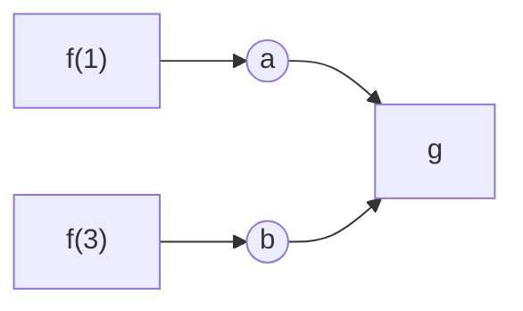
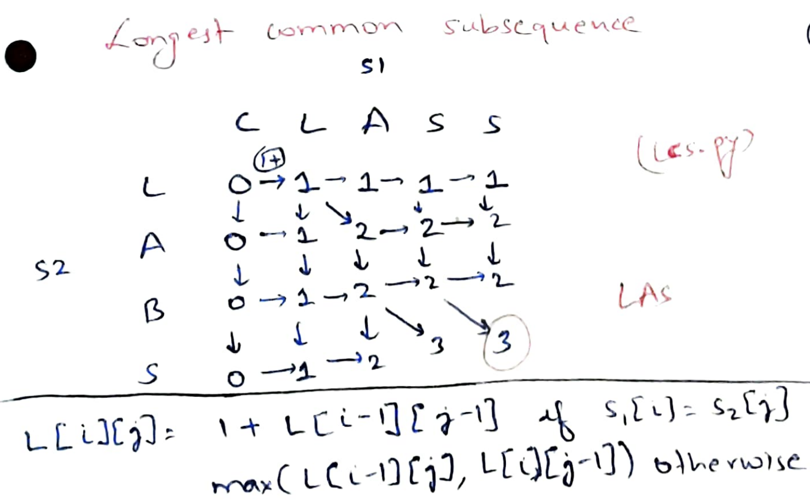
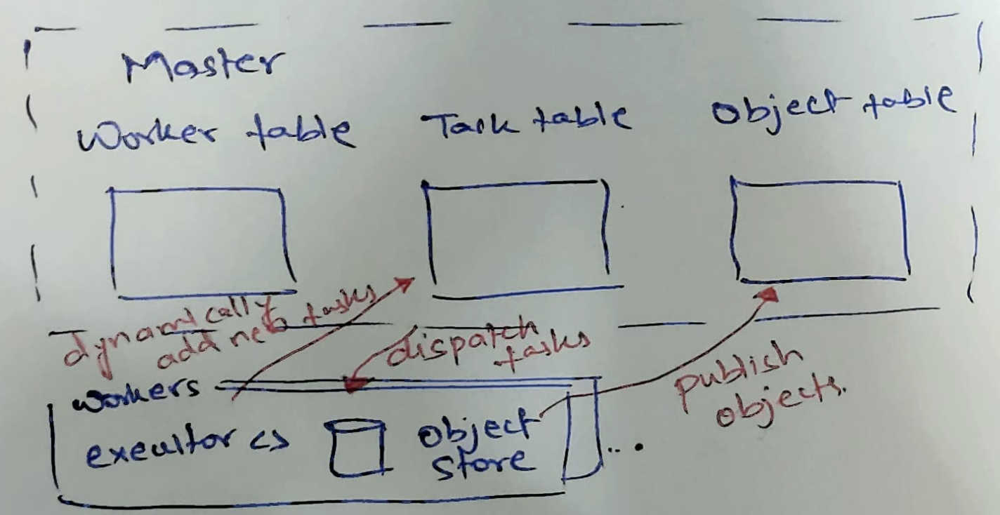
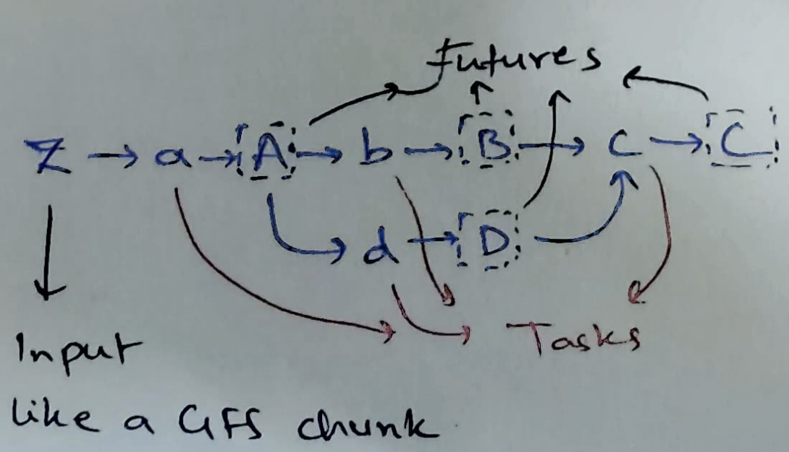
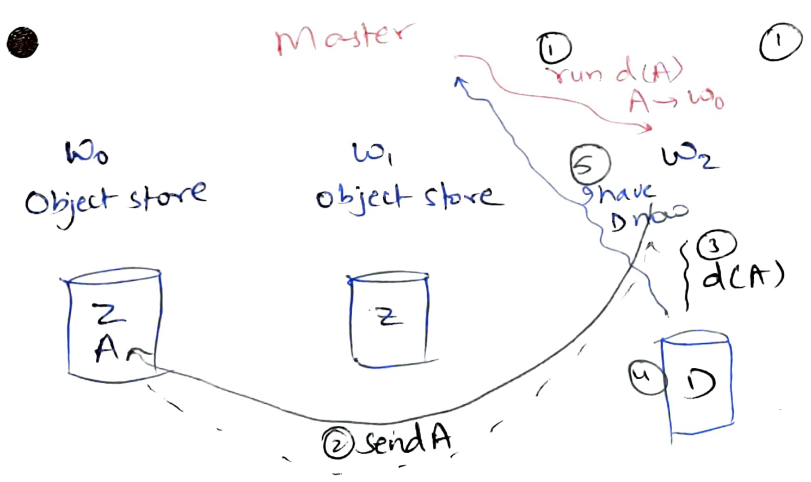
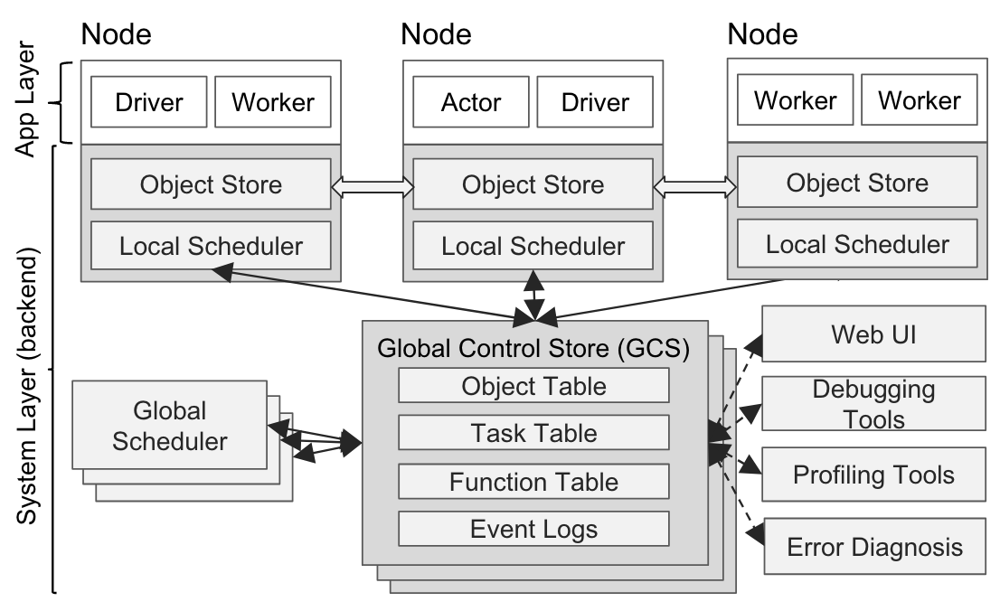
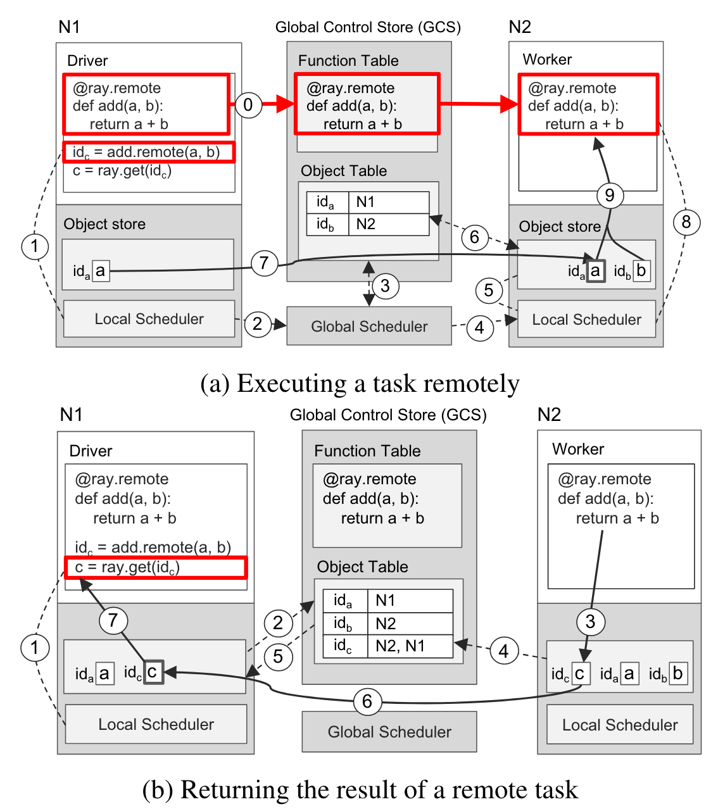
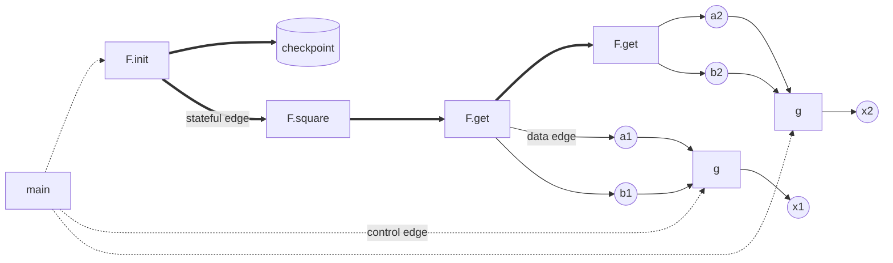

# Ray

- [Ray](#ray)
	- [Tasks and futures](#tasks-and-futures)
		- [A simple system for dynamic tasks and futures (CIEL \[NSDI'11\])](#a-simple-system-for-dynamic-tasks-and-futures-ciel-nsdi11)
	- [Ray](#ray-1)
		- [Execution](#execution)
		- [Actors](#actors)
		- [Fault tolerance](#fault-tolerance)
- [Summary](#summary)


So far, we saw systems where task dependencies are defined upfront and then
executed. To do FT via lineage-based reexecution, lineage is managed by a single
master program, therefore the tasks are kept *coarse-grained* to keep the
lineage graph size manageable.

Another possibility is where new tasks are defined "on-the-fly": web
clients submit new tasks or new tasks are generated as program executes. Many
popular systems like Celery, AirFlow, and Dask support such a *work-pool* model.
The simplest implementation (e.g., Celery) may have a single pool of work (a
task queue) and stateless workers. Here, any worker can work on any task; tasks
can be put into the queue at any time. Lab-1 implemented the work-pool model
where clients added new tasks as files into a Redis stream; stateless workers
did word-count on files. This implementation was too simple: we would often want
to give the output of one task to another task and to define complex
dependencies like automatically start a new task when other two tasks complete.

## Tasks and futures

A more natural way of specifying dynamic task dependencies is by using
*futures* which were first introduced in 1970s. A future references an object
that may not yet be produced.

```py
import ray
ray.init()

@ray.remote
def f(x):
	return x*x

@ray.remote
def g(a, b):
	return a + b

x = g.remote(f.remote(3), f.remote(1))
print(ray.get(x)) # 10
```

A `.remote(..)` call enqueues a task and immediately returns a "future".
Futures can be passed into other tasks. `ray.get` is a blocking call that
returns the value of the future. The above program dynamically create new
tasks `f` and `g` and creates the following task dependency:



Dynamic tasks and futures lets us specify arbitrary task dependencies more
naturally. For example, [this](demos/ray_mr.py) runs map-reduce using Ray.
We first specify 3 map tasks; each map task returns 3 futures (we had to tell
Ray that the map task will return 3 futures using `.options`). 3 corresponding 
futures from the map tasks are given to each reduce task.

[Longest common subsequence](ray_lcs.py) shows a more interesting
task-dependency that is hard to specify in Spark/MapReduce. Here, we are running
a dynamic-programming algorithm that computes the longest common subsequence
between two strings. For example, `CLASS` and `LABS` have a longest common
subsequence `LAS` of length 3. The algorithm runs by filling a matrix of size 
`m*n` where `m` and `n` are the sizes of the two strings. This algorithm is of
interest for DNA sequences which can be very long. 



Each value in the matrix depends upon the left, top, and the top-left value. A
task can compute a block of the matrix. If we choose a small block size, it
creates too many tasks, increasing scheduling overheads. If we choose a large
block size, there is not enough parallelism available to keep workers busy. On
my 8-core laptop, Ray is able to fill 3000x3000 matrix fastest (in 0.7 seconds)
with 60x60 blocks, i.e, it is able to schedule and run ~3.5k tasks per second!

The paper shows that Ray can manage 1000s of cores and schedule millions of
tasks per second!

### A simple system for dynamic tasks and futures (CIEL [NSDI'11])

We can have a bunch of workers, each containing an object store. Object stores
will store immutable object values for the futures. A master program keeps track
of all the workers, tasks, and objects.



Let us say, we want to execute the following DAG. Here, $z$ is the input, $A$,
$B$, $C$, and $D$ are futures; $a$, $b$, $c$, and $d$ are tasks.



Task table | | | Object table  | | |
-----------|-|--------------|-|-|-|
Task| Waiting on object| Status 		| Object | Location | Waiting tasks
$a(z)$| $\phi$ | Runnable 					| $z$ | w0, w1 | $a(z)$
$b(A)$| $A$ | Pending 							| $A$ | | $b(A), d(A)$
$d(A)$| $A$ | Pending 							| $B$ | | $c(B, D)$
$c(B, D)$| $B, D$ | Pending 				| $D$ | | $c(B, D)$
 .        |        |         				| $C$ | |

Master schedules $a(z)$ on w0 (locality-aware). This produces $A$ in object
store of w0. When w0 tells master about it, master can schedule $b(A)$ and
$d(A)$ to workers w0 and w2 respectively. w2 downloads $A$ from w0 to run
$d(A)$. This is again a careful separation of control-plane from data-plane;
master never receives/sends the actual objects.



The fault tolerance approach is same as Spark/MapReduce: re-execute lineage to
recover lost objects. If w2 is unable to download $A$ from w0, it complains to
master. Master will mark both $b(A)$ and $d(A)$ as pending and re-execute $a(z)$
on w1. Therefore, tasks need to be deterministic and idempotent.

Clearly, this approach will not scale to millions of tasks per second due to a
single master.

## Ray

### Execution

Ray can start millions of millisecond-level tasks every second. Such
fine-grained tasks bring two scalability challenges for the master program:

1. the lineage graph that tracks dependencies between objects and tasks becomes
much larger; and
2. the scheduling decisions need to be made a lot more quickly.

To solve these challenges, Ray shards master. 

1. All the state is kept in a sharded Global Control Store (just replicated
redis instances). This makes everything else (like the scheduler) stateless.



2. To make fast scheduling decisions, Ray designs a bottom-up scheduler. Each
node always tries to schedule the (stateless) tasks on itself. Only if the task 
queue is beyond a threshold, the task is sent to the global scheduler that does
locality-aware scheduling.




Note that before an object leaves the object store of a node, its lineage needs
to be persisted in the GCS so that it can be recovered via lineage-based
reexecution.


### Actors

In addition to stateless tasks, Ray supports stateful *actors* by marking
classes as `remote`. Special processes are started as actors. Each class is 
resident on one such process. All method invocations on the actor class is
executed in its corresponding process.

```py
import ray
ray.init()

@ray.remote
class F(object):
	def __init__(self, x, y):
		self.x = x
		self.y = y
	def square(self):
		self.x = self.x*self.x
		self.y = self.y*self.y
	def get(self):
		return self.x, self.y

@ray.remote
def g(a, b):
	return a + b

f = F.remote(1, 3)
f.square.remote()

a1, b1 = f.get.options(num_returns=2).remote()
x1 = g.remote(a1, b1)
print(ray.get(x1)) # 10

a2, b2 = f.get.options(num_returns=2).remote()
x2 = g.remote(a2, b2)
print(ray.get(x2)) # 10
```

[Parameter servers](demos/ray_ps.py) can be easily specified with Ray. A
parameter server is just a Ray actor; workers are just Ray tasks. Since tasks
are stateless, Ray can run them on any Worker. However, remote methods called on
Ray Actors must be run by its process. Other processes do not have the state
encapsulated by the Actor.

### Fault tolerance

The approach to fault tolerance is still lineage-based re-execution. Stateful
actors execute methods serially and generate *stateful edges* between their
method executions.  They are checkpointed periodically. If an actor process
crashes, a new actor process is instantiated from the actor's checkpoint that
plays the actor's lineage forward. For the simple Actor program above, the 
following shows the lineage graph:



In the above lineage graph, if we lose the Actor process holding `F`, after the
first `g` finishes and prints `x1=10`, we CANNOT just recover `F` from the
checkpoint. Otherwise, we may observe `x1` being printed as 10 and `x2` being
printed as 4. After recovering `F` from the checkpoint on a new Actor process,
we must play its lineage forward.

# Summary

Ray is one of the latest successful distributed compute system, already widely
used in the industry. It does not force programmers to use map/reduce/join-type
operators but ties seamlessly into the familiar programming model by making
functions as stateless tasks and classes as stateful actors. While Ray does a
great job with scheduling millions of tasks per second using its bottom up
scheduler, programmers can still shoot themselves in the foot by choosing the
wrong granularity of tasks. Ray ecosystem is growing rapidly in supporting
distributed profiling and distributed debugging.