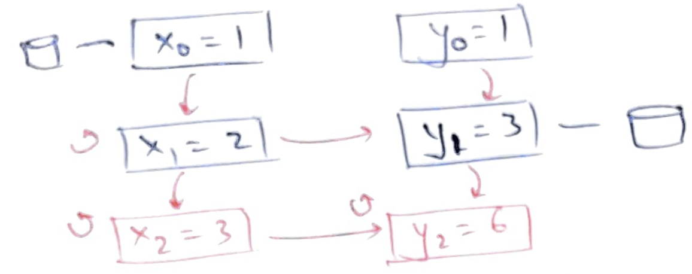
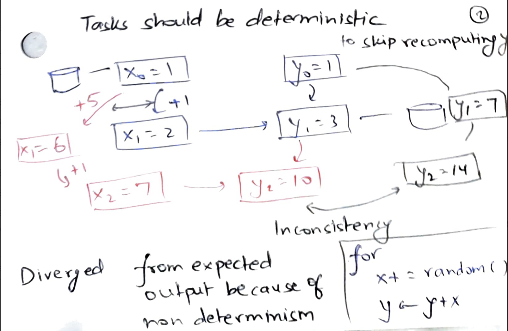
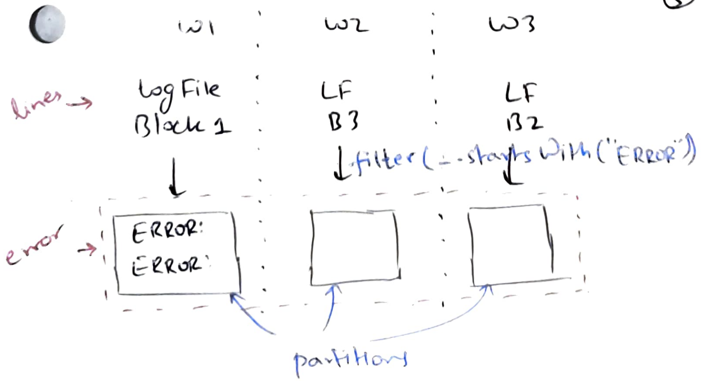
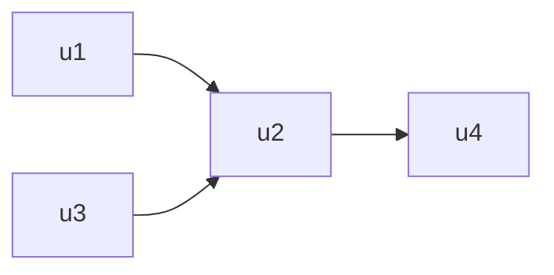
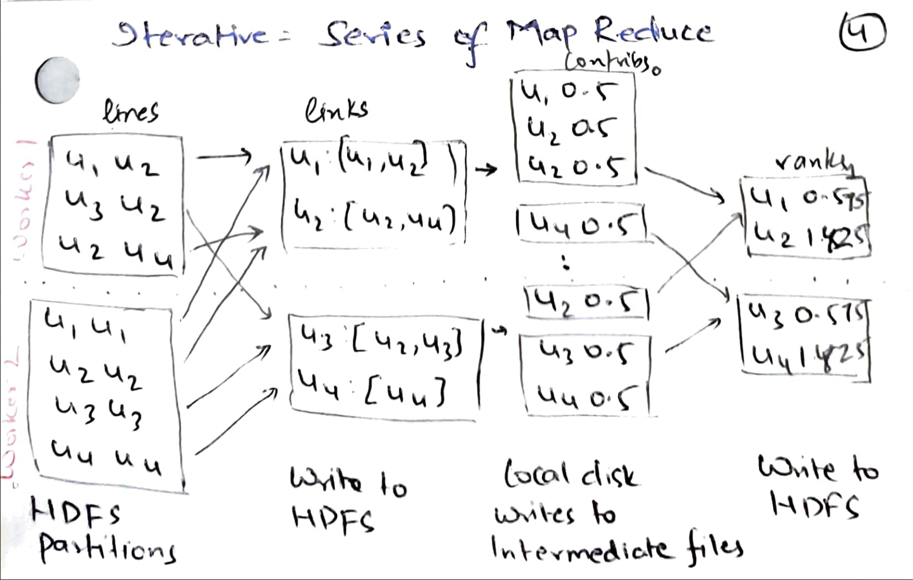
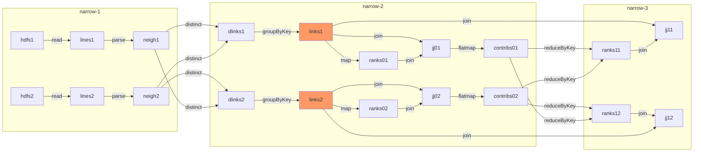

# Resilient Distributed Datasets in Spark

## Overview
Spark will do *asynchronous checkpointing* of its state, i.e, create a
checkpoint without pausing the program for fault tolerance. It will also try to
not re-execute entire computation from the last checkpoint. It will try to only
re-execute the program *partially* to recover just the lost state.

In [DSM](compute-dsm), we saw how asynchronous checkpointing led to
inconsistent checkpoints. Let us revisit *why* we ended up with inconsistent
checkpoints. We saw a simple `for` loop with the initial state as $x=0$ and
$y=0$:
 
```py
for ..:
  x += 1
  y = y+x
```

When we asynchronously create checkpoint, we might capture $x=1$ after the first
iteration of the loop and $y=3$ after the second iteration of the loop. If we
restore from this state and continue executing the `for` loop, we will reach
$x=2$ and $y=5$ which could not have been reached in a fault-free execution.

The main problem is that our checkpointing and restore mechanism got confused
between multiple *instances* of $x$ and $y$. We checkpointed $x$ from the
first iteration and $y$ from the second iteration. And then we didn't know that
they are from two different iterations. 

The first idea of Spark is that let us make our variables **immutable**. In our
toy example, it means that $x$ in the first iteration *is not the same as* $x$
in the second iteration. Let us refer to variables in different iterations as
$x_0, y_0$; $x_1, y_1$ etc. The immutability of variables also helps in
replicating them: due to immutability, we need not worry about *consistency*
during replication. We can easily create multiple replicas of each variable
while the program is running, since the program is guaranteed to not modify
variables further.

Now, even with separate naming convention and immutability of variables, we
might still capture, in our asynchronous checkpoint, different variable
versions, i.e, $x_0=1$ and $y_1=3$. The second idea is to remember the
**lineage** and recover the program state using it. For example, the following
shows the lineage between program variables in our toy program:



To come to the latest loop iteration, we *need not* recover $y_0=1$. We can just
follow the lineage to recover $x_1$ and then continue the loop from there to
compute $x_2, y_2$. For recovering variables using lineage, we need to
re-execute the task on the lineage edge; tasks must be **deterministic** and
**idempotent**.

For example, let us say we change the toy program to do `x+=random()`. In the
original execution, $x_1=2, y_1=3$. Now when we recover $x_1$ from the
checkpoint, we re-execute `x+=random()` and get $x_1=6$. Note that $x_1=6,
y_1=3$ is an inconsistent state: it cannot be reached from $x_0=1, y_0=1$ in a
fault-free execution.



Of course if we apply these ideas to regular programs, we will end up with
humongous lineage graphs. To reduce the size of lineage graphs, the idea of
Spark is that 

1. Our immutable variables will be large collections instead of small scalar
values;
2. We will only allow coarse-grained transformation, such as filter, map,
reduce, etc.  that take one collection to another collection. Roughly speaking,
a coarse-grained transformation applies the same function to each element in the
collection.

Therefore, the lineage graph will be small. An edge in the lineage graph takes
one large collection to another large collection using a deterministic
coarse-grained transformation.

## Resilient distributed datasets

These ideas are exposed to programmers using an "RDD" abstraction. An RDD
appears to programmer as a single object, but it is actually distributed across
machines. For example, in the following Spark program, both `lines` and `errors`
are RDDs.

```py
lines = spark.textFile("hdfs://...") 
errors = lines.filter(_.startsWith("ERROR")) 
errors.persist()
```

In the following figure for example, there are three partitions of `lines` 
resident on three workers. The user-defined `filter` is applied on each
partition independently and locally by each worker to get three partitions of
`error`. Each RDD partition is immutable. The following figure shows the lineage
graph.



## Execution

Execution is similar to [MapReduce](./compute-mr). There is a driver machine
that manages other worker machines. The driver is keeping track of RDDs. For
each RDD, driver knows its 
* number of partitions, 
* partition function: may be simple hash-based or could be user-specified.
For example, user wants all data related to iitd.ac.in within a single partition,
* where are its partitions: partitions may be replicated for FT,
* list of dependencies (lineage).

Let us see an example execution of a
[PageRank](https://github.com/apache/spark/blob/master/examples/src/main/python/pagerank.py)
program written using Spark. PageRank measures the popularity of pages. 
Given the following graph, one would expect 
* u1 and u3 to have equal ranks,
* u2 to have a higher rank than u1 and u3
* u4 to have a higher rank than u2 (a popular page u2 thinks u4 is popular, but
  u4 does not consider u2 to be popular).



The algorithm estimates the probability that a user will visit the page. It
starts with assigning equal rank of 1 to each page and simulates a user at each
step: with 0.85 probability the user clicks a link at random, and with 0.15
probability the user visits a random page.

```py
# Loads in input file. It should be in format of:
#     URL         neighbor URL
#     URL         neighbor URL
#     URL         neighbor URL
#     ...
lines = spark.read.text(sys.argv[1]).rdd.map(lambda r: r[0])

# Loads all URLs from input file and initialize their neighbors.
links = lines.map(lambda urls: parseNeighbors(urls)).distinct().groupByKey().cache()

# Loads all URLs with other URL(s) link to from input file and initialize ranks of them to one.
ranks = links.map(lambda url_neighbors: (url_neighbors[0], 1.0))

# Calculates and updates URL ranks continuously using PageRank algorithm.
for iteration in range(int(sys.argv[2])):
	# Calculates URL contributions to the rank of other URLs.
	contribs = links.join(ranks).flatMap(lambda url_urls_rank: computeContribs(
		url_urls_rank[1][0], url_urls_rank[1][1]
	))

	# Re-calculates URL ranks based on neighbor contributions.
	ranks = contribs.reduceByKey(add).mapValues(lambda rank: rank * 0.85 + 0.15)
```

In the following, we see how `pagerank.py` executes as a series of mapreduce
jobs. The graph is stored in HDFS partitions. It is parsed to find
`links`. Each link contributes a ratio to every other URL. These contributions
are added up together for each URL, multiplied by 0.85, and we finally add 0.15
to get the next set of ranks.



Observe that `links` is cached since it is used in every iteration. PageRank
builds the following lineage graph when it is running on two workers.



All the "*1" partitions such as `hdfs1`, `lines1`, `neigh1` etc. are resident on
worker-1 and all the "*2" partitions such as `hdfs2`, `lines2`, `neigh2` etc.
are resident on worker-2. Spark classifies all transformations into narrow and
wide.  "Narrow dependencies" are executed locally. "Wide dependencies" require a
shuffle between workers. The figure above shows all the narrow dependencies. 
`distinct` and `reduceByKey` are wide dependencies.


Note that `dlinks` -> `groupByKey` -> `links` is a narrow dependency since the 
RDDs are already partitioned by URLs. `links`, `ranks` -> `join` -> `jj` is also
a narrow dependency since `links` and `ranks` are "co-partitioned", i.e, same
source URLs (which determine the join condition) are in the same partition.
Narrow dependencies are preferred over wide-dependencies since 
* transformations can pipeline data within a worker, whereas wide dependencies
require data to be available on all parent partitions; and
* at a crash, we just need to recover one parent partition, whereas for wide 
dependency, we need to recover all parent partitions.

We could do the same computation using a series of MapReduce jobs. A sequence of
narrow dependencies can be written as a `map` task, and a wide-dependency can be
written as a `reduce` task. But, each MapReduce job writes its output to GFS.
Therefore, each PageRank iteration will necessarily write to GFS. Spark can
choose to persist every few iterations to reduce disk overhead.

The approach to fault tolerance is simple: recompute lost partitions by
following the lineage backwards. To avoid ending up with long lineage chains, we
should checkpoint occasionally. We can be smart in doing this checkpointing. For
example in the PageRank program, `ranks` is O(number of URLs) and `contribs` is
O(number of web links); so checkpointing `ranks` should be preferred. 

A checkpoint can be made asynchronously since partitions will not get modified
while we are checkpointing them. Checkpointing an RDD involves workers
replicating all of the RDD partitions into each other's memory. If worker memory
is getting full, it can spill some RDD partitions to disk. Users can provide a
"persistence priority" to RDDs to guide Spark.

The approach to straggler mitigation is similar to MapReduce: start backup tasks
and let two workers race with each other to compute RDD partitions. Since, the
transformation are deterministic and inputs are immutable, both racing workers
should end up computing the same RDD partition.

### Evaluation
Figure 7 shows that later iterations of Spark are much faster than in Hadoop
(an open-source clone of MapReduce) since the data is already present in memory.
In Figure 11, authors inject a fault in iteration 6. Iteration 6 takes longer
time than other iterations due to the recovery via lineage-based reexecution.

## Summary

DSM allows arbitrary fine-grained updates. It has to deal with consistency
issues stemming from multiple readers and writers. The checkpoints are expensive
since it has to checkpoint the complete program state. Checkpoints had to be
made synchronously, i.e, stop the program execution while checkpointing, as
otherwise we may end up with inconsistent checkpoints. We had to restart all the
threads from the checkpoint to recover the program state. DSM transparently
placed threads on workers which may not be locality-aware.

In contrast, RDDs allow only deterministic coarse-grained transformations.
Because RDDs are immutable, we can easily create multiple replicas without
worrying about consistency. These checkpoint replicas can be made asynchronously
as the program is guaranteed to not modify once-written RDDs. Checkpointing is
cheaper than a full checkpoint. We can smartly choose to checkpoint slower to
compute and faster to checkpoint RDDs. After crashes, we need not rollback entire
program back to the last checkpoint. Only the lost partitions can be recovered
using its lineage. To overcome stragglers, backup workers can race to compute
RDD partitions. Because of deterministic tasks, both racing workers shall end up
with the same contents in the RDD partition. Narrow dependencies can be executed
completely locally on workers; users are given control on how they want to
partition RDDs.

The design is quite similar to MapReduce. Spark supports more database-like
operators, such as `join` and `groupBy`, and especially wins on iterative
computations since MapReduce had to go to cluster file system after every
iteration.
