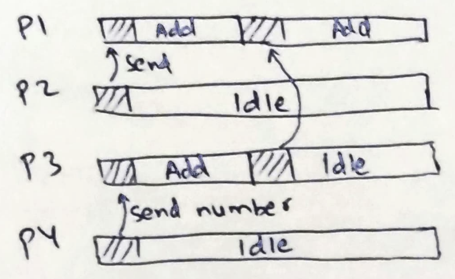
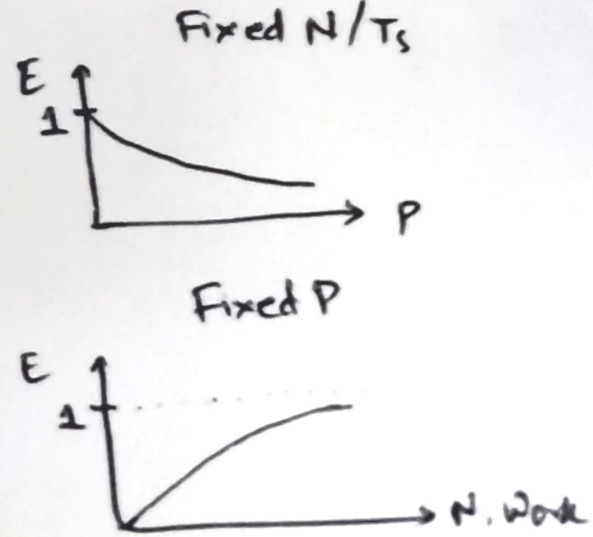
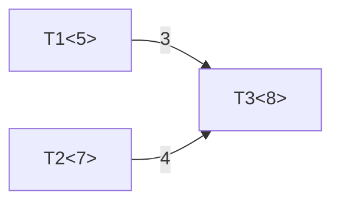
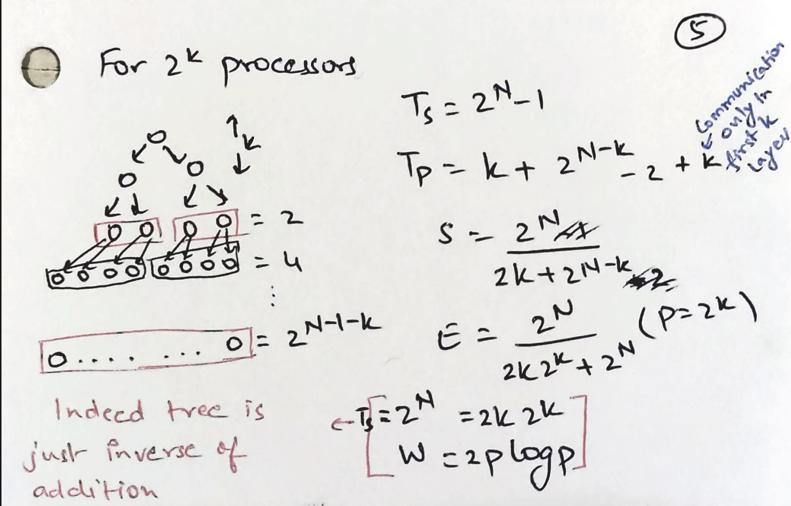
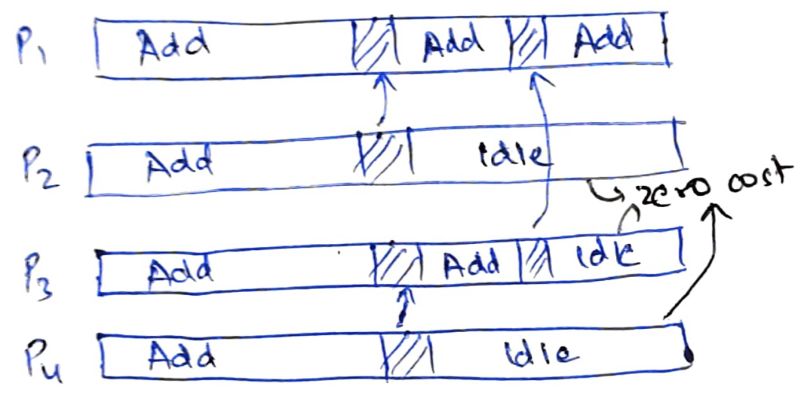

# Scalability in computation

In this note, we try to define when can we say that a program is scalable.  Is
it when it can support 1 million users? Or when it is able to run on 10k
machines? But, the nature of different programs can be quite different from one
another and so such definitions do not quite work. What is a scalable program is
similar to asking what is a fast program? It's better to define things
analytically.

But, the real hardware is quite messy. Cache access times are must faster than
DRAM. Integer operations are faster than flops. CPUs can be undergoing frequency
modulations while the program is running. A program that was slower compared to
another program 10 years ago may now be faster because the cache sizes are now 
larger. Hardware's messiness makes it hard to understand and analyze program
behavior.

## Simplifying assumptions for analyzing programs

What algorithm folks did is to make simplifying assumptions that are independent
from the hardware characteristics to reason about the "fast"ness of programs.
For example, we assume that all basic operations like +, <, *, etc take constant
time. Secondly, memory access is free. There is no notion of memory hierarchy.
With these simplifying assumptions, we can easily analyze programs and claim
things like worst-case time complexity of bubble sort is $O(N^2)$ which is
slower than merge sort's $O(NlogN)$.

We would like to do something similar to talk about whether a program scales.
Note that distributed hardware is messier than a single machine. There is
* network topology: some machines might be closer to one another than others;
* contention: multiple CPUs might be sending the request at the same time causing
  contention on various busses;
* network conditions: network routers might temporarily get busy slowing down
  traffic;
* stragglers: some CPUs might be slower than others;
* and so on.

We need to similarly make some simplifying assumptions to not get bogged down by
the messiness of real-world hardware. We assume that all basic operations take
same constant time on all processors. To account for the overhead of
*communication*, we further assume that sending 1 byte from one processor to
another takes a constant time. Note that this is a huge over-simplification. It
disregards stragglers, network topology, and network conditions. If two threads
are running on the same CPU, their communication overhead is assumed to be the
same as two threads running on two different data centers!

## Speedup, efficiency, iso-efficiency, scalability
Now with this simplification, we can start analyzing algorithms. Let us say we
are adding N numbers on N processors. Serial time $T_s$ of doing this
computation on a single processor is $O(N)$. To compute the same sum on N
processors, we can apply the following algorithm. In first round, processor
$2i+1$ sends its data to processor $2i$ and processor $2i$ adds them up. In
second round, processor $4i+2$ sends data to processor $4i$, and so on.

This process completes in $O(logN)$ steps and in each step we are doing constant
communication and constant computation so parallel time $T_p = O(logN)$. This
gives us an overall speed up of $S = T_s / T_p = N/logN$. If $N$ is large, $S$
is a big number! Looks like we have a good parallel algorithm! Or do we?

Ideal speedup with $N$ processors = $N$ and $N/logN < N$. This means that most
processors are not "efficiently" utilized. We can come up with another
definition to directly measure efficiency $E = S / p = T_s / p*T_p$ where $p$ is
the number of processors. Efficiency captures fraction of time where processors 
are utilized. For the above algorithm, $E = 1 / logN$. For large $N, E
\rightarrow 0$, i.e, most processors are idle!

This really is the case. Following shows a timeline of the computation. After
sending their numbers in first step, processors $2i+1$ sit idle throughout the
algorithm. Processors $4j+2$ sit idle forever after second step, and so on.

Can we do better? Let's try again with $P < N$ processors. Here, we bootstrap 
each processor with $N/P$ numbers. So first they compute the sum locally which 
takes $O(N/P)$ and then follow the previous algorithm that takes $O(log P)$
time.  So, we get $S = N / (N/P + logP) = P / (1 + PlogP/N)$ and $E = 1 / (1 +
PlogP/N)$.

If we fix the amount of work and keep adding processors, the efficiency will
keep going down tending towards zero. This is because there is not enough work
to do so processors have to sit idle. Conversely, if we fix the number of
processors, and keep increasing the problem size, the efficiency increases
tending towards 1. This is the behaviour we expect from scalable programs.

Another way to talk about scalability is to measure iso-efficiency $W$.
Iso-efficiency is defined as the rate at which the problem size needs to grow,
when we add a new processor, to maintain efficiency. Lower the rate of growth of
the problem size, the more scalable is the program. For additions, $T_s = N =
O(PlogP) = W$.

For completely unscalable program, like non-parallelizable code, $W = \infty$,
i.e, there is no way increase the problem size to maintain efficiency when
adding another processor. For embarrasingly parallel programs, $W = constant$,
i.e, we just need to increase the problem size by a constant amount when we are
adding a new processor.

## Task DAGs

Parallel algorithms can also be represented as task DAGs. The following shows
three tasks. Task T3 can be run as soon as tasks $T1$ and $T2$ complete. Task
$T1$, $T2$, $T3$ take time units 5, 7, and 8 to complete respectively. It takes 
3 time units to send $T1$'s output to $T3$ and 4 time units to send $T2$'s
output to $T3$. If $T1$ and $T3$ are run on the same processor, then it would
take zero time to send $T1$'s output to $T3$.

Let's now see a bad task graph with $N$ tasks. Assume all tasks take 1 unit of
time.

Here, $T_s = N$ and $T_p = N$; $S = 1$ and $E = 1/p$. There is no way to
increase the problem size $N$ while adding another processor to keep constant
efficiency! This program is completely unscalable.

For a balanced binary tree of tasks with depth N i.e, $2^N - 1$ tasks and $2^k$
processors:

## Function-as-a-service

The analysis so far is for standard parallel programs. Recently, cloud providers
have started providing "function-as-a-service" (FaaS). [AWS
Lambda](https://aws.amazon.com/lambda/pricing/) shows the pricing model for
FaaS.

> Duration is calculated from the time your code begins executing until it
returns or otherwise terminates, rounded up to the nearest 1 ms.

Basically in FaaS, user does not pay for resources if the CPU is no longer being
used measured in granularities as small as 1ms! Let's see if measuring
efficiency still makes sense. $E = T_s / p*T_p$. $T_s$ is essentially the cost
we are paying for using 1 processor for $T_s$ time. Similarly, $p*T_p$ was
assumed to be the cost we are paying for using $p$ processors for $T_p$ time.

$pT_p$ = real computation work + communication overhead + idle time. But under
FaaS, we do not pay anything for idle time!

So instead of optimizing for iso-efficiency, we are now trying to find task
graphs, number of workers, placement, etc. such that 

* $min(T_p)$ where $cost < T_s + \Delta$ (budget sensitive jobs)
* $min(cost)$ where $T_p < T_s / \alpha$ (latency sensitive jobs)

Budget sensitive job specifies a cost and tries to finish the work as quickly as
possible. Latency sensitive job specifies a deadline and tries to finish the 
work in lowest cost.