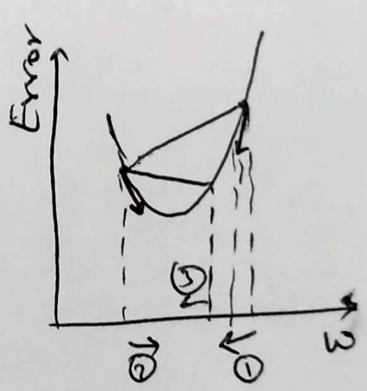
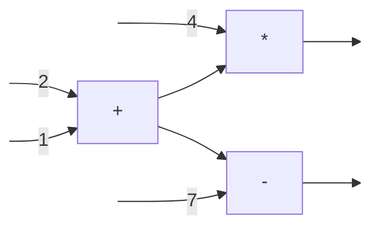
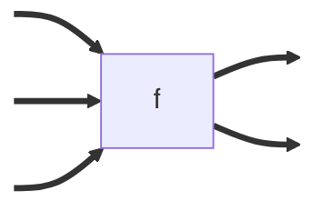
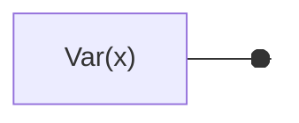
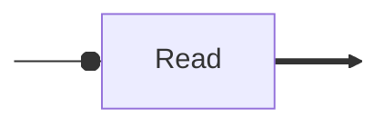
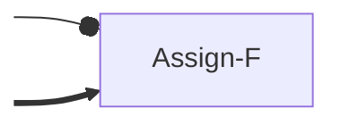
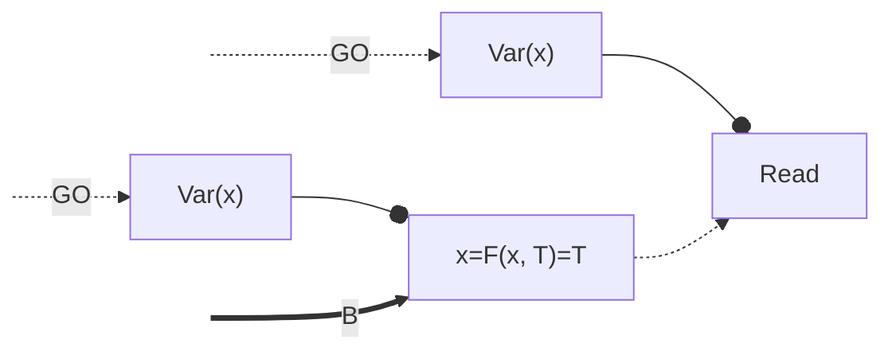
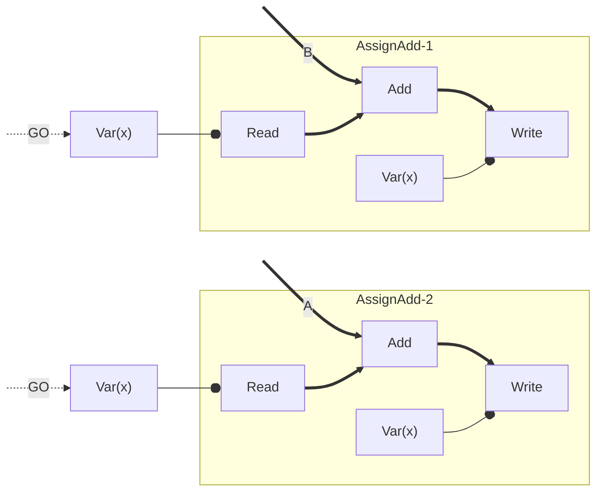

# TensorFlow

TensorFlow is a distributed system for doing large-scale machine learning.
We are interested in studying this because:

1. ML tranining is an  important (maybe now the most important?) application for
distributed compute. Yet, batch compute systems that we studied so far, like
Spark and MapReduce, are ill-suited for it. We will understand why.
2. ML is statistical in nature. This can be exploited in fault tolerance and
straggler mitigation strategies.
3. ML workloads use heterogenous compute: CPUs, GPUs, TPUs, and other
accelerators. TensorFlow is a good system design for seamlessly managing diverge
hardware.

## Background
Let us quickly revise how ML training works. We will use a basic neural network
as an example. Let us say the task is to identify digits from a grayscale input
images of size 30x30, i.e, there are 900 pixels each with value 0 (black) or 1
(white). We can represent this as 900 neurons (one for each pixel) in the input
layer and 10 neurons in the output layer (one for each digit). In between input
and output layers there can be other layers. 

A neuron can take inputs $x_1, x_2, \cdots, x_n$ from other neurons and applies
a non-linear function to produce an output $y$ between 0 and 1, i.e,
$y = F(w_1*x_1 + w_2*x_2 + \cdots w_n*x_n + b)$. This output will become the
input for neurons in the next layer. Variables $<b, w_1, w_2, \cdots w_n>$ are
called model *parameteres*. These are what we are interested in learning.

The training process uses training data. For our example, the training data will
have many grayscale 30x30 digit images. For each image, the training data also
contains the ground truth. For a given training image of digit 0, the expected
output from the 10 neurons in the output layer would be $E = <1, 0, \cdots, 0>$,
i.e, the output neuron zero has a value 1 and the other output neurons have value
0.

We initialize all model parameters randomly. Now, let us say that for the zero
image, the model produces outputs $O = <0.1, 0.8, \cdots, 0.01>$ on the 10
output layers. We can now calculate *error* as 
$\sum_{N=\{0\cdots 9\}}(O_N - E_N)^2/N$. In training, this is what we aim to
minimize by learning appropriate model parameters. 

A common optimization algorithm is *gradient descent*. The idea is that error is
a function of model parameters. At any given time during the training process,
we are observing one error value stemming from the current values of model
parameters. The algorithm itertively nudges the model parameters in the
direction that decreases the error fastest. Mathematically, this direction is
[the gradient](https://en.wikipedia.org/wiki/Gradient) of the error function. 
Gradient is a generalization of differentiation to functions with multiple
inputs. The following shows three iterations of the algorithm assuming just one
model parameter.

In 2012's ImageNet challenge, the task was similar: given an image identify its
class. The classes were more diverse than just digits: cats, dogs, etc. The
winninig entry AlexNet was trained using a GPU and had 62M+ model parameters!
AlexNet significantly outperformed all other models. This gave rise to *deep
neural networks*: it is being found that if the models have more parameters
(more layers), then it tends to learn better. State-of-the-art models today,
like GPT-4, have trillions of parameters trained on petabytes of data making
model training a naturally distributed compute problem.

TensorFlow lets ML researchers create novel model architectures and train at
scale without worrying about difficult distributed systems issues like FT,
stragglers, scalability, heterogeneity, etc. It also support inference on
heterogenous devices like data centers, workstations, and mobiles.

## Difficulties with existing systems

### Spark

We can try to use Spark for ML model training by making model parameters RDD.
However, to keep the size of lineage graphs manageable by the driver program,
Spark only allows *coarse-grained* transformations. For example, multiply every
number in RDD by 2. Coarse-grained transformations take a set of RDD partitions
to generate a new RDD partition. Multiple workers apply the same transformation
in parallel to generate different partitions of an RDD. 

However, model training requires *fine-grained* transformations, i.e, every
model parameter is nudged differently. If we try to store these fine-grained
transformations in the lineage graph, the graph will explode.

### Parameter servers

The main issue is that Spark's programming model only allows stateless tasks.
This is the reason why Spark workers were able to simply re-execute failed
tasks. Another popular approach for ML training at the time was to introduce
special *parameter servers* to manage state (ML model parameters).  Other
stateless workers are given different portions of the training data in each
*epoch*. Each worker 

1. reads parameters from parameter servers;
2. compute error for its own portion of training data;
3. compute gradient for the error in its own portion of training data;
4. sends parameter nudges to parameter servers;
5. repeat.

In the *synchronous* version, parameter servers add nudges from all the workers 
before allowing next read of parameters.  However, such a synchronization can
let stragglers severely affect runtimes. Therefore an *asynchronous* version can
be used. Here, the parameter servers apply nudges as an when they receive them;
they do not block reading of parameters. For example, a worker can read model
parameters $p$, calculate error, gradient, and nudge $\Delta$. It sends this
nudge to parameter servers and receives new parameters $p' + \Delta$. Other
workers may have already changed $p$ to $p'$. Because of the statistical nature
of ML training, an asynchronous version still works. It hurts the *learning
rate* but removes the barrier thereby reducing idling workers.

However, such a stateful<>stateless split may not be desirable. For example, if
we want to divide every parameter by 2, it is better to be able to send the
compute to the parameter server instead of downloading all parameters to
stateless workers, dividing by 2, and then sending results back. 

## TensorFlow
TensorFlow does not create an upfront stateful/stateless separation. It works
with a *unified dataflow graph* that captures both mutable state (for model
parameters) and computation. Let us now understand this dataflow graph.

### Dataflow graphs
A dataflow graph captures data dependencies between operators. Each operator has
some input and some output edges. An operator can run (also called, can *fire*)
if all its input edges have data. When an operator fires, it runs *atomically*
and puts its output on its output edges, making downstream operators *ready* to
fire. The order in which two ready operators can fire is not specified. For
example, in the following dataflow graph, first `+` fires to output `3` on its
output edges. `*` and `-` can now fire in any order.

### Unified dataflow graph in TensorFlow
In TensorFlow, data flowing on edges are tensors. TensorFlow adds mutable state
into its dataflow graph. TF graph has four types of operators:

1. Stateless operators that take `k` tensors and output `l` tensors. An example
is matrix multiplication.

2. Variable operators that return a reference to the variable.

3. Read operators that read a variable reference and output a tensor that is
the current value of the variable.

4. Assign-F operators that takes a variable reference, say `x`, and an input
tensor, say `T`, and does `x = F(x, T)`. It does not output anything.

In addition to variable reference edges and data edges, the graph can have
*control edges*. These edges are just there to control order of firing among
operators. They fire with just one value `GO`. For example, the control edge
from write to read in the following example constrains the `Read` to read `B`.

The advantage of `AssignF` operators instead of a `Write` operator is that it
allows for skipping control edges between `AssignF` operators (if `F` is
commutative). Skipping control edges means opportunities for more parallelism.
Consider the following graph:

Starting from $x=X$, the possible outcomes are $x=\{X+A, X+B, X+A+B\}$.
`AssignAdd` makes `Read`+`Add`+`Write` as one *atomic operation*. Therefore, the
only possible outcome is $x=X+A+B$.