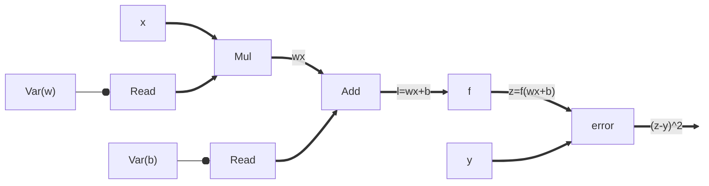
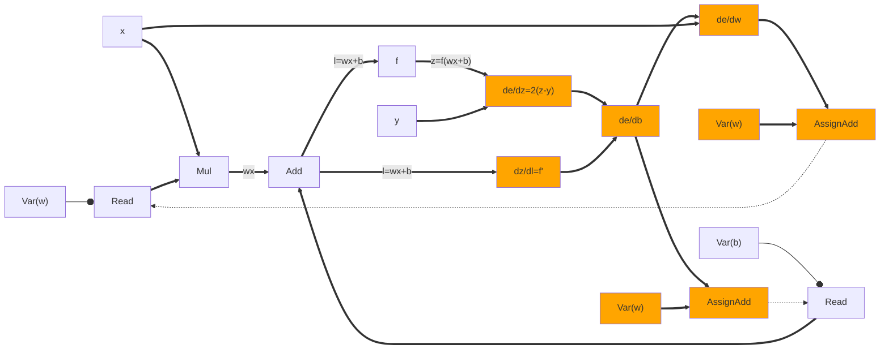
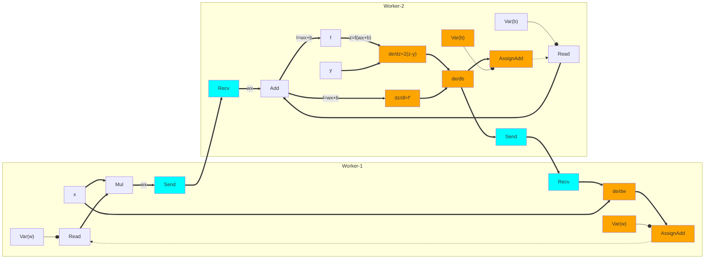

# TensorFlow

Let us now build the TensorFlow's dataflow graph for a very simple
*single-neuron* ML model training task. Let us say we have an ML model with one
neuron that takes a single input vector $x$ and outputs a single output vector
$z=f(wx+b)$.  The ground truth is a single output vector $y$. This gets
expressed in TensorFlow as:

All the functions in TensorFlow are *primitive* operators like multiplication
and addition with known differentiations. TensorFlow can apply chain rule on the
dataflow graph to find gradients:

$\frac{de}{db} = \frac{de}{dz}*\frac{dz}{dl}*\frac{dl}{db};\frac{de}{dw} = \frac{de}{dz}*\frac{dz}{dl}*\frac{dl}{dw}$

$\frac{de}{db} = 2(z-y)*f'(l)*1;\frac{de}{dw} = 2(z-y)*f'(l)*x$

Gradient calculation operators are auto-generated and added to the dataflow
graph (highlighted in orange). Gradients are used to update model parameters $w$
and $b$. `AssignAdd` has a control edge to `Read` to start next iteration.

After preparing the unified dataflow graph, TensorFlow *lowers* the graph on
available heterogenous devices. While lowering, operators using the same
variable reference such as `Read` and `Assign-f` must come to the same *device*.
Therefore, variable edges never cross device boundaries. If there is a data edge
crossing device boundary, special `Send` and `Recv` operators are inserted.
These operators have customized implementations for fast data transfer:
`cudaMemCpyAsync` if workers are CPU/GPU on same machine, DMA to transfer
between two GPUs on same machine, and TCP/RDMA for transfer between remote
machines.

