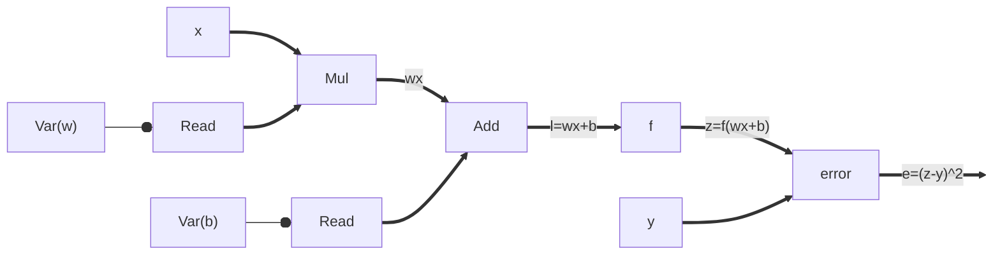
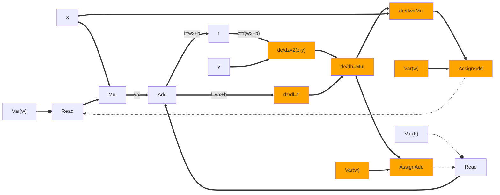
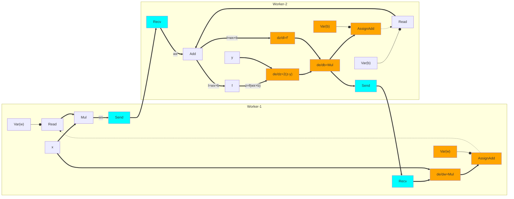
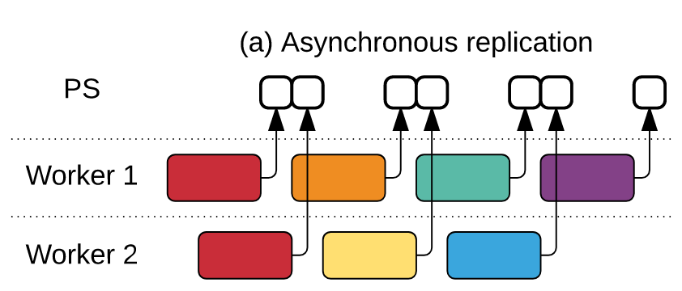
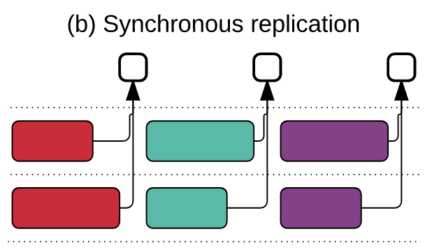
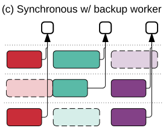
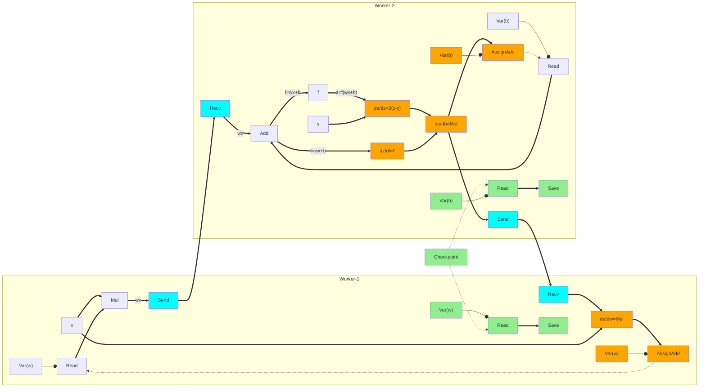

# TensorFlow

- [TensorFlow](#tensorflow)
	- [Automatic differentiation](#automatic-differentiation)
	- [Heterogenous execution](#heterogenous-execution)
	- [Concurrent execution](#concurrent-execution)
	- [Fault Tolerance](#fault-tolerance)
- [Summary](#summary)

Let us now build the TensorFlow's dataflow graph for a very simple
*single-layer* ML model training task. Let us say we have an ML model with one
layer that repeatedly takes a single input vector $x$ and outputs a single
output vector $z=f(wx+b)$.  The ground truth output vector is $y$. This can be
expressed in TensorFlow as:

## Automatic differentiation

All operators in TensorFlow are *primitive* like multiplication and addition
with well-known differentiations. TensorFlow can apply chain rule on the
dataflow graph to find gradients:

$\frac{\partial e}{\partial b} = \frac{\partial e}{\partial z}*\frac{\partial z}{\partial l}*\frac{\partial l}{\partial b};\frac{\partial e}{\partial w} = \frac{\partial e}{\partial z}*\frac{\partial z}{\partial l}*\frac{\partial l}{\partial w}$

$\frac{\partial e}{\partial b} = 2(z-y)*f'(l)*1;\frac{\partial e}{\partial w} = 2(z-y)*f'(l)*x$

$\frac{\partial e}{\partial w} = \frac{\partial e}{\partial b}*x$

Gradient calculation operators are auto-generated and added to the dataflow
graph (highlighted in orange). Gradients are used to update model parameters $w$
and $b$. 

Notice that `AssignAdd` has a control edge to `Read` to start next iteration.

## Heterogenous execution
After preparing the unified dataflow graph, TensorFlow *lowers* the graph on
available heterogenous devices. While lowering, operators using the same
variable reference such as `Read` and `Assign-f` must come to the same *device*.
In other words, variable edges never cross device boundaries. Doing so enables
making `Assign-f`s and `Read`s to the same variable atomic without any
additional synchronization.

If there is a data edge crossing device boundary, special `Send` and `Recv`
operators are inserted.  These operators have customized implementations for
fast data transfer: `cudaMemCpyAsync` if workers are CPU/GPU on same machine,
DMA to transfer between two GPUs on same machine, and TCP/RDMA for transfer
between remote machines.

## Concurrent execution
For illustration, we have shown a single input `x` with a single ground truth
`y` and the same input is read repeatedly into two different workers.  In a real
setting, there will be many more workers reading different shuffled batches of
inputs $<x,y>$ and applying updates to model parameters $<w, b>$. This is what
the paper calls *concurrent execution*: multiple subgraphs are running
completely asynchronously with respect to each other.

Workers `Read` model parameter values, locally compute nudges according to their
gradients with their own batch of input, and send `AssignAdd`s. As per the
control edge in the above figure, a `Read` starts as soon as an `AssignAdd`
finishes. We can draw this worker behaviour as an event timeline. 

Each color represents a different value read for the model parameters.
1. Workers 1 and 2 read the same value (red)
2. Workers 1 updates the value and immediately reads a new value (orange)
3. Worker 2 updates the value and immediately reads a new value (yellow)
4. and so on.

Because of no synchronization, this easily scales to 1000s of workers (Figure
8b), but it hurts learning rate. It is important to note that for general
purpose computations, this would have been completely wrong. Because, ML
training is ok with *weak consistency*, this is fine. 

If our training job is only running on ~100 workers, then we could use
*synchronous training* since it has a better learning rate. Since, TensorFlow's
unified dataflow graph allows mixing mutable variables with stateless operators,
we can easily implement synchronous training by adding a counter/queue. We can
place a counter increment operator before an `AssignAdd` operator; only when the
counter has reached total number of workers, it unblocks next epoch's `Read`s. 

Asynchronous training is less affected by stragglers since the workers are
not waiting on each other to apply nudges and read next parameter values.
Synchronous training can scale to 100s of workers (Figure 8b) but
synchronization can easily become bottlenecked by stragglers. To overcome
stragglers, the idea is to unblock next `Read` as soon as we have received m/n
updates. This is again possible only because ML training is ok with *weak
consistency*. It is ok to miss model parameter nudges from some workers.

## Fault Tolerance

If a stateless worker, processing an input batch, crashes, we can easily
replace it by another worker. Doing FT for stateful workers holding model
parameters is more difficult. Spark's asynchronous checkpointing worked because
RDDs are immutable.  But in TF, model parameters are mutable. In the unified
dataflow, there is also no nice "source-to-sink" dataflow structure like in
Flink so the barrier-based algorithm will also not work. 

To get consistent checkpoints, we can create synchronous checkpoints: stop the
world, start checkpointing, wait for everyone to finish checkpointing, resume
the world. For synchronous training, a natural place to checkpoint is at the end
of an epoch. The world is already stopped waiting for new model parameters.
TensorFlow puts special checkpointing operator `Save` within its
unified dataflow to create periodic checkpoints.

Things are more difficult for asynchronous training. There is no natural place 
to stop the world. Further, stopping the world increases idling. We could use
the asynchronous checkpointing algorithm studied with vector clocks. But this
may end up saving lots of in-flight messages in the checkpoint. 

TensorFlow again exploits the weak consistency requirements of model training
and creates *inconsistent checkpoints*! When TF wants to create a checkpoint, it
just signals each stateful worker who in turn checkpoint their parameter
values without any further coordination. Different parameters may have seen
different set of nudges! The following shows additional `Save` operators for
asynchronous checkpointing.  As shown in this toy example, worker-1 may
checkpoint `w` *after* it has done `AssignAdd` whereas worker-2 may checkpoint
`b` *before* it has done `AssignAdd`.

# Summary

At the time of training, ML model parameters require fine-grained updates unlike
Spark's coarse-grained transformations. Parameter servers create a strict
stateful<>stateless worker separation which reduces flexibility in placing
computations on stateful workers. TensorFlow extends dataflow with mutable state
by adding three new types of operators: variable operator that returns a
variable reference; Read operator that takes a variable reference and returns
the current value of the variable; and Assign-f operator that takes a variable
reference `x`, a tensor `T`, and assigns `x=f(x, T)`. Just like in standard
dataflow, an operator is ready if its inputs are ready; ready operators can
"fire" atomically in any order.

TF keeps only primitive operators in the dataflow graph whose differentiations
are well-known. It differentiates the input graph by applying chain rule and
extends the dataflow graph with auto-generated differentiation operators for
doing gradient descent.  The resulting graph is lowered on to heterogenous
workers while ensuring that variable reference edges never cross device
boundaries. 

TensorFlow exploits the fact that ML models can learn even under weak
consistency in various design decisions.  It allows asynchronous training where
workers do not block on each other to read and nudge model parameters. For fault
tolerance, it creates inconsistent checkpoints in a coordination-free manner.
Under synchronous training, it skips updates from a few workers to minimize the
performance hits due to stragglers.