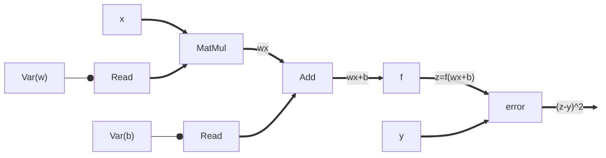

# TensorFlow

Let us now build the TensorFlow's dataflow graph for a very simple
*single-neuron* ML model training task. Let us say we have an ML model with one
neuron that takes a single input vector $x$ and outputs a single output vector
$z=f(wx+b)$.  The ground truth is a single output vector $y$. This gets
expressed in TensorFlow as:

All the functions in TensorFlow are *primitive* operators with known
differentiations. TensorFlow can apply chain rule on the dataflow graph.
