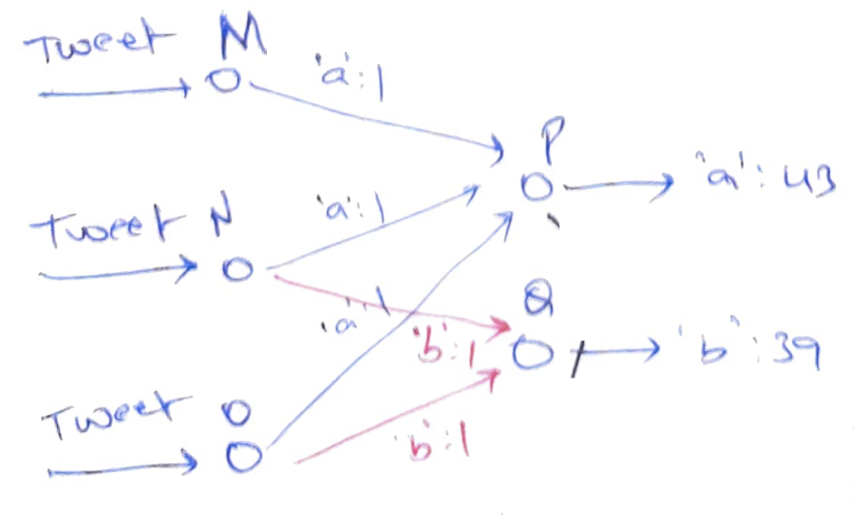
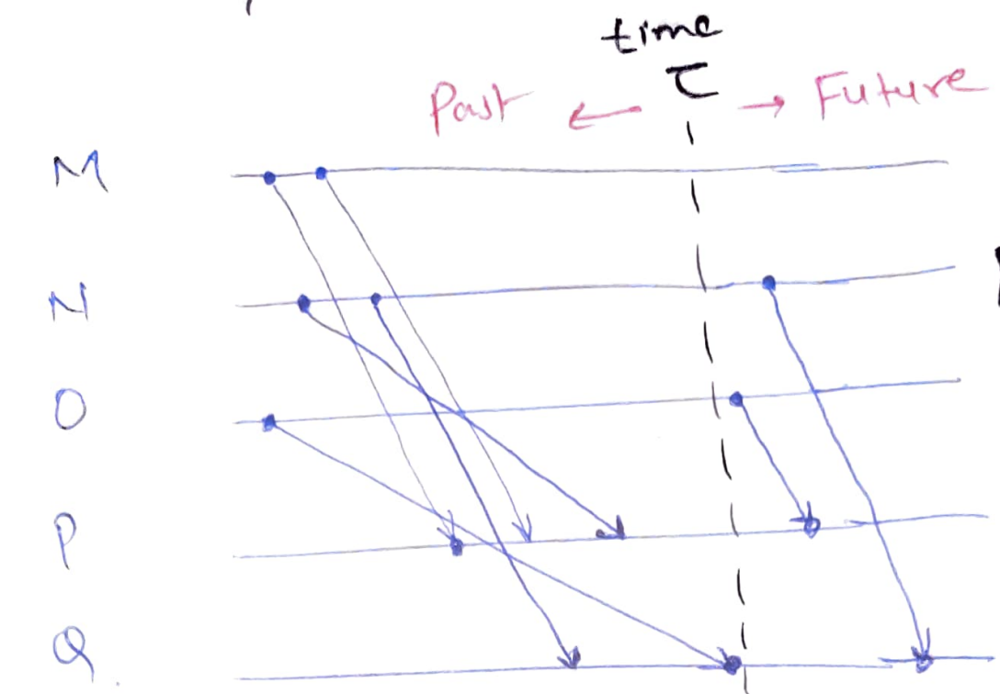
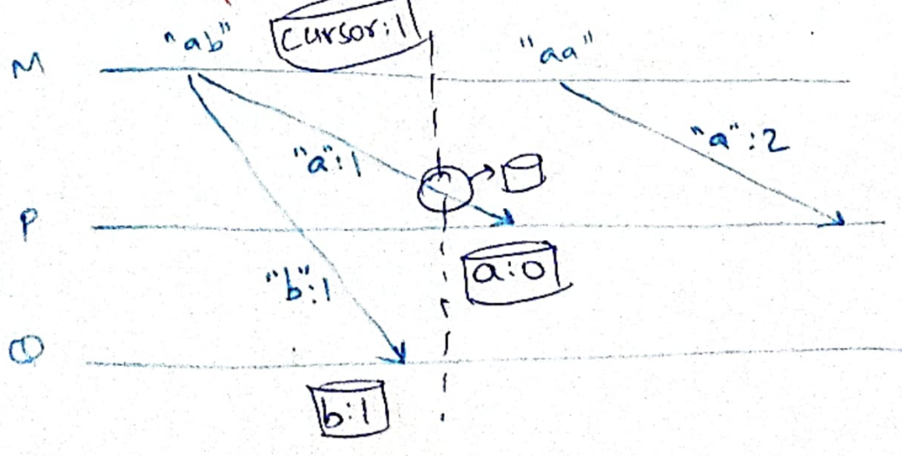
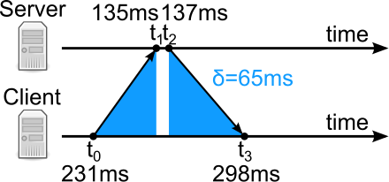
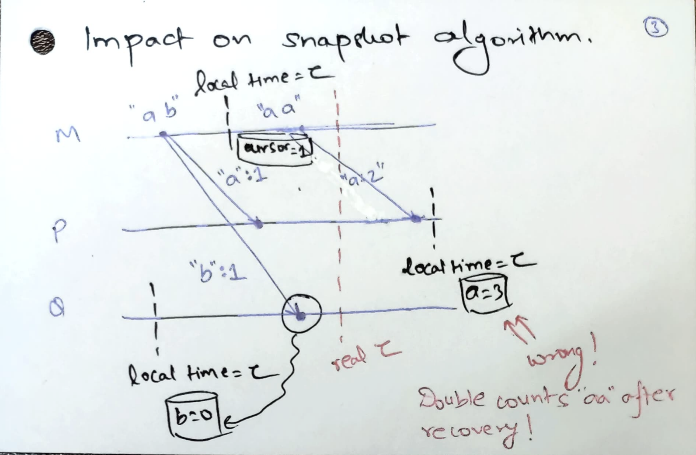
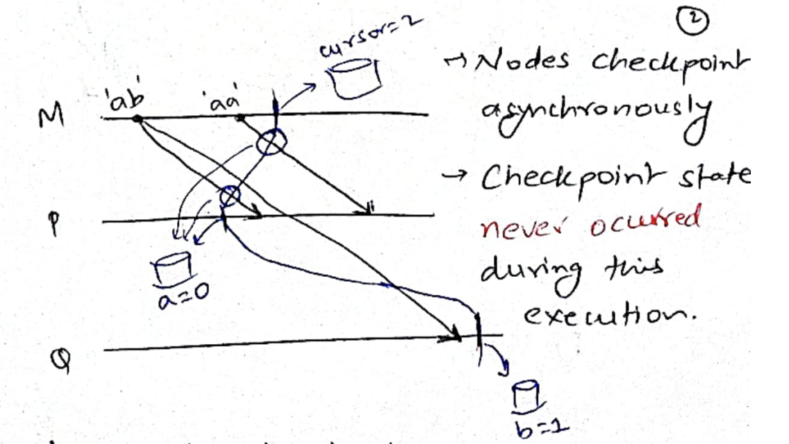
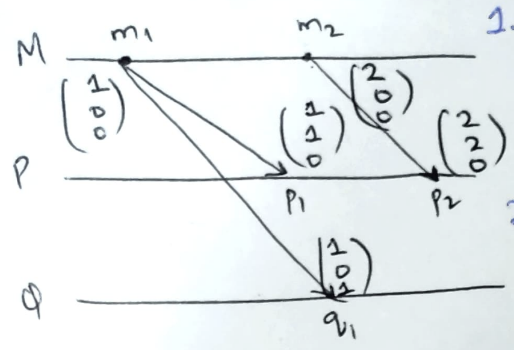
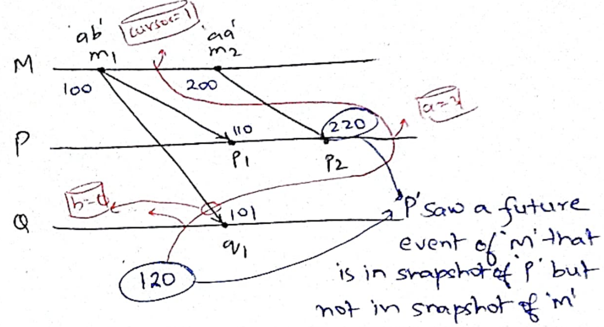

# Asynchronous checkpointing

- [Asynchronous checkpointing](#asynchronous-checkpointing)
  - [Clock drifts](#clock-drifts)
    - [Network Time Protocol](#network-time-protocol)
    - [Impact of clock drifts](#impact-of-clock-drifts)
  - [Consistent Checkpoints](#consistent-checkpoints)
  - [Vector clocks](#vector-clocks)
  - [Checkpointing algorithm](#checkpointing-algorithm)
- [Summary](#summary)

Continuous operator model provided good freshness in the common case but because
of its stateful workers, fault tolerance mechanism of rerunning tasks on another
worker no longer works. Spark streaming removes state from workers by
discretizing streams into mini-batches. Doing so simplifies fault tolerance, by
making tasks stateless, but reduces freshness in the common case: when there are
no failures.

Let's go back to continuous operator model. Here, tokenizer is running on
workers M, N, O and aggregator is running on workers P, Q. Remember that M, N,
and O contain "cursors" of their streams and P and Q contain word counts.

We will try another approach to do fault tolerance of stateful operators by
creating checkpoints. A checkpoint, also called a snapshot, can be thought of as
a *cut* in the timeline of events that separates past events (in the checkpoint)
from future events (not in checkpoint).

The following example shows an example event timeline where worker M is
processing two tweets "ab" and "aa". It sends word counts to workers P and Q. We
ignore workers N and O in rest of the discussion. Processing of tweet "ab" is in
the checkpoint and of tweet "aa" is not in the checkpoint. Worker M checkpoints
it cursor; workers P and Q checkpoint their respective word counts.

One approach to create an asynchronous global checkpoint could be to let the 
*checkpoint coordinator* pre-decide and broadcast a global timestamp 
$\tau = now + \Delta$.  Each worker checkpoints its state at this pre-decided
timestamp. Mappers checkpoint their "cursor": which ID of the stream did they
process last, and reducers checkpoint their word counts.

This simple approach loses in-flight messages. We also need to checkpoint
messages that were sent before the checkpoint but received after the checkpoint
time. 

But, now how do we know that a checkpoint is *complete*? Workers P and Q might
get a pre-checkpoint message at any time in the future.  One simple algorithm is
to maintain a "deficit" count at the checkpoint coordinator. For example, the
mappers can remember how many messages it sent before the checkpoint time. And
the reducers can remember how many messages it has received from before the
checkpoint time. Checkpoint coordinator can maintain 
total deficit = total sent - total received. 
After the checkpoint time $\tau$ has passed, as reducers receive more messages,
they keep increasing total received.  When total deficit hits zero, we
know that the checkpoint is complete.

Upon crash, all workers and channels revert to the last checkpoint: mappers
rewind to the saved cursor, in-flight messages are put in the receive buffers of
reducers, reducers roll back to the saved word counts.

## Clock drifts
Unfortunately, the pre-decided timestamp approach does not work because it is
practically very difficult to have perfectly synchronized clocks. Computer
clocks can drift due to variety of reasons such as temperature, vibrations, and
age of the computer. Ordinary quartz clocks [drift by](https://medium.com/geekculture/all-things-clock-time-and-order-in-distributed-systems-physical-time-in-depth-3c0a4389a838) 1 second in 11-12 days.

### Network Time Protocol
We don't feel such drifts while using computers since computers commonly use
network time protocol to periodically adjust their local clocks with
*timeservers*. Time servers are typically equipped with more expensive and
bulkier *atomic clocks*.  Atomic clocks drift by 1 second in 100 million years!

In the most basic sense, NTP works as follows:

The client adjusts its clock by calculating the drift.  Assuming clock drift 
(= server time - client time) is $\theta$ and RTT is $\delta$, then

* $t_1 = t_0 + \theta + \delta / 2$
* $t_2 = t_3 + \theta - \delta / 2$
* $\theta = \frac{(t_1 - t_0) + (t_2 - t_3)}{2} = -128.5ms$

With NTP, computer times are typically within 1ms of each other in a LAN
setting. This is not that great for creating checkpoints: within 1ms, CPUs could
run millions of instructions.

### Impact of clock drifts
Let us see how clock drifts can lead to creation of *inconsistent checkpoints*
when running the above algorithm. 

A *consistent checkpoint* is a global state such that:
* the checkpoint state is reachable from the initial state, and
* final states reachable after recovering from the checkpoint state are
  reachable from the initial state in a fault-free execution.

Checkpoint coordinator pre-decided a timestamp
$\tau$ to checkpoint; all workers create a checkpoint when their local time
becomes $\tau$. Notice that the clock drifts in different computers can be 
arbitrary, so local times do not match the real time and do not match each
other. Following shows an inconsistent checkpoint:

Pre-decided timestamp approach tried to create a checkpoint at an actual global
time. In absence of clock drifts, such a checkpoint is consistent since it
captures a global state where workers and channels were *simultaneously* in this
state. This checkpoint properly separates past from the future and is therefore
consistent.

Whereas, in the example above, "future" event i.e, events not in the checkpoint
"M sending a:2" has affected "past" event, i.e, events in the checkpoint, "P
receiving a=2" and is therefore inconsistent. Recovering from this checkpoint
leads to double counting of "aa".

## Consistent Checkpoints
Since *no one* knows the actual global time, we must relax the *simultaneity*
condition for creating checkpoints. We will now checkpoint a global state where
workers and channels *may have been* simultaneously in that state. Note that the
workers and channels *may never be* in the checkpoint state in *this execution*.
The following shows an example consistent checkpoint.

Observe that the system was never simultaneously in the checkpointed state! When
`Q` had "b=1", `P`'s count was already "a=3".

## Vector clocks
We now want to tweak the above algorithm and make it work in the presence of clock
drifts. Since workers anyways do not know the actual global time, we are going
to let go of actual global time and the workers' local clock time. We will
instead use a *virtual time* in the form of *vector clocks*.

A vector clock $c$ is a vector of integers $(c_1, c_2, \cdots, c_p)$. There is
one component in the vector clock for each worker. A clock of (1, 2) means that
worker 1 has seen 1 event and worker 2 has seen 2 events. There are, generally
speaking, three types of events: an internal event that just changes the local
state, a send event that sends a message to another worker, and a receive event
that receives a message from another worker and changes its local state.

The time is kept in the following manner:
1. At an internal event, process $i$ increments $c_i$;
2. At a send event, process $i$ increments $c_i$ and sends its clock with the
message;
3. At a receive event, process $i$ increments $c_i$ and for all other clock
components does $c_j = max(c_j, s_j)$ where $s$ is the vector clock of the
message. 

The following shows an example:

We say $u \leq v$, if $\forall i: u_i \leq v_i$. Further, $u < v$, if $u \leq v$
and $u \neq v$.  We say two vector clocks are concurrent $u || v$ if neither $u
< v$ nor $v < u$. With the above timekeeping mechanism, vector clocks *maintain
causality*, i.e, $C(e_1) < C(e_2)$ iff $e_1 \rightarrow e_2$.

In the above example, $C(m_1) < C(p_2)$; $m_1$ has causally affected $p_2$,
i.e, $m_1 \rightarrow p_2$.  Whereas, $C(p_2) \not< C(q_1)$ and $C(q_1) \not<
C(p_2)$, therefore $C(p_2) || C(q_1)$. Neither has causally affected the other,
i.e, they are concurrent, $p_2 || q_1$.

Since vector clocks maintain causality, we can redefine "past" and "future" in
terms of vector clocks.  In the inconsistent checkpoint seen before, worker `P`
had a "future event" $(2, 2, 0)$ in the checkpoint but worker `M` did not have a
"past event" $(2, 0, 0)$ in the checkpoint. Past and future correspond to
causality and not real-time; they are decided by $<$ relationship of vector
timestamps, i.e, $(2, 0, 0) < (2, 2, 0)$.

## Checkpointing algorithm

With this understanding, we can now create consistent checkpoints. The idea is
simple: checkpoint before processing a message from the "future".  The idea is
that the vector timestamp has $P+1$ components for $P$ processes.  The last
component is incremented only to create the next checkpoint. The algorithm also
uses the property that the process $i$ which owns the $c_i$ component of the
vector timestamp always has the max value for that component (i.e, it is most
caught up).

The algorithm proceeds as follows: a co-ordinator process decides to checkpoint 
spontaneously. It increases the $c_{p+1}$ by 1. Since, the co-ordinator process 
is the only process that can initiate a checkpoint, it is guaranteed to have the
maximum value of $c_{p+1}$. The process checkpoints itself and starts sending
messages timestamped with the new vector timestamp.

Let us say that the old value of $c_{p+1} = d$ and new value is $d+1$.  Now it
is straightforward to distinguish messages sent before the checkpoint and the
messages sent after the checkpoint.

When a process receives a message with $c_{p+1} = d+1$ for the first time it
checkpoints itself and updates its clock according to the usual vector time
propagation mechanism. Therefore, all the future messages sent by it will have 
$c_{p+1} = d + 1$. Checkpoint is created *before* processing the incoming
message with $c_{p+1} = d + 1$

But since messages may be delivered out-of-order, a process that had already
checkpointed may receive $v_{p+1} = d$ messages. These messages need to be
checkpointed separately as "in-flight" messages of the channel.

The only remaining difficulty is how to detect whether the checkpoint is
complete. Since, messages may be arbitrarily delayed, we may not know if we
might still receive a message with $v_{p+1} = d$. The simple approach described
in pre-decided actual timestamp still works: each process remembers the count of
$v_{p+1} = d$ that it has sent minus the count of $v_{p+1} = d$ messages it has
received. 

When the process creates a checkpoint, it sends this count to the coordinator
process. This count can be summed across all the processes to know the pending
in-flight messages (total deficit). As messages are received, total deficit is
decremented. When the total deficit hits zero, we can be sure that the
checkpoint is complete!

# Summary

We saw a general purpose asynchronous checkpointing scheme that is guaranteed
to create consistent checkpoints. This scheme works for any distributed program
(beyond just streaming computations). The algorithm works because:

1. Vector clocks are isomorphic to causality, i.e, 
$C(e_1) < C(e_2) \Leftrightarrow e_1 \rightarrow e_2$. 
Because of this property and the timekeeping mechanism, we can judge if a message
is from "past" (pre-checkpoint) or from "future" (post-checkpoint). 
  * First post-checkpoint message can be easily identified to initiate a
    checkpoint. 
  * In-flight pre-checkpoint messages can be easily identified and checkpointed.
2. Timekeeping in vector clocks ensure that the process always has the maximum
value for its own component. Checkpoint coordinator can safely increment its own
component to request another checkpoint. No other worker can by itself increment
the clock component of checkpoint coordinator.
3. Each worker never puts a "future" event in the checkpoint. When it receives a
message from the future, it immediately creates a checkpoint before processing
the message.

One of the most interesting part is that the consistent checkpointed state may
actually have *never occurred* during the execution of the program! We saw an
example of this. You can read [more about it
here](https://github.com/codenet/public-notes/blob/main/paper-1989-vector-clock.md)
and of course in the paper.