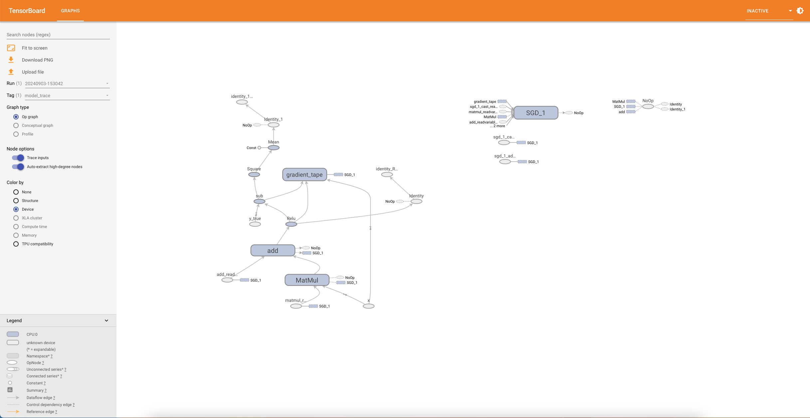
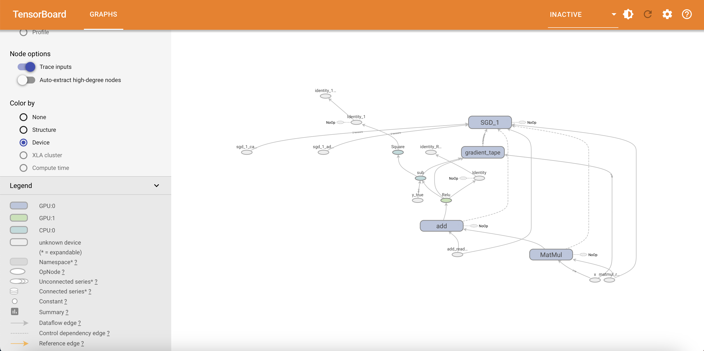
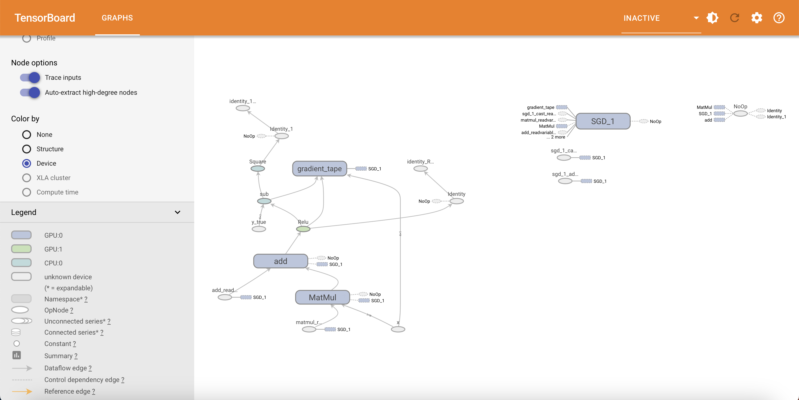
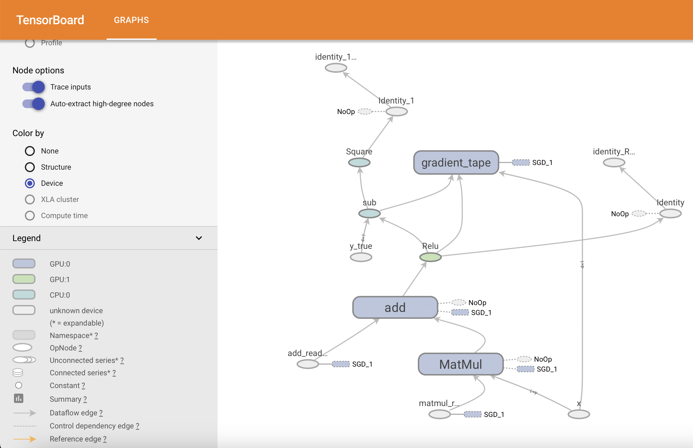

# TensorFlow Graph for Single Neuron ML Model

### Visualization on Tensorboard
* Download the `demos/tf.py` file.
* Clear any existing logs and run the tensorflow code: `rm -rf ./logs/ && python tf.py`

* Run `tensorboard --logdir logs/single_neuron`
* Open the TensorBoard URL in your browser to visualize.


### Walkthrough

* In this demo we are trying to replicate the example which is described [here](../compute-tf.md).

* We used `2 GPUs (GPU:0, GPU:1)` and `1 CPU (CPU:0)` to run this code.

```python
import tensorflow as tf
import datetime

# Printing all the available devices (GPU, CPU) in the host machine.
print("Available devices:", tf.config.list_physical_devices())

# x: input vector
# y: ground truth
x_train = tf.constant([[1.0], [2.0], [3.0], [4.0]], dtype=tf.float32)  
y_train = tf.constant([[2.0], [4.0], [6.0], [8.0]], dtype=tf.float32)  

# w: weight, b: bias
w = tf.Variable([[1.0]], dtype=tf.float32, name='weight')
b = tf.Variable([0.0], dtype=tf.float32, name='bias')

# f(x) = max(0, x)
# Placing this activation function operator on GPU:1
def activation_function(x):
  with tf.device('/GPU:1'):
    return tf.nn.relu(x) 

# Error function returns the sqaure of difference of vectors
# Placing this operator on CPU:0
def error_function(y_true, y_pred):
  with tf.device('/CPU:0'):
    return tf.square(y_true - y_pred)

optimizer = tf.keras.optimizers.SGD(learning_rate=0.01)

# The training function which takes x and y_true as argument
# Placing this function on GPU:0
@tf.function
def train_step(x, y_true):
  with tf.device('/GPU:0'): 
    with tf.GradientTape() as tape:
      wx = tf.matmul(x, w)
      wx_plus_b = wx + b 
      z = activation_function(wx_plus_b)
      loss = error_function(y_true, z)
    
    gradients = tape.gradient(loss, [w, b]) # Gradient calculation
    optimizer.apply_gradients(zip(gradients, [w, b])) # Updating model parameters 'weight' and 'bias'
  
  return z, loss

# Logs will be stored here
log_dir = "logs/single_neuron/" + datetime.datetime.now().strftime("%Y%m%d-%H%M%S")
writer = tf.summary.create_file_writer(log_dir)

tf.summary.trace_on(graph=True)

outputs, loss = train_step(x_train, y_train)

with writer.as_default():
  tf.summary.trace_export(name="model_trace", step=0)

print("USE `tensorboard --logdir logs/single_neuron` to visualise graph on TensorBoard")
```

We get the following result when we visualize the tensorflow's dataflow graph on TensorBoard:






Here we can observe that `weight` and `x` goes as input to `MatMul` operator. The output of this operator and `bias` goes as input to the `add` operator. All this is done in `GPU:0` as can be seen through the legend.

The operator with the activation function (relu) is present in `GPU:1`.

The `sub` operator calculates the difference of `y (ground truth)` and output of activation function. Finally the `square` operator computes the sqaure of this vector. Remember, our error function was `tf.square(y_true - y_pred)`.

Both the `sub` and `sqaure` operators are present in `CPU:0`.

The `sgd` node (stochastic gradient descent) updates the model parameters based on the current gradient. This has control edges to other operators to start future iterations.