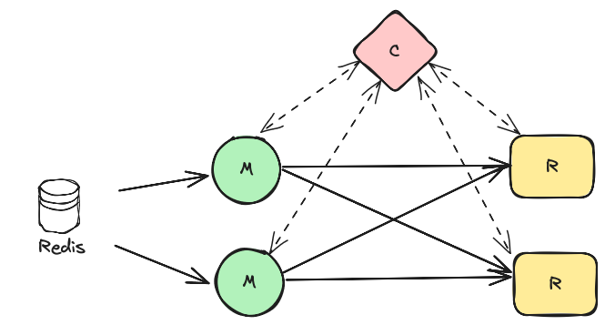
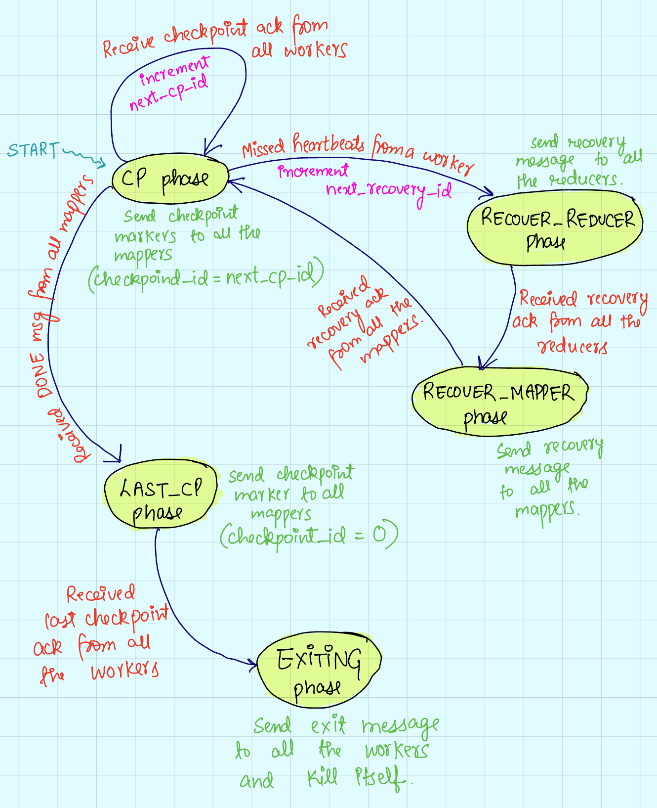

# Lab-2: Lightweight asynchronous consistent checkpointing

Find the deliverables in docs/deliverables.md.

## High Level System Overview.

In this assignment, you will implement Chandy-Lamport Algorithm on a Flink-like
setting for consistent global checkpointing of the system and use these
checkpoints to recover from worker failures.

The system performs word counting while being resilient to failures (except for
the coordinator; we will assume that the coordinator never dies, until the job
is done). 

There are 3 types of workers:

1) Mappers
2) Reducers 
3) Coordinator

The resiliency is achieved by using checkpoints. In this method, each worker
(mapper & reducer) creates checkpoints every once in a while.  And whenever a
failure happens, all of them rollback to the last completed checkpoint. However,
the checkpoints needs to be consistent and to achieve that we use Flink-like
checkpointing.

### The Mapper

#### Main tasks:-

1) Each mapper reads a file name from its redis stream, and perform word count
on the words of this file.
2) Based on a hashing function (word -> reducer), sends certain word counts to
certain reducer.

#### Auxiliary tasks:-

1) Checkpoints itself when asked by the coordinator (Save the last stream id it
read from redis into a file).
2) Forward checkpoint markers to the reducers.
3) Sends checkpoint_ack to the coordinator when done creating a checkpoint.
4) Recovers itself when asked by the coordinator.
5) Sends recover_ack to the coordinator when done finishing recovery.
6) Sends heartbeats to the coordinator after every HEARTBEAT_INTERVAL.
7) Notifies coordinator that it is done when no more files are left to process
in its redis stream.

### The Reducer

#### Main task:-
1) Receives the words from the mappers, and keeps a counter for each word.

#### Auxilary task:-
1) Checkpoints itself when it receives markers from all the mappers.
2) Sends checkpoint_ack to the coordinator when done creating a checkpoint.
3) Recovers itself when asked by the coordinator.
4) Sends recover_ack when it is done recovering.
5) Sends heartbeats to the coordinator after every HEARTBEAT_INTERVAL.

### The Coordinator
#### Main Tasks:-
1) Periodically sends checkpoint markers to the mappers.
2) Monitors if any worker missed heartbeats.
3) Sends recovery command when required.
4) Sends exit command when required.

In this assignment we fix the number of mappers and reducers to 2 with 1
coordinator.  So the system looks like the following.




## Low level system design

### Mapper design

```python
# STATE held by the Mapper
  idx: int                                # its index 0 or 1
  reducer_ports: list[int]                # ports on which reducers will receive messages
  pid: int                                # its process id
  id: str                                 # its id in the form of "Mapper_{idx}"
  last_cp_id: int                         # id of the last checkpoint that was created by it
  c_socket: socket.socket                 # the socket that will be used to communicate with the coordinator
  last_stream_id: bytes = b"0"            # cursor in the redis stream until which it has completed processing
  last_recovery_id: int = 0               # id of the last recovery (more on this below)
  reducer_sockets: list[socket.socket]    # sockets it will use to send messages to the reducers  
  is_wc_done: bool = False                # set to true when nothing is left to process.
```

1. A mapper is a Python process, which the Coordinator starts.

2. The process simply starts and waits for threads (described below) to 
complete. To avoid races, a _command queue_ is used as a synchronization
primitive between the threads. Threads add commands in the queue, only one
thread consumes the queue (Command handler thread). Only this thread edits
the state of the mapper.

3. The process starts the following threads:
   1. _Heartbeat thread_: Sends heartbeats to the coordinator over a UDP
   connection after every HEARTBEAT_INTERVAL.

   2. _Coordinator handler thread_:- Receives checkpoint/recovery/exit messages
   from the coordinator. It processes these messages and puts an appropriate
   command in the command queue. 

   3. _Command handler thread_:- It constantly reads from the command queue and
   executes the command. If the queue is empty, it performs word count by reading
   file from redis stream.

We now describe how the command handler thread needs to handle commands. The
thread can receive 3 such commands: Checkpoint, Recover, Exit. And it also is
doing word counting when there are no commands in the queue.

1. Upon receiving a checkpoint marker, the thread should first checkpoint its
`last_stream_id` and then forward the checkpoint marker to all the reducers.
After checkpointing, the thread should update the `last_cp_id` and send a
checkpoint_ack to the coordinator.

2. Upon receiving a recovery command, the command handler thread should recover
`last_stream_id` from the requested checkpoint_id, update the
`last_recovery_id`, and send a recovery_ack to the coordinator.

3. When there are no commands to process, it reads a file from its redis stream;
   it counts the words and forwards each word count to an appropriate reducer.
   Usually in streaming systems, the processing never ends. However we want to
   check whether word counts are correct in the end (after recovery etc.) so we
   work with *bounded* streams.  When the stream is exhausted by the mapper, it
   must inform the coordinator that it is finished by sending it a done message.
   
   Upon receiving done from all the mappers, the coordinator will send
   last_checkpoint message to the mappers (a checkpoint marker with id = 0). For
   workers there is nothing special about this message, but they send
   last_checkpoint_ack instead of checkpoint_ack upon completing this
   checkpoint. Upon receiving last_checkpoint_ack from everyone, coordinator can
   then trigger the Exit Phase.
   
4. Upon receiving an exit command, the command handler thread can close all
sockets and kill the process.


#### Messages that can be received:-

From coordinator
1. checkpoint with checkpoint_id
2. recovery with checkpoint_id, recovery_id
3. exit

#### Messages that can be sent:-
To reducer
1. word_count
2. fwd_checkpoint

To coordinator
3. heartbeats
4. checkpoint_ack
5. last_checkpoint_ack
6. recovery_ack
7. done

### Reducer design

```python
# STATE held by the Reducer
  idx: int                             # its index 0 or 1
  pid: int                             # its process id
  id: str                              # its id in the form of "Reducer_{idx}"
  c_socket: socket.socket              # the socket that will be used to communicate with the coordinator
  listen_port: int                     # Port on which it will receive messages from mapper
  server_socket: socket.socket         # Socket on which i will listen from the mapper
  barrier: threading.Barrier           # Blocking threads for the alignment phase of Flink
  wc: dict[str, int]                   # Count of each word
  last_recovery_id: int = 0            # id of the last recovery (more on this below)
  last_cp_id: int                      # id of the last checkpoint that was created by it
  client_sockets: list[socket.socket]  # Socket on which it will receive messages from the mapper
   
```
1. A reducer is a Python process, which the coordinator starts.

2. Reducers follow a similar structure as Mappers. The process simply starts and
waits for these threads to be completed. Only the command handler thread
modifies the state to avoid races. Other threads just put commands in the
_command queue_.

3. Reducer process has the following threads.
   1. _Heartbeat thread_: Sends heartbeats to the coordinator after every
   HEARTBEAT_INTERVAL. 

   2. _Handle mapper thread_: There are `NUM_MAPPERS` number of such threads;
   one for handling connection from each mapper. This thread receives words and
   checkpoint markers from the corresponding mapper, and puts an appropriate 
   command in the command queue.

   3. _Coordinator thread_: Receives Recovery/Exit messages from the coordinator
   and puts the corresponding commands in the command queue. 

   4. _Command handler thread_: Reads from the command queue and executes the
   command. There can be 4 such commands: WordCount, Checkpoint, Recover, Exit.

4. The command handler thread works similar to as in mappers. 

The primary difference is that reducers receive the checkpoint marker from the
mappers and not the coordinator. The message type for this message would be
fwd_checkpoint. Upon receiving a checkpoint marker, reducer should use
Flink-like algorithm to do _alignment_ for consistent snapshotting, i.e, block a
channel upon receiving a checkpoint marker until it receives checkpoint marker
from all the channels. The state contains a barrier for this purpose.

Another difference from mappers is that reducers never send done message to the
coordinator as it does not really know whether it is done (it might receive yet
more messages from the mappers).

#### Messages that can be received:-
From mappers:
1. word_count
2. fwd_checkpoint

From coordinator:
1. recovery
2. exit

#### Messages that can be sent:-
To coordinator:
1. heartbeats
2. checkpoint_ack
3. last_checkpoint_ack
4. recovery_ack


### Coordinator design

Before explaining coordinator design, we will first explain the checkpointing
and recovery process that should justify the design of the coordinator.

#### Checkpoint Process
1. Coordinator periodically sends checkpoint messages to mapper. Checkpoint
messages contains `checkpoint_id, recovery_id`.

2. Upon receiving the checkpoint message, the mapper will commit its state
(`last_stream_id`) to the file system. It then forwards the checkpoints to the
reducers.

3. Mappers then send a checkpoint_ack with the `checkpoint_id` to the
coordinator.

4. Reducers upon receiving the message from all the mappers will checkpoint
their state (local word counts) to the file system and similarly send a
checkpoint_ack with `checkpoint_id` to the coordinator.

5. After receiving the checkpoint_ack from a worker, the coordinator is assured
that the checkpoint with `checkpoint_id` is created by the worker.


#### Recovery Process
Recovery needs to be triggered when the coordinator misses a heartbeat from a
worker. To recover, coordinator needs to take the following steps:

1. Restart the crashed worker.

2. Just restarting is not enough, we also need to inform everyone to reset
themselves to an older completed checkpoint (minimum `checkpoint_id` across all
the workers).  This is done by sending a recovery message to all the workers. This
message includes `recovery_id` and `checkpoint_id`. `checkpoint_id` is the id of
the checkpoint where they need to rollback to.  `recovery_id` acts as a logical
clock of the system. Say, all the workers have been recovered but a mapper is
yet to recover, so it will keep sending word counts to the reducer. To prevent
this, every message is augmented with `recovery_id`. Upon seeing older
`recovery_id` in a message, reducer can easily reject these messages.

#### Phase machine
To manage the checkpointing and recovery process described above, we maintain a
_phase machine_ inside the coordinator. (It is basically a state machine but we
call it a phase machine to differentiate it from the coordinator state described
below.)

Coordinator is in a "PHASE" according to which it performs certain actions.

```python
class PHASE(IntEnum):
  CP = 1
  RECOVER_REDUCER = 2
  RECOVER_MAPPER = 3
  LAST_CP = 4
  EXITING = 5
```

1. The system starts in checkpointing (`CP`) phase. In this phase, the
coordinator sends checkpoint markers (with `id = next_cp_id`) to all the
mappers. Then it waits for acknowledgement from all the workers for this
checkpoint id. When it has received acknowledgment from all the workers, it
increments the `next_cp_id` and again enters the `CP` phase. After waiting for
`CHECKPOINT_INTERVAL`, it sends next checkpoint marker.

2. Whenever the coordinator notices that it has missed heartbeats from a certain
worker, it assumes that the worker has failed, and it needs to recover. For
simplicity, it first recovers all the reducers, and then recover the mappers so
that reducers are ready to receive post-recovery data from the mappers.
Coordinator enters `RECOVER_REDUCER` phase whenever there is any failure. In
this phase, the coordinator sends recovery message to all the reducers. When it
has received recovery_ack from all the reducers, it transitions into
`RECOVER_MAPPER` phase. 

3. `RECOVER_MAPPER` phase is similar to `RECOVER_REDUCER` phase. The coordinator
sends recovery message to all the mappers. When it has received recovery_ack
from all the mappers, it transitions back into `CP` phase. 

4. When both the mappers have told the coordinator that they are done reading
their redis streams, the coordinator transitions to `LAST_CP` phase. In this
phase, the coordinator asks both the mappers to make their final checkpoint.
This special checkpoint marker should have `checkpoint_id = 0`. This should be
the last checkpoint a worker makes.

5. When the coordinator has received last_checkpoint_ack from all the workers
for the final checkpoint. It transitions into the `EXITING` phase.

6. In `EXITING` phase, the coordinator sends `exit` message to all the workers.
After sending the messages, the coordinator kills itself.

The above phase diagram is shown below:




#### Coordinator state
To run this phase machine, coordinator maintains a state described below.  In
this state, the coordinator tracks the current phase it is in. It also includes
a view of all the workers, i.e what the coordinator thinks about the state of
each worker.

```python
# Global state that contains worker state.

self.phase: PHASE                      # The current phase of the system. The system starts in CP as described above.
self.next_recovery_id: int             # The id of the next recovery that coordinator will send to all workers. This ID is useful to distinguish post-recovery and pre-recovery messages/workers. This ID should monotonically increase.
self.next_cp_id: int                   # The id of the next checkpoint marker that coordinator will send to mappers. Mappers will then forward these markers to reducers. This ID should monotonically increase. It starts from 1.
self.workers: dict[str, WorkerState]   # State of each worker in the system.
self.sock: Optional[socket.socket]     # UDP socket for communicating with workers.
```

```python
# Worker State.

self.idx: Final[int]                # Index of this worker.
self.id: Final[str]                 # It can be Mapper_1, Mapper_2, Reducer_1, Reducer_2.
self.is_mapper: Final[bool]         # True, if a worker is mapper. False for reducers.
self.last_hb_recvd: int             # When did this worker send last heartbeat (in seconds).
self.last_cp_id: int                # The ID of last checkpoint a worker successfully made.
self.recovery_id: int               # The ID from where worker last successfully recovered.
self.is_done: bool                  # Only for mappers (True when a mapper has finished reading its redis stream).
self.last_checkpoint_done: bool     # Has a worker finished making its last checkpoint.
self.addr: Final[tuple[str, int]]   # For udp connection ("localhost", port).
self.process: Process               # Process object for this worker (Each worker is a Python process). Coordinator can use this handle to kill the process (for testing) and replace it with another process (at the time of recovery).
```

#### Design
1. A coordinator is a Python process which is created in our `main.py` .

3. The coordinator starts the Reducers and Mappers after intial setup (refer to
starter code for this).

3. Then it starts 2 threads: sender and receiver. Again, only receiver thread
edits the state to avoid races. Receiver just puts the current phase in the
*phase queue*; sender thread reads the phase from queue to send appropriate
messages.

   1. Sender thread reads the current phase of the system through phase queue.
      If the queue is empty it does nothing.  Otherwise, based on the current
      phase, it sends appropriate messages of to the workers. 

   2. Receiver thread continuously listens for messages from workers. Based on
   the message received, it updates the global state and the phase.  If the
   update function (refer starter code) returns a phase, then we enqueue this
   phase into the phase queue, so that the sender thread can read it and take
   appropriate actions.

4. Finally, we have also setup a periodic alarm and attached an handler
(`monitor_health`) to it. The alarm is triggered after every HEARTBEAT_INTERVAL.
In this handler, the coordinator needs to check the last time when a HEARTBEAT
was received by all the workers. If there is a miss, it should start recovery.

#### Messages that Coordinator can receive:

From all workers
1. heartbeats
2. checkpoint_ack
3. last_checkpoint_ack
4. recovery_ack

Only from mappers
1. done

#### Messages that Coordinator can send:
To all workers:

1. recovery
2. exit

Only to mappers:
1. checkpoint

### Communication and messages

Communication from mappers to reducers happen via persistent TCP connections.
All communication between coordinator <-> mapper/reducer happens on a UDP
connection. 

We use message struct defined in `message.py` for sending / receiving messages.
It consists of following attributes:

1. Message Type: Type of this message. Could be HEARTBEAT, CHECKPOINT, WORD_COUNT, etc.
2. Source: Id of the worker who sent this message.
3. Kwargs: Dictionary for rest of the metadata associated with this message.

## Assumptions

1. Even though UDP is unreliable, we assume that the message is delivered
eventually without corruption.

2. We assume that the network never crashes. If workers are able to send
heartbeats to the coordinator, then they must also be able to send data to each
other.

3. The test script never crashes the coordinator. However, bugs in your code
could crash the coordinator.

4. We assume that file system is always available and reliable. Checkpoints
created in the local file system can be read and written reliably.