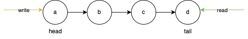

# Lab3: High Throughput Chain Replication using CRAQ

In this assignment you will implement [`CRAQ: A Distibuted Object-Storage System`](https://www.usenix.org/legacy/event/usenix09/tech/full_papers/terrace/terrace.pdf)
(Strong consistency variant - refer Section 2 of the paper)
from scratch and improve the read throughput as compared to the basic 
implementation of `Chain Replication` that we have provided. The read-write 
history should be linearizable.

## Specifications
- You have to implement both server and client side of the system.
- The system should be able to handle `SET` and `GET` requests.
- The system stores key-value pairs. Both key and value are strings.
- The system should be able to handle multiple clients (upto 32) concurrently.
- You need not worry about the fault tolerance of the system.
- The system consists of a single chain of 4 servers.

## Background

You are provided with a library `core/` which will help you in setting up the
server framework, handling connections and transfer of messages. You can use
this library to implement the server side of the system.
The library provides you with the following functionalities:
- `core/message.py` : To define the message format for communication between servers.
    The same format is used by the client to communicate with the server.
    All the messages should be of type `JsonMessage` and can contain any number of fields.
- `core/server.py` : Each server process will be an instance of the `Server` class.
    It listens for incoming connections and handles the messages in a separate
    thread. You can extend this class to implement your server.
    You should implement the `_process_req` method to handle the incoming requests.
- `core/network.py` : To establish connections between servers.
    The class `TcpClient` is used to establish a connection with a server.
    It maintains a pool of connections to the server and reuses them.
    The `send` method sends a message to a server and returns the response message from the server. \
    The class `ConnectionStub` maintains all the connections to the servers in the cluster.
    It takes a set of servers it can connect to and establishes connections to all of them.
    An instance of this class is made available to all the servers in the cluster.
    You are supposed to use this class to send messages to other servers in the cluster.
    It provides an interface to send messages to any server by name in the cluster without 
    worrying about the connection details. It provides the following methods:
    - `send` : To send a message to a server by name and get the response.
    - `initiate_connections` : To establish connections to all the servers in the cluster. 
        This method should be called during the cluster formation before sending any messages.
- `core/cluster.py` : The class `ClusterManager` is used to manage the cluster of servers.
    It starts the servers and establishes connections between them according to a specified topology.
    You can extend this class to implement your cluster manager 
    (See the provided chain replication implementation for reference).
    You may overwrite the `create_server` method to create your server instance.
    This class expects the following parameters:
    - topology: The cluster topology information of the form `dict[ServerInfo, set[ServerInfo]]`
    representing a set of servers each server can send messages to. This information is used to create `ConnectionStub`
    which maintains the connections between the servers as explained above.
    - master_name: Let's assume that the tail is the master for the sake of this assignment. This currently does not have much significance.
    - sock_pool_size: The number of sockets to be maintained in the pool for each server. This directly affects the number of concurrent connections that can be maintained by the server.
- `core/logger.py` : To log the messages and events in the system.
    You can use the `server_logger` and `client_logger` objects to log the messages.
    The client logs will be used to check the linearizability of the system.
    You can change the log level to `DEBUG` to see the logs on the console and debug your code.

## System Design of Chain Replication

### CrClient

The `CrClient` object can be used to send `SET` and `GET` requests to the cluster. The client picks the appropriate server to send the request based on the request type. If the request is a `SET` request, it sends the request to the `head` server of the chain. If the request is a `GET` request, it sends the request to the `tail` server of the chain.

The message format for the requests is of type `JsonMessage` and as follows:
- `SET` request: `{"type": "SET", "key": <key>, "value": <value>}`
- `GET` request: `{"type": "GET", "key": <key>}`

### CrCluster
We will manage a cluster of servers (in this assignment, we will have 4 servers) namely a, b, c and d. 
The interconnection among the servers will be mananged by the ClusterManager. 



- Topology: For each server we will store the set of servers that, this server can 
send messages to.
    ```python3
        topology={self.a: {self.b}, # a can send message to b
            self.b: {self.c},       # b can send message to c
            self.c: {self.d},       # c can send message to d
            self.d: set()}          # d does not send message to any server
    ```
- Each server will also store its previous and next server in the chain.
- The first server of the chain is called `head` and the last one is called `tail`.
- The `connect` method of `CrCluster` returns a `CrClient` object which can be used to send requests to the cluster.

### CrServer

This extends the `Server` class from the `core` library. It stores the key-value pairs in its local dictionary. It additionally stores the previous and next server in the chain. `_process_req` is called whenever a message is received by the server. The server processes the request and sends the response back to the client. 

#### Handling SET Request
Whenever the `head` server receives a `SET` request, it updates its local
dictionary and sends this request to its adjacent server. The `tail` upon receving
this request sends the acknowledgement as `"status" : "OK"` message to the
penultimate node of the chain. This way, the acknowlegment is sent back.

When this acknowledgement reaches back the `head` node, we say that the `SET`
request is completed and the head node sends the acknowledgement to the client.

#### Handling GET Request
In Chain replication, the `GET` request is always sent to the `tail` node. Hence
when it recieves such a request, it sends the response from its local dictionary.

## Checking Linearizability

**PRE-REQUISITE**: You need to have `go` version >= 1.21 installed on your system (baadal VM). You can find the installation instructions [here](https://golang.org/doc/install).

To test that the read-write history of the system is linearizable, we have used
[Porcupine](https://github.com/anishathalye/porcupine). You dont need to
understand its inner working. We have provided you the interface to interact with it.

We use the logs from the client to check if the history is linearizable or not. 
The `lcheck` library is used for testing. 
This assumes that the initial value of any key is `"0"` if no explicit SET call is made.

Run this command to test linearizability in lcheck directory:
```bash!
go run main.go <client-log-file-path>
``` 

The testcases can consist of multiple worker threads (clients) sending requests concurrently.
A request can be a `SET` or a `GET` request and the client logs the request and the response.
The following is the expected format of the client logs:
```
12:15:50 INFO worker_0 Setting key = 0
12:15:50 INFO worker_1 Getting key
12:15:50 INFO worker_1 Get key = 0
12:15:50 INFO worker_0 Set key = 0
```
The linearizability checker looks for 4 types of events in the logs:
- `Setting <key> = <value>` : A `SET` request is made by the client.
- `Set <key> = <value>` : The `SET` request is completed.
- `Getting <key>` : A `GET` request is made by the client.
- `Get <key> = <value>` : The `GET` request is completed.

NOTE: Here, worker and client are used interchangeably.

It also fetches the worker id from the log to track the order of events.
The worker name must follow the format `worker_<id>` and be unique.
A worker should only send requests one after the other, not concurrently.

Kindly ensure, that you do not modify any of the logging formats. 
This is important for the linearizability checker to work correctly and grade your submission.
A sample log file is provided in the `logs/` directory for reference.

## CRAQ
Taking the implementation of Chain Replication as reference, you have to 
implement CRAQ. Kindly use the `core/` library to setup the server framework,
handle connections, and transfer messages.

In CRAQ, the `GET` requests could be served by any server (not just the tail, as
opposed to the case of Chain Replication - Refer Section2.3 of the paper). Hence, the read throughput should be
comparatively high for CRAQ (refer Figure 4 of the paper).

You need to complete the the CRAQ implementation in the `craq` directory.
Do not modify the names of the files or classes provided in any of the directories.
We will be using the same names in our testcases.

## Measuring Throughput

The throughput of the system can be measured by the number of requests processed by the system in a given time. You can trigger requests from multiple clients concurrently to measure the throughput of the system. Each client should send requests sequentially for a specified duration. The throughput can be calculated as the total number of requests processed by the system in that duration.

In order to measure the throughput, you should limit the bandwidth of the network. You can use the `tc` command to limit the bandwidth of the network. We have provided the steps to limit the bandwidth in the Makefile. You can use the following command to limit the bandwidth to 100kbps:
```bash
make limit_ports
```
Please ensure that you limit the bandwidth for throughput measurement. Make sure the values `START_PORT` and `BANDWIDTH` in the Makefile are set correctly.

NOTE: The `tc` command requires `sudo` permissions. You can run the `make limit_ports` command with `sudo` permissions. This command works only on the linux machines. You are encouraged to use the provided `baadalvm` for this assignment.

## Submission

You need to submit a zip file of the `craq` directory. The zip file should be named as `<entry_number>_<name>.zip`.
Your submission should contain the following files:
- `craq/__init__.py`
- `craq/craq_server.py`
- `craq/craq_cluster.py`
- `craq/<any-other-file.py>`

## Evaluation
The read-write history generated by your implementation should be linearizable.
And the read-throughput of CRAQ should be higher than basic chain replication.

- 0 marks: Non-linearizable history.
- +20 Marks: Correct linearizable history of CRAQ with improved read-throughput.
    Note that your submission should achieve a minimum throughput improvement of 2X as compared to the basic chain replication for clean reads. Otherwise, you will not be eligible for these 20 marks.
- +20 Marks: Relative grading based on throughput under various tests.
