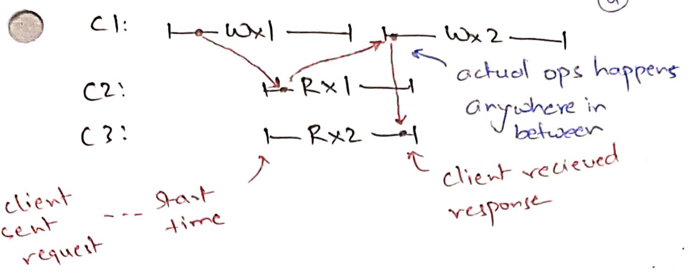
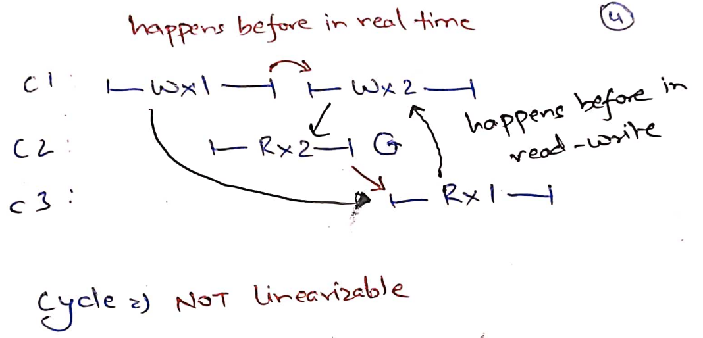
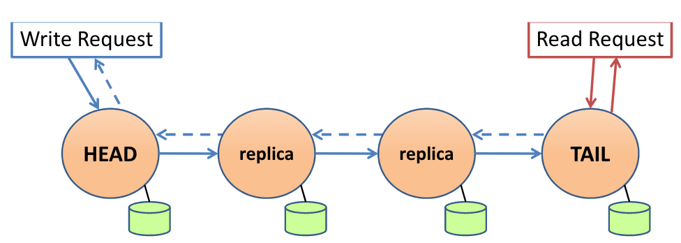
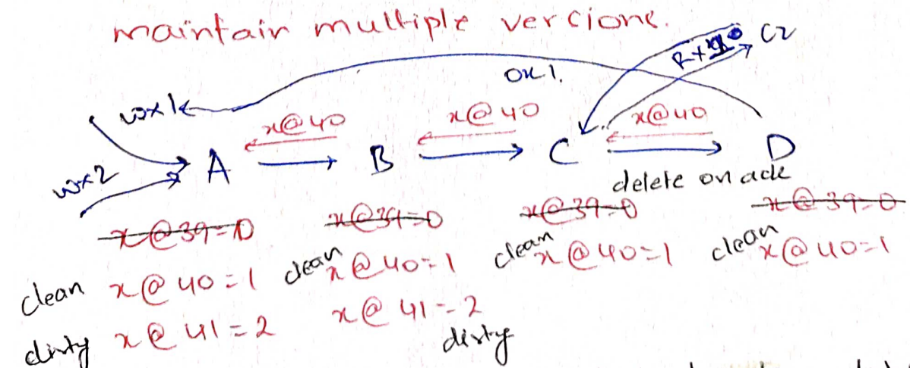
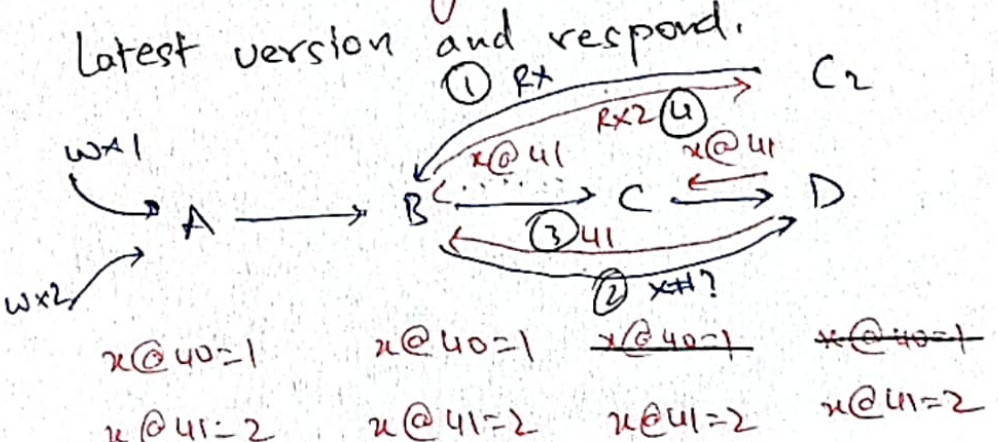

# Chain Replication with Apportioned Queries

- [Chain Replication with Apportioned Queries](#chain-replication-with-apportioned-queries)
	- [Linearizability](#linearizability)
		- [Safety and liveness](#safety-and-liveness)
	- [Chain Replication](#chain-replication)
	- [CRAQ design](#craq-design)
	- [Performance](#performance)
- [Summary](#summary)


CRAQ's goals are different from GFS. Here, we are interested in building a
key-value store where all the data fits in memory of a single server. But of
course, we will do replication for fault-tolerance. Unlike GFS's large files
with sequential reads/writes, we are interestd in doing small random reads and
writes to keys. Again unlike GFS, we want to provide more "consistent" view of
storage to (possibly) concurrent clients.

CRAQ builds on top of chain replication. Let us first see CR and then
improvements made by CRAQ.

## Linearizability
Let us now formally define what we mean by consistency. When talking about
consistency, we don't want to talk about the internals of a storage system.  We
judge consistency by the behaviors that can be observed by the clients. In
strong consistency, we create an illusion of a single storage server even in the
presence of replication. We want that all execution histories are
*linearizable*, i.e, one can find a *total order* among all read-write
operations such that:
* the total order matches the real time order for non-overlapping histories; and
* reads see last writes.

In particular, we want to find *linearization points* for each request where the
storage must have serviced the operation. Linearization points define the total
order as above. Following shows a linearizable history:



Following shows a history that is *not* linearizable:



Note that linearizability does not force an order on concurrent requests. For
example in the following linearizable history, Wx2 started after Wx1 but it was
executed before Wx1.


The goal of Chain Replication is to only show linearizable histories. 

### Safety and liveness

Note that linearizability is a *safety* property. Safety properties mean "bad
things never happen". We want our storage system to never show non-linearizable
histories.  But safety by itself is trivial to achieve. For example, a useless
storage system that *never* services any reads or writes never shows
non-linearizable histories. 

Therefore, we typically also specify *liveness* properties which means "good
things eventually happen". For our storage system, we want that all read/write
requests are eventually serviced assuming some servers are still alive and
reachable from clients; clients are indefinitely retrying their requests.
Liveness, without safety, is also trivial to achieve. For example, in another
useless storage system, client libraries directly return ok to every write
request and 1 to every read request. The system is live but does not provide
linearizability.

Safety and liveness can be applied to many things. For example, *safety:* do not
fail any course; *liveness:* get the degree. When designing locks, *safety:*
provide mutual exclusion; *liveness:* each lock acquire request (assuming proper
lock releases in the application) is serviced.

## Chain Replication

Under CR, storage servers are organized in a chain. All the write requests go to
the head which forwards it down the chain. Write acknowledgements are sent up
the chain by the tail. All the read requests are serviced directly by the tail.



This design clearly provides linearizable histories since the times at which
reads and writes were serviced by the tail directly serve as the linearizable
points.

Fault tolerance is done in a straightforward manner. When a node fails, a system
outside the chain (like an administrator or a more sophisticated heartbeating
system) simply removes the node from the chain. The requests that were in-flight
are retried by the clients.

Why is this correct? Let us say initially x=0 and Wx1 was in-flight. It was seen
by the tail which responded to another client with Rx1 and crashed. After fault
recovery, can the system respond with Rx0 (without any other Wx in flight).

This is not possible. Since all writes are flowing from head to tail, any write
request that was received by the tail, such as Wx1 above, was seen by *all*
servers in the chain. If there are no other Wx in-flight, new tail is guaranteed
to reply with Rx1.

To tolerate `F` failures, chain replication needs `F+1` systems in the chain.
This is as good as it can get! 

Since tail is solely servicing all the read requests, it is more heavily loaded
than other servers. The overall system's read throughput is equal to that
provided by the tail. To improve system throughput, we can maintain different
chain topologies for different keys as shown below. For example, the follows
shows an example with three servers.

```
A-H: S1 -> S2 -> S3
I-Q: S3 -> S1 -> S2
R-Z: S2 -> S3 -> S1
```

In the above setup, reads to the key `M` will be serviced by S2; reads to the
key `R` will be serviced by S1.

## CRAQ design

The above sharding was possible only because we were providing a get/set
interface for just single keys: each key is being get/set independently.
However, we may be interested in setting multiple keys together in a
"mini-transaction" such as atomically write `M=10, R=20` like in a bank account
transfer. Both writes should be visible together. If `M` and `R` flow through
two different chains, it makes atomicity complicated.

The idea of CRAQ is that we can improve read throughput of a single chain by
allowing reads from *non-tail* servers. The difficulty is that we want to
preserve linearizability.

In CRAQ, for each key, each server maintains *multiple versions*. When a write
request flows through a server, it writes the key's value at the next version.
This value is currently *dirty*. We have not seen acknowledgement back from the
tail. When we see a write acknowledgement back from the tail, we can delete all
the older versions of the key and mark the acknowledged version *clean*. Tail
never has dirty version of keys. Following shows an example. Initial value 
`x=0` was recorded at version `39`. There are two inflight writes: `x=1` is
written at version `40`, and `x=2` is written at version `41`. When a server
receives an acknowledgement of version 40, it deletes version `39` and marks
version `40` as clean.



To service a read request, if a server only has one clean version (that means
there are no in-flight writes downstream), it can directly respond with the
clean version. In the above example, `C` can directly respond `x=1` to `C2`
since it only has version `40` for `x`. It is sure that tail has seen `x=1` and
that the tail can not have seen a newer value of `x`.

However, if the read request goes to say `B`; `B` does not know which version
has tail seen. What shall we do then?

Option 1: serve latest version? This can break linearizability. `C` has no idea
about `x=2` so it is still returning `x=1`.

```
C0 (inflight write): |-- Wx2 ---
C1 (served by B)   :   |-Rx2-|
C2 (served by C)   :          |-Rx1-|
```

Option 2: serve latest clean version? This can also break linearizability. 
`B` does not know that `D` have actually already seen `x=2`.

```
C0 (inflight write): |-- Wx2 ---
C1 (served by B)   :         |-Rx1-|
C2 (served by D)   :  |-Rx2-|
```

If a server has dirty versions at the time of reads, CRAQ's solution is to ask
the tail about its version. Then, reply to the client with that version.



It is still linearizable as when the tail applies writes, responds to
read/version requests forms linearizable points.

## Performance

The table in Figure 5 shows that the read throughput increases linearly with
increasing the chain size. This is because all servers are able to answer read
requests. Test-and-set is much slower since it can have only one outstanding
write for a given key. This shows that pipelining multiple writes (by keeping
versions) down the chain significantly improves write throughput.

Figure 6 interestingly shows that even when we increase writes, CRAQ is able to
provide better read throughput than CR. This is surprising since when we
increase writes, non-tail servers may always have dirty versions during reads,
requiring a version check with the tail. In other words, all read requests might
still involve the tail. The reason for improved throughput is that the tail is
only responding with *version numbers* and not with full objects. If objects 
were small, we would not see such a read throughput improvement.

# Summary

CR and CRAQ are simple techniques for providing linearizability.
Linearizability is strong consistency: the storage system behaves *as if* it was
running on a single server. CR/CRAQ are widely used by industry, e.g.,
[Facebook](https://engineering.fb.com/2022/05/04/data-infrastructure/delta/) and
[MongoDB](https://www.mongodb.com/docs/manual/tutorial/manage-chained-replication/).

If we think beyond key-value stores with just get/set operations, chain
replication is actually implementing *replicated state machines* where we treat
each server as a *deterministic* state machine. With chain replication, we are
ensuring that each server applies transformations in the *same order*. Since,
the state machine is deterministic, all servers will follow the same state
transitions (with later servers slightly lagging behind the earlier servers).

For example, if our storage servers were Redis servers, we could send all Redis
commands, such as Redis functions, through the chain. Doing so easily replicates
Redis servers. [Ray](compute-ray.md) uses CR for its Global Control Store, built
on top of Redis.

Later in the course, we will see Raft that also replicates a log to build 
replicated state machines. Raft will have automatic fault tolerance, unlike
CR/CRAQ where a third-party FT system needs to remove servers from the chain.