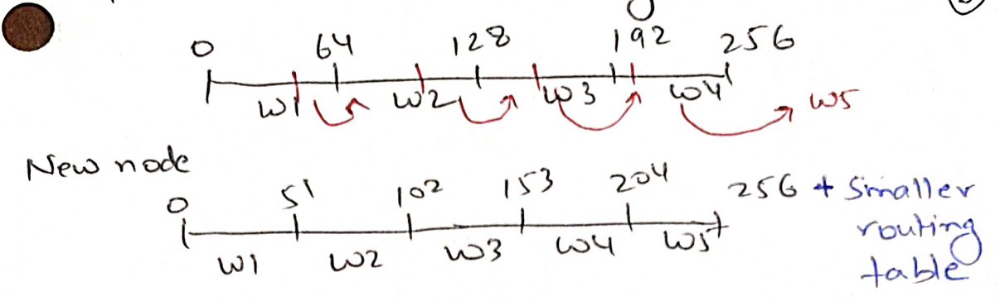
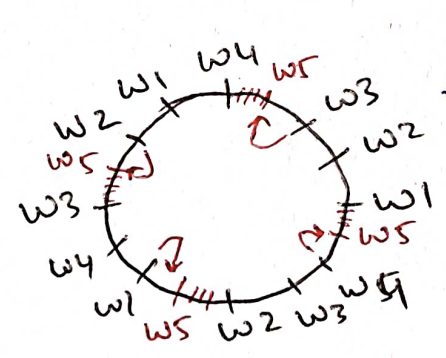
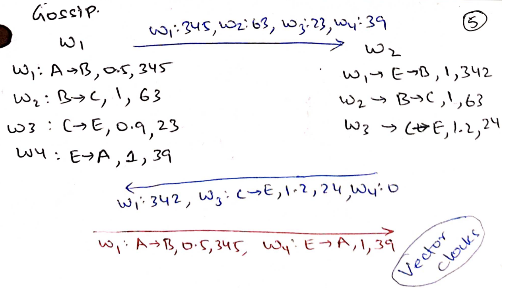

# Dynamo

## Design Goals

Amazon's Dynamo is a key-value store that supports small reads and writes.  One
of the primary differentiating design goal is to provide *high availability*: 99.9%
of reads and writes should succeed in less than 300ms. The paper describes it
quite dramatically:

> customers should be able to view and add items to their shopping cart even if
disks are failing, network routes are flapping, or data centers are being
destroyed by tornados. Therefore, the service responsible for managing shopping
carts requires that it can always write to and read from its data store, and
that its data needs to be available across multiple data centers.

### CAP Theorem

Consistency and availability are typically at odds with each other. Let us say
there are two replicas holding value `v` for a key `k` and the replicas get
*partitioned*: they are not able to talk to one another because of network
issues. Now, if a write `k:v'` comes to replica-1 and a read of `k` comes to
replica-2, we have two choices:

* Replica-1 should reject the write and/or replica-2 should reject the read.
Otherwise, reads and writes will not be consistent. Such systems are called CP:
they prefer consistency during partition.
* Replica-1 allows the write and replica-2 allows the read. Reads and writes 
are inconsistent but the storage system is highly available. Such systems are
called AP: they prefer availability during partition.

This tradeoff above is called the CAP theorem: during network partitions, choose
availability or consistency. CR/CRAQ is CP. Dynamo is AP. To provide high
availability, Dynamo gives up on consistency.

A further trade-off typically comes without network partition. For consistency,
replica-1 may accept the write only after it has received acknowledgement from
others, like in Chain Replication. However, this increases the write latency.
Another possibility is to acknowledge the write first and then replicate in the
background to get low-latency.

This tradeoff is called PACELC theorem: an extension to the CAP theorem. During
partitions, choose availability or consistency; else choose low-latency or
consistency. Dynamo lets the programmer tune whether they want to prefer
low-latency or consistency during (non-partitioned) writes.

### Decentralization

Amazon is interested in storing userID -> shopping cart, userID -> session ID
etc. Because of lots of users, all the data does not fit in a single machine,
unlike CRAQ. Before designing Dynamo, Amazon used RDBMS. However, to get good
performance, RDBMS needs to be carefully managed and sharded. Amazon wanted
automated sharding, replication and fault tolerance, which DBs did not support
at the time. 

Amazon realized that it does not have complex queries, so query optimizers are
not required. Workloads do not involve joins, so a simple key-value store,
instead of DB's ACID (Atomicity, consistency, Isolation, Durability)
transactions works just fine.  Dynamo provides automated sharding, replication,
and fault tolerance. 

> Dealing with failures in an infrastructure comprised of millions of components
is our standard mode of operation; there are always a small but significant
number of server and network components that are failing at any given time. As
such Amazon’s software systems need to be constructed in a manner that treats
failure handling as the normal case without impacting availability or
performance.

Dynamo influenced many storage systems like Cassandra and Riak which were later
called BASE systems: Basically Available, Soft (inconsistent) state, Eventually
consistent, to contrast with DB's ACID transactions. We will later see what
eventually consistency means.

To get high availability, Dynamo is completely *decentralized*, i.e, there is no
special master worker. In a master based design, storage servers might be made
unavailable if they are unable to talk to a master.  Let us first see the design
of Dynamo for just serving reads.

## Read-only decentralized highly available FT key-value storage

GFS master had many responsibilities:
* Locating chunks: given a file offset, returns chunk handle, list of
  chunkservers.
* Load balancing: roughly equally spread chunks over chunkservers.
* Failure detection using heart beats. Create new replicas when some
  chunkservers go down.
* Maintain primary chunkserver. Give leases to primary. Ensure no split-brain.

Dynamo needs to do all of these functions *without* a master.  Let us say each
key is hashed to get a number less than $K$. Given a key $k<K$, we want to
identify list of its replicas. There can be millions of keys ($K$) and thousands
of servers ($S$). Directly storing replicas for every key will make the routing
tables very large.

Idea 1: static partitioning. Keys $[Ki/N, K(i+1)/N)$ are stored on server $i$.
This reduces the routing table. But if a new server joins, the transfer load is
imbalanced. Last worker needs to transfer lot more keys than others.

Idea 2: Close the range to form a ring. Keys and servers live on the ring. Key
is served by the next server in the counter-clockwise direction. Each server
lives in multiple places on the ring. A new server joins in multiple places on
the ring and steals keys from many servers.

Such an assignment need not be static. If there are some hot ranges/slow
workers, servers can move forward (backward) in the ring to steal (give up)
keys. 

Dynamo is worried that when servers steal an arbitrary portion of the key space,
the sending server may need to do a lot of random disk IO to locate the keys
falling in the portion. Therefore, Dynamo stores the keys in fixed-sized ranges.
Each range is stored as a separate file. Only a full range can be stolen/given
up. If there are $Q$ ranges, the worst-case routing table size is $O(Q)$: every
range may be with a different server. When a new worker joins, it can steal
$Q/S$ ranges.

Replication strategy is simple: each key is stored by next $N$ servers in the
ring. Note that these $N$ servers may be close on the ring, but will typically
be in different data centers so that they have uncorrelated failures.

### Gossip protocol

So far, we only understand the mechanism. But how should the coordination
happen? A read can come to any server; this server needs to forward the read to
the server holding the key. How should a server know about all the other servers
and their positions on the ring as they join/leave? How/when should it
steal/give up key ranges?  

GFS used its master for coordination, such as to do load balancing. Another
option is that every worker heartbeats with every other server to get to know
about dead servers/current load of servers/changes in ring positions. But such
continuous all-to-all communication causes too much network traffic.

We observe that having a stale view of the ring is ok. Let us say W5 does not
know that a key `k` has moved from [W1, W2, W3] to [W4, W1, W2]. If W5 asks W3
for `k`, W3 can forward the request to W4. To exchange information, each server
randomly chooses 1-3 servers every 1 second and *gossips* with it. During a
gossip, servers exchange what they know about everyone else. Therefore, any
update is known to everyone else in O(log N) gossip rounds.

But how to gossip? Let us say W1 gets to know from W4 that W2 is handling A-B
key range and from W3 that W2 is handling A-C range. Who should W1 believe?  The
one it is hearing from last? W1 needs to believe whoever has the latest
information on W2. 

The following shows a gossip exchange between W1 and W2. Each server maintains
key range, current load, and the version of its information for every other
server. W1 first sends the versions of information it has for everyone. If W2 is
more updated for some servers (like for W3), it sends the later information it
has and requests updates for servers (like for W1, W4) it is not updated on.  W1
responds with the latest information as per W2's request.

