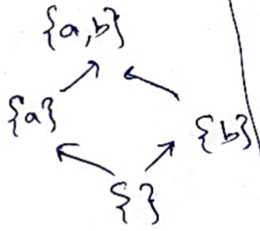
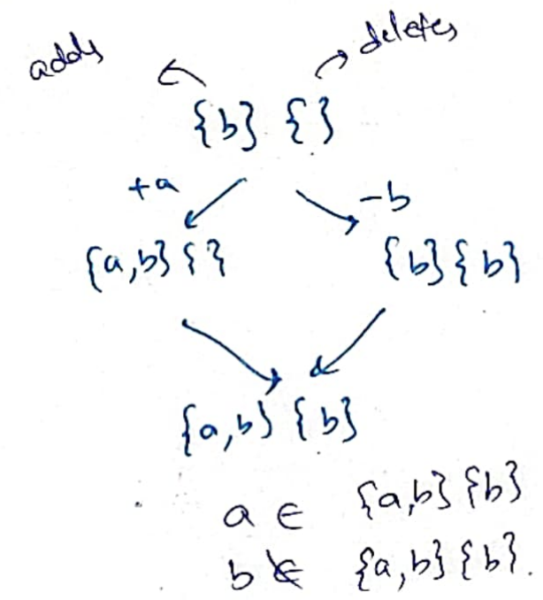
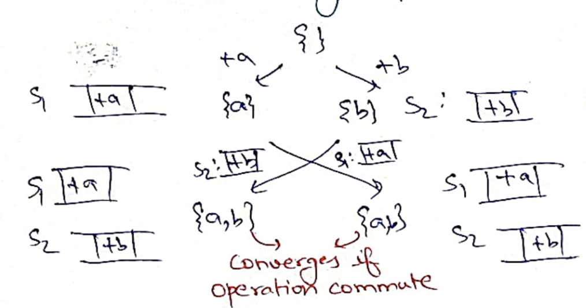
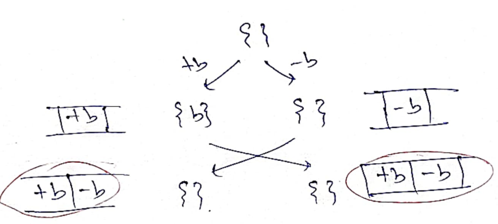
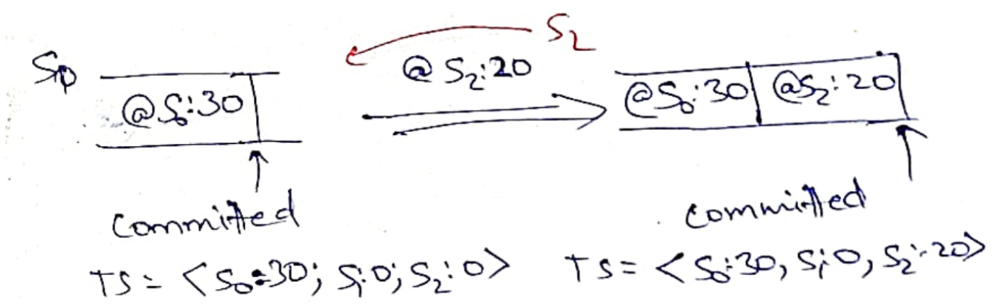
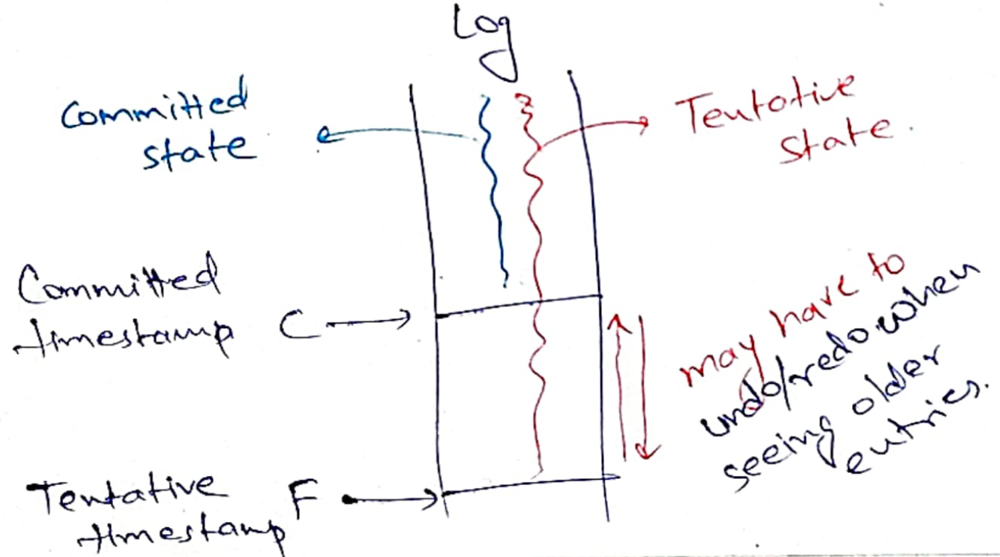
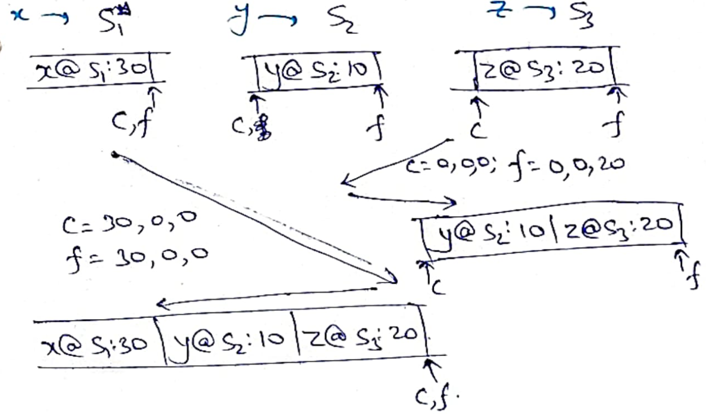
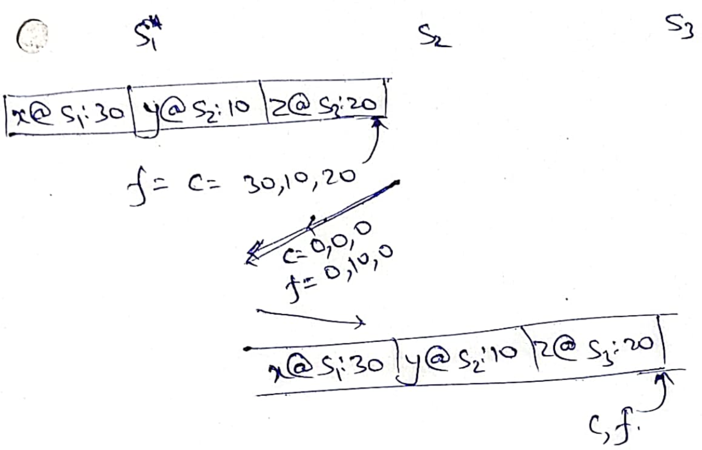

# Bayou/CRDT

CP systems (consistent-under-partition) like [CRAQ](./storage-craq.md) reject
writes during network partitions. AP systems (available-under-partition) like
[Dynamo](./storage-dynamo.md) accept writes on replicas even under network
partitions. Replicas may diverge due to these writes. *Eventually*, when network
partitions heal, the replica states need to be *reconciled* such that all
replicas agree on their states. Such storage systems are called *eventually
consistent*. 

The simplest way to achieve eventual consistency is to implement
last-writer-wins (LWW), where every replica takes the state which was written
last. LWW makes sense for some use cases, but it is basically a euphemism for
everyone-except-last-writer-loses, i.e, it can lose a lot of writes. Imagine
three offline Google docs users editting (different parts of) the same document
in a flight. After landing, all edits of two users are lost. We would like to
*automatically* reconcile diverged replica states such that we do not lose
writes.

*Convergence* of diverged replicas after automatic reconciliation may not be
obvious. Let us say replica S1 accepted `x=1` and replica S2 accepted `x=2`.
After reconciliation, we may end up with S1 having `x=2` and S2 having `x=1`.

## Conflict-free replicated data types (CRDTs)

If the state and the operations allowed on state follow certain properties, then
we can get really good convergence guarantees. This state + ops can be exposed
to the programmer as special "replicated data types" where the programmer need
not explicitly do any reconciliation; the data type itself knows how to
reconcile itself.

We have two options to reconcile the states of diverged replicas:
1. State exchange: here each replica sends its state to the other replica; and
2. Operations exchange: here each replica sends a log of operations it has
applied to its state to the other replica.

### State-based CRDT (Convergent replicated data types)

1. States form a semi-lattice, i.e, states have a partial order and any two
states have a unique lowest upper bound, 
2. Operations are monotonic on this semi-lattice.

Then, we can merge the two states of diverged replicas by taking their lowest
upper bound.  Examples:

1. G-set (grow-only set). We are only allowed to insert elements into the set.
   To merge, take a union of the two sets.  
   
   
   
   Note that the allowed operations are monotonic on the semi-lattice: deletions
   are not allowed on G-sets. Deletions may be lost after merge!

2. U-set. Maintain two separate sets for additions and deletions. Insertions go
   into addition set; deletions go into deletion set. An element is in U-set if it
   is in (Additions - Deletions). U-set also clearly forms a semi-lattice. To
   merge, union corresponding addition sets and deletion sets.
    
   

	 Note that once an element is deleted, it cannot be reinserted. Can you try to
	 fix it?

### Operations-based CRDT (Commutative replicated data types)

If all operations are *commutative*, then the order in which they are
applied doesn't matter. In the following example, replica `S1` first inserts
`a`, then inserts `b` whereas replica `S2` first inserts `b`, then inserts `a`.
Because insertions are commutative, both replicas reach the same final state.



It can be shown that state-based CRDTs and operation-based CRDTs are equivalent.
If you have small states like Amazon's shopping carts, it makes sense to
exchange states. But if you have large states like full-fledged databases, it
makes more sense to exchange just the operations.

CRDTs require strict properties over allowed operations. The most general way
(without discussing the types of operations) to achieve convergence is to build
*replicated state machines*. As discussed in [Chain
replication](./storage-craq.md#summary), if all replicas can play the same log
of actions in the same *order* on a deterministic state machine, we can
replicate the state machine. Bayou takes the same idea to build a replicated
state machine using a replicated log in presence of network partitions.

## Bayou goals and ideas
In Bayou (1995), intermittent connectedness of mobile phones and laptops is the
norm (compared to intermittent disconnectedness nowadays). Bayou application
storage is writeable even when laptops are offline. Bayou can accept
*conflicting writes*, i.e, writes that do not *commute*. After replicas exchange
logs, everyone plays the log in the *same order* as follows:



Notice that the second replica had to *rollback* `-b`. It applies `+b` and then
again apply `-b` to reach identical state as the first replica. 

### How to order operations?
How shall we decide the global order, i.e, how does each replica know `+b`
should be applied *before* `-b`? Bayou applies a *timestamp* $TS=\{id: server,
t: clocktime\}$ to each operation.  Unlike vector timestamps, these operation
timestamps are *totally ordered*.

$TS1 < TS2$ if $TS1.t < TS2.t$ or if $TS1.t == TS2.t$ then $TS1.id < TS2.id$.
Therefore, `+b@S1:10` needs to be applied before `-b@S2:20`.

Because rollbacks can happen in Bayou, clients are made aware that writes are 
currently *tentative*. These writes are subject to change. The example Bayou
gives is of a meeting room booking system. Clients can see that their booking
requests are currently *tentative*. They may change if the system discovers
(during connectedness) that some other clients have already booked the same room
in an overlapping slot.

### How to commit?

But at some point, we would like to *commit* our writes, i.e, now the writes
cannot be rolled back! When can we say that? Let us say we have the following log:

```
op1@S1:10 | op2@S2:20
```

Since, both S1's and S2's times are beyond 10 already, we can be sure that `op1`
is committed. However, we may see more writes from S1 in times 10-20, thereby
requiring rollback of `op2`. Therefore, `op2` is only tentative. This works.

But unfortunately, any crashed/partitioned server can prevent commits.  For
example, in our log, we know S1 has moved to time 1000 but we only have log
entries from S2 till time 3. We cannot consider any writes in time 3-1000
committed since we may receive older writes from S2!

In Bayou, the common global order of writes is decided by the *primary* replica.
This works for the use cases they have in mind. For example, the lecture hall 
coordinator can be made primary, and all faculty laptops trying to book lecture
rooms are secondary. As long as a faculty laptop can connect to the lecture hall
coordinator, it will be able to commit. In the previous design, *all* faculty
laptops need to be up to get a lecture room.

Primary has no tentative writes; it commits as soon as it learns about a log
entry. The assumption everywhere in Bayou is that everyone learns about log
entries of any server *in timestamp order*. For example, if I have learned about
`op@S2:20`, it is not possible that I do not know about `op2@S2:10`.

Therefore, every server can maintain a vector *committed timestamp*: I have seen
and committed all writes before this timestamp. The following shows how primary
server `S0` commits a write from `S2`.



## Bayou implementation
The way Bayou is implemented is as follows. Each server maintains a log of
operations and two separate states: *committed* and *tentative*. A prefix of the
log, up until committed timestamp, is applied on to the committed state. All of 
the log is applied on to the tentative state. Uncommitted log entries may need
to be rolled back and re-applied (if we learn of an older log entry).



### Anti-entropy

Servers asynchronously do *anti-entropy* with each other, i.e, they exchange
portions of logs that they may not have. For doing anti-entropy, each server can
randomly pick another server and send it committed timestamp `c` and final
timestamp `f`. The other server responds with the committed log entries that are
ahead of `c` and tentative log entries that are ahead of `f`. Upon receiving
these log entries, the server rolls back its tentative logs, plays forward
received committed log entries, deletes already committed log entries from its 
tentative log, merges received tentative log entries with its tentative logs,
and plays forward tentative log entries. It updates `c`, `f`, committed state,
and tentative state while playing forward the logs.

The following shows several anti-entropy exchanges between three servers:




Notice that the write of `y` received by S2 already got committed by S3 when it
did anti-entropy exchange with S1. Therefore, servers can commit even if they
are themselves partitioned from the primary! 

We can see that after a few rounds of anti-entropy, all replicas shall have
identical states, i.e, *eventually*, they become *consistent*.

### Invariants

* For all servers, $c \leq f$.
* For primary, $c = f$.
* For any two servers, $c1 \leq c2 \vee c1 \geq c2$.
* For any two servers, it is possible that $f1 \not\leq f2 \wedge f1 \not\geq f2$.

# Summary

If all operations commute on state, replicas can exchange logs and apply logs
out-of-order or exchange states and merge to lowest upper bound to converge.
Commutativity can be encoded directly into the data type (CRDTs) that only
exposes methods that are commutative. Programmers can interact with these data
types and not worry about merging, commutativity, etc.

Bayou can handle conflicting operations, i.e, operations that do not commute. It
makes clients aware of tentative states that may be rolled back. Bayou has a
strong primary responsible for committing. If new writes stop coming, after a
few rounds of anti-entropy, replicas shall *eventually* come to the same state.
Bayou also implements *replicated state machines* like Chain Replication: each
replica plays the *same log* in the *same order* on a *deterministic state
machine*.

The paper has many other details: 
* maintenance of undo logs to undo tentative writes;
* de-duplicating tentative and committed states to reduce memory consumption;
* conflict-resolution and merging procedures; and
* dealing with clock drifts using Lamport clocks.