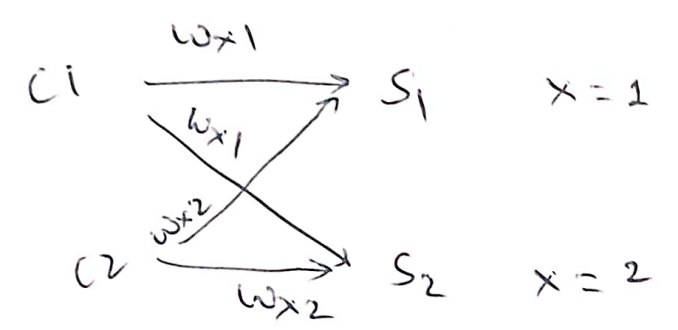
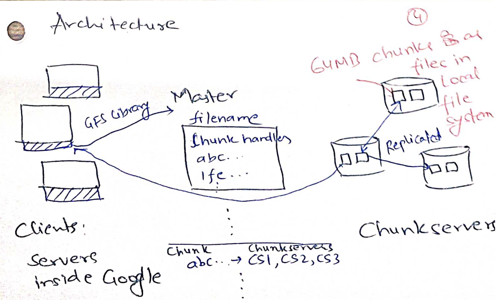
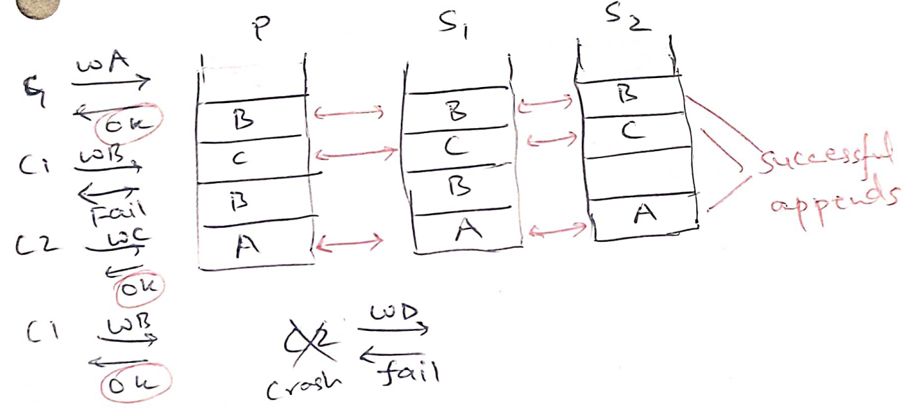

# Google file system

We now switch gears to study distributed storage. As we saw in MapReduce and
Ray, fault-tolerant distributed storage is a key abstraction that simplifies
writing distributed applications. MapReduce used GFS files as inputs and
outputs.  Ray used a fault-tolerant Global Control Store to make everything
else, such as the global scheduler, stateless. 

The holy grail, in some sense, is similar to the one we had for distributed
computation: can we let the programmer pretend that they are talking to a single
reliable, very large, very fast storage? This simple goal implies many things: 

* Disks are *much* slower than CPUs and memory. CPUs execute one instruction in
~1ns, memory access time is ~100ns, a hard disk seek time is ~1ms making them ~1
million times slower than CPUs! Similarly, disk bandwidths are about 100k times 
less than memory bandwidth. (SSDs are much faster, but because of cost, HDDs are
still popular). In the OS course, we saw that to provide a "very fast" storage,
a common trick (via RAID: Redundant Array of Inexpensive Disks) we use is to
expose multiple disks as a single disk to improve the aggregate throughput.

* However, this can be insufficient for two main reasons: data size
and fault tolerance. The total data we want to store exceeds the disk capacities
of a single system. Or we want the data to remain available for reads and writes
even after the single machine crashes. 

  > Again, this needs to be thought carefully for your application. If your
  application is ok with some downtime and if the data can fit comfortably in a
  single disk, it might be wise to avoid distributed storage.  Redundancy in
  RAID could be sufficient to avoid data loss.  In the paper, Google machines
  had 80GB disks but needed to store 152 TB of data (Table 2) containing
  crawler's output (used to compute PageRank), server logs, and MapReduce job
  outputs. 

* When data exceeds capacity of a single server, we need to *shard* the data
onto multiple servers. Sharding improves overall capacity as well as aggregate
bandwidth of reading/writing data. When we start managing multiple storage
servers, we start seeing *constant faults* due to which we need fault tolerance
strategies. To keep the data *available* during faults, the main things to do is
*replication*. But now, replicas might become *inconsistent* breaking the
*single* very large, very fast storage illusion. 

Ideal consistency is where we can maintain the illusion that the clients are
talking to a single server: the storage applies one write at a time (even if
they are concurrent) and reads return the latest write. Consistency is defined
in terms of "allowed histories": what read/write behaviours are clients allowed
to see.

For example, let us say we have 4 clients. C1 and C2 concurrently write to `x`, 
C3 and C4 later read `x`:

```
C1: |----Wx10-----|
C2: |----Wx20-----|
C3:                 |----Rx??-----|
C4:                 |----Rx??-----|
```

In this history, C3 and C4 can read 10 or 20, but they must be the same. Let us
see a bad design where this may not be the case. Here, C1 and C2 both send their
writes to S1 and S2. Last writer wins on each server. C3 and C4 just read from
S1. 



Now due to differing network delays, if S1 sees x=10 last and S2 see x=20 last, 
they may disagree on the value of x. Further, say C3 reads x=10 from S1, but then
S1 crashes, so C4 reads x=20 from S2. These sequence of events led to a history
that we would not expect from a single server.

We will later see very sophisticated algorithms in the course that ensure
consistent behaviour across arbitrary server crashes and network delays. We will
also see in the course that consistency and availability are generally at odds
with one another leading to many interesting distributed storage designs. 

## GFS goals
Academia had been thinking about distributed storage for a while. GFS was first
industrial large-scale distributed storage. It provided
* a familiar file system interface for easy sharing of data between applications
  (crawler and pagerank) running in the data center, 
* automatic fault tolerance against both silent disk corruptions and server
  failures,
* automatic load balancing across servers, and
* automatic sharding to increase aggregate performance and available capacity.

It differed from prior efforts in that 
* Academia believed it is pointless to build distributed storage that is not
strongly consistent (gold standard for consistency). GFS is not strongly
consistent but still useable.
* GFS focuses on sequential access to huge files, unlike databases that do small
random reads and writes. Imagine crawlers appending their logs in one multi-TB
file and then page rank application reading the log file.
* The paper has masters and chunkservers (analogous to MapReduce workers). In
GFS, master is also FT.

## GFS design

Unlike regular OS file systems where most files are small (a few KBs), typical
GFS files are large (>100MB to multiple-GBs) with typical workloads being large
sequential reads and writes. Files are broken into chunks (analogous to disk
blocks (4KB)/extents in regular file systems) and GFS chooses a large chunk size
of 64MB. Each chunk has a unique identifier called *chunk handle*. Chunks are
spread across *chunkservers* which store each chunk as just a regular file in
their local file system. For each file, master maintains a list of chunks and
the chunkservers holding each chunk. Large chunk size reduces master metadata.

Applications are linked with a GFS client library. When an application wants to 
read/write a file, the library takes the file offset and asks master for the
appropriate chunk handle and their chunkservers. One of these chunkserver may be
*primary*: it is the one that will coordinate writes to the chunk. All other
chunkservers are *secondaries*. Client caches the response for future
reads/writes to the same chunk.



For a read request, client library just sends the chunk handle and the offset
within the chunk to the nearest chunkserver. Master is carefully kept on the 
control-plane: actual data never flows through the master. Large chunk sizes and
caching in clients, client-master interactions are reduced. Clients can maintain
a persistent TCP connection with the chunkserver to read the complete chunk
sequentially before needing to ask master about the next chunk.

Writes are trickier since they may be concurrent and have to be replicated on
*all* the chunkservers for fault tolerance. GFS is more well-behaved for
record appends, e.g. multiple crawlers are appending their logs to a large GFS
file. GFS provide atomic appends: GFS picks different offsets for different
(possibly concurrent) appends.

The basic idea is simple (Figure 2): client sends its record to nearest
chunkserver which forwards it to next nearest chunkserver and so on. All
chunkservers keep the record in an in-memory cache. Client asks primary to
commit the write. Primary picks the next offset, writes to the local chunk file
at the offset, and asks secondaries to also write at the same offset. If
everyone acknowledges the write to primary, primary replies the offset to
client, otherwise replies failure. Client retries writes in case of failures.

## GFS consistency

The consistency guarantee that GFS gives is that if a record append was
successful then all chunkservers will have written that record at the returned
offset. Chunks diverge for failed appends. For example, in the following figure,
for successful record appends, each chunkserver has the same record at the
returned offset.  However, appending B had failed once which was again retried
by C1. Due to this, the primary (P) and a secondary (S1) has duplicate Bs, but
the other secondary (S2) has only one B record. Therefore, if we read the chunk
from two different replicas, we may see different records (due to failures)!



The performance advantage of this design is that primary could commit "C"
without waiting for (the failed) "B" to commit. Therefore, primary is able to
initiate commits in-parallel from concurrent clients instead of committing
one-at-a-time. The disadvantage is (1) we wasted the disk space in the chunk and
(2) made reads deal with missing/duplicate records. We are not too worried about
(1) because hopefully such failures are not common. When master notices that it
is missing heartbeats from S2, it will remove S2 from its chunkserver list.

Paper makes two suggestions for reads:
* to identify missing records, make records *self-verifying*. Start each record
with a "magic header" to signal start of a record. Follow it with length of
record and then a fixed-length checksum to verify that the record is valid.
* to deal with duplicate records, writer puts a unique *record ID* which the
reader can use to de-duplicate. Another possibility is that the application
semantics are robust to small number of duplicates. For example, the page rank
will probably not change too much if we add a few duplicate links to the web
graph.

## Fault tolerance of chunkservers

