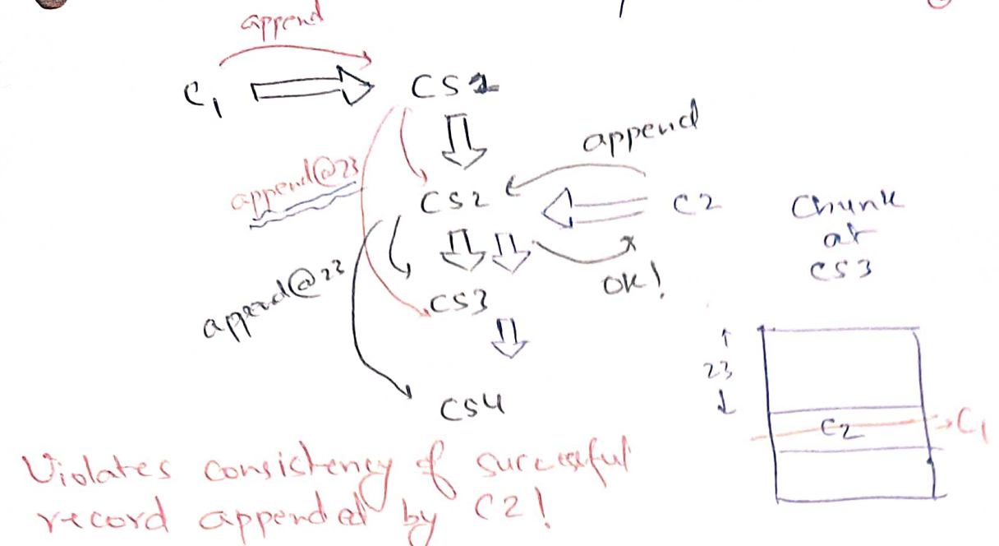

# Google file system

- [Google file system](#google-file-system)
	- [GFS goals](#gfs-goals)
	- [GFS design](#gfs-design)
		- [GFS consistency](#gfs-consistency)
		- [Fault tolerance of chunkservers](#fault-tolerance-of-chunkservers)
		- [Fault tolerance of master](#fault-tolerance-of-master)
	- [Summary](#summary)


We now switch gears to study distributed storage. As we saw in MapReduce and
Ray, fault-tolerant distributed storage is a key abstraction that simplifies
writing distributed applications. MapReduce used GFS files as inputs and
outputs.  Ray used a fault-tolerant Global Control Store to make everything
else, such as the global scheduler, stateless. 

The holy grail, in some sense, is similar to the one we had for distributed
computation: can we let the programmer pretend that they are talking to a single
reliable, very large, very fast storage? This simple goal implies many things: 

* Disks are *much* slower than CPUs and memory. CPUs execute one instruction in
~1ns, memory access time is ~100ns, a hard disk seek time is ~1ms making them ~1
million times slower than CPUs! Similarly, disk bandwidths are about 100k times 
less than memory bandwidth. (SSDs are much faster, but because of their low
cost, HDDs are still popular). In the OS course, we saw RAID (Redundant Array of
Inexpensive Disks) that provides an illusion of faster storage by exposing
multiple disks as a single disk to improve the aggregate throughput and to not
lose data in case of individual disk failures.

* However, this can be insufficient for two main reasons: data size
and fault tolerance. The total data we want to store exceeds the disk capacities
of a single system. Or we want the data to remain available for reads and writes
even after the single machine crashes. 

  > Again, this needs to be thought carefully for your application. If your
  application is ok with some downtime and if the data can fit comfortably in a
  single disk, it might be wise to avoid distributed storage.  Redundancy in
  RAID could be sufficient to avoid data loss.  In the paper, Google machines
  had 80GB disks but needed to store 152 TB of data (Table 2) containing
  crawler's output (used to compute PageRank), server logs, and MapReduce job
  outputs. 

* When data exceeds capacity of a single server, we need to *shard* the data
onto multiple servers. Sharding improves overall capacity as well as aggregate
bandwidth of reading/writing data. When we start managing multiple storage
servers, we start seeing *constant faults* due to which we need fault tolerance
strategies. To keep the data *available* during faults, the main things to do is
*replication*. But now, replicas might become *inconsistent* breaking the
*single* very large, very fast storage illusion. 

Ideal consistency is where we can maintain the illusion that the clients are
talking to a single server: the storage applies one write at a time (even if
they are concurrent) and reads return the latest write. Consistency is defined
in terms of "allowed histories": what read/write behaviours are clients allowed
to see.

For example, let us say we have 4 clients. C1 and C2 concurrently write to `x`, 
C3 and C4 later read `x`:

```
C1: |----Wx1-----|
C2: |----Wx2-----|
C3:                 |----Rx??-----|
C4:                 |----Rx??-----|
```

In this history, C3 and C4 can read 1 or 2, but they must be the same. Let us
see a bad design where this may not be the case. Here, C1 and C2 both send their
writes to S1 and S2. Last writer wins on each server. C3 and C4 just read from
S1. 


Now due to differing network delays, if S1 sees x=1 last and S2 see x=2 last, 
they may disagree on the value of x. Further, say C3 reads x=1 from S1, but then
S1 crashes, so C4 reads x=2 from S2. These sequence of events led to a history
that we would not expect from a single server.

We will later see very sophisticated algorithms in the course that ensure
consistent behaviour across arbitrary server crashes and network delays. We will
also see in the course that consistency and availability are generally at odds
with one another leading to super interesting distributed storage designs. 

## GFS goals
Academia had been thinking about distributed storage for a while. GFS was first
industrial large-scale distributed storage. It provided
* a familiar file system interface for easy sharing of data between applications
  (crawler and pagerank) running in the data center, 
* automatic fault tolerance against both silent disk corruptions and server
  failures,
* automatic load balancing across servers, and
* automatic sharding to increase aggregate performance and available capacity.

It differed from prior efforts in that 
* Academia believed it is pointless to build distributed storage that is not
strongly consistent (gold standard for consistency). GFS is not strongly
consistent but still useable.
* GFS focuses on sequential access to huge files, unlike databases that do small
random reads and writes. Imagine crawlers appending their logs in one multi-TB
file and then page rank application reading the crawler log file.
* The paper has masters and chunkservers (analogous to MapReduce workers). In
GFS, master is also FT. Unlike MapReduce, GFS puts efforts into making master
FT. The main reason is that GFS master is responsible for its files *forever*
whereas MapReduce master is only responsible only for the duration of the job.

## GFS design

Unlike regular OS file systems where most files are small (a few KBs), typical
GFS files are large (>100MB to multiple-GBs) with typical workloads being large
sequential reads and writes. Files are broken into chunks (analogous to disk
blocks (4KB)/extents in regular file systems) and GFS chooses a large chunk size
of 64MB. Each chunk has a unique identifier called *chunk handle*. Chunks are
spread across *chunkservers* which store each chunk as just a regular file in
their local file system. For each GFS file, master maintains a list of chunks
and the chunkservers holding each chunk. Large chunk size reduces master
metadata.

Applications are linked with a GFS client library. When an application wants to 
read/write a file, the library takes the file offset and asks master for the
appropriate chunk handle and their chunkservers. One of these chunkservers may
be *primary*: it is the one that will coordinate writes to the chunk. All other
chunkservers are *secondaries*. Client caches the response for future
reads/writes to the same chunk.


For a read request, client library just sends the chunk handle and the offset
within the chunk to the nearest chunkserver. Master is carefully kept on the 
control-plane: actual data never flows through the master. Large chunk sizes and
caching in clients, reduce client-master interactions. Clients can maintain
a persistent TCP connection with the chunkserver to read the complete chunk
sequentially before needing to ask master about the next chunk.

Writes are trickier since they may be concurrent and have to be replicated on
*all* the chunkservers for fault tolerance. GFS is more well-behaved for
record appends, e.g. multiple crawlers are appending their logs to a large GFS
file. GFS provide *atomic appends*: GFS picks different offsets for different
(possibly concurrent) appends.

The basic idea is simple (Figure 2 of the paper): client sends its record to
the nearest chunkserver which forwards it to the next nearest chunkserver and so
on. All chunkservers keep the record in an in-memory cache. Client asks primary
to commit the write. Primary picks the next offset, writes to the local chunk
file at the offset, and asks secondaries to also write at the same offset. If
everyone acknowledges the write to primary, primary replies the offset to
client, otherwise replies failure. Client retries writes in case of failures.

### GFS consistency

The consistency guarantee that GFS gives is that if a record append was
successful then all chunkservers will have written that record at the returned
offset. Chunks diverge for failed appends. For example, in the following figure,
for successful record appends, each chunkserver has the same record at the
returned offset.  However, appending B had failed once which was again retried
by C1. Due to this, the primary (P) and a secondary (S1) has duplicate Bs, but
the other secondary (S2) has only one B record and an empty portion in the file.
Therefore, if we read the chunk from two different replicas, we may see
different records (due to failures)!


The performance advantage of this design is that primary could commit "C"
without waiting for (the failed) "B" to commit. Therefore, primary is able to
initiate commits in-parallel from concurrent clients instead of committing
one-at-a-time. The disadvantage is (1) we wasted the disk space in the chunk and
(2) made reads deal with missing/duplicate records. We are not too worried about
(1) because hopefully such failures are not common. When master notices that it
is missing heartbeats from S2, it will remove S2 from its chunkserver list.

Paper makes two suggestions for reads:
* to identify missing records, make records *self-verifying*. Start each record
with a "magic header" to signal start of a record. Follow it with length of
record and then a fixed-length checksum to verify that the record is valid.
* to deal with duplicate records, writer puts a unique *record ID* which the
reader can use to de-duplicate. Another possibility is that the application
semantics are robust to small number of duplicates. For example, the page rank
will probably not change too much if we add a few duplicate links to the web
graph.

### Fault tolerance of chunkservers

Things get trickier when we consider failing chunkservers. Let us say (CS1*,
CS2, CS3) were chunkservers for a chunk "abc" with CS1 as primary. A client C1
has this information cached locally. 

Now, let us say master starts missing heartbeats from CS1, so, it copies "abc"
from CS2 to CS4 and makes CS2 as primary.  A new client C2 asks master about the
chunk "abc" and receives the chunkserver list as (CS2*, CS3, CS4). 

However, it is possible that CS1 had not actually crashed, it had just broken
network connection with the master. There is no way for master to know whether
the server has actually crashed or not. Because of this, now we have two
primaries (CS1 and CS2) in the system for the same chunk "abc". This bad
situation is called *split-brain*. Bad things can happen because of the
split-brain.

Let us say both C1 and C2 initiate an append. For C1's append, CS1 picks the
chunk offset as "23" and sends it to CS2, CS3; for C2's append, CS2 picks the
same chunk offset and sends it to CS3, CS4. If we allow both writes to happen,
some chunkservers would have written C1's record and some would have written
C2's record. This violates the desired consistency guarantee that for successful
appends *all* chunkservers have the same record on the returned offset.



To solve this, CS2 and CS3 *must reject* appends from CS1. But *how does CS3
know* if it should reject requests from CS1 or from CS2? The idea is that
whenever master wants to assign a new primary, it first increments a *chunk
version number*. This chunk version number is communicated to all the
chunkservers in the master's list (CS2, CS3, CS4) and is also returned to the
clients. Each chunkserver reject write requests with old version numbers. 

This safeguards our consistency guarantees but the poor client C1 is stuck with
an old primary CS1, unable to write anything. Maybe the master incorrectly
thought that CS1 is dead, but actually CS1 was alive and was in middle of doing
lots of writes with CS2 and CS3. If master assigns a new primary, all the
outstanding writes will be rejected.

The second idea is that master assigns primaries for a limited period of time
(default=60s) also called a *lease*. Master only assigns a new primary after the
lease of the old primary has expired (or has been explicitly revoked by the
master). This lets old primaries finish their inflight writes. Primaries need to
constantly refresh their leases with the master. In the above case, if CS1 is
finally able to talk to master after a few missed heartbeats, it will be unable
to refresh its lease since CS2 is already made the new primary. At this point, 
CS1 will tell C1 that its lease has expired and its version is old. C1 should go
check with the master about the new chunkservers of "abc".


Are version numbers still required if we are using lease? Yes! We shouldn't
assume anything about the network delays. It is possible that an older append
request from CS1 arrives at CS3 even after CS1's lease has expired.

### Fault tolerance of master

GFS master is maintaining the following state. Each state is marked with (v) for
volatile or (nv) for non-volatile.

Filename 
* array of chunk handles (nv)

Chunk handle 
* list of chunkservers (v)
* version number (nv)
* primary to coordinate writes (v)
* lease expiration time (v)

All mutations to the non-volatile state, such as creating new files, adding
chunk handles to a file, incrementing version number of a chunk handle, are
persistently written to a log *before* the master's in-memory state is mutated
and made visible to clients. The idea is same as the *write-ahead logging* we
are familiar with from file systems and databases.

The write-ahead log is persistently written to a local disk as well as to a
replica's disk. In case the master fails, a system outside GFS (or simply a
human administrator) promotes the replica as the new master. The replica plays
the log forward to recover the non-volatile states and continues as the new
master. Just like databases, this log can become very large over time, so once
in a while we also snapshot the master state and put it in replica's disk.
Replica can recover from the last snapshot and then play the remaining log
forward.

Clearly, filenames and each file's chunk handles need to be non-volatile as
otherwise we will forget which files we have and which chunks each file uses.
Let us now carefully check volatility of all the other states.

1. Chunk handle -> list of chunk servers (v). There is no point of keeping this
state persistent as chunkservers are the ones who anyways know the correct
information. For example, some disks may have crashed, chunk files may have
gotten corrupted. When new master starts, it asks all chunkservers about all 
their chunks.

2. Chunk handle -> primary, lease expiration time (v). Master just waits for the
max lease time (60s) to expire before giving out new leases.

3. Chunk handle -> version number (nv). Let us say the entire datacenter lost
power. Along with master, all the chunkservers are also slowly booting up. What
if for a chunk, only stale chunkservers have rebooted. If master starts giving
out lease from this version, we will lose all the writes that were made to a
newer version of the chunk!

Therefore, when master increases a version number, all the chunkservers as well
as the master must write the version number persistently to their disks. This is
necessary to differentiate between stale and up-to-date versions after reboot.

## Summary

Similar to how MapReduce got reincarnated as Hadoop in the open-source, GFS
lives on within Google and as Hadoop Distributed File System (HDFS) in the
open-source. HDFS is very widely used. The paper gives many interesting system
design lessons:

* A familiar abstraction that is able to effectively hide complexity can go a
  long way in the adoption of new systems: GFS provides the familiar file system
  interface, effectively hiding the complexity of data spread over thousands of
  disks, to share very large files between applications within the data center.
* Changing application behaviour often requires re-building systems from ground
  up: solving for large files and mostly sequential reads/writes led to
  unconventional design choices in GFS such its large chunk sizes, etc.
	* Rebuild only what is necessary; reuse battle-tested systems wherever
	possible. GFS relies on Linux file systems and stores chunks as regular OS
	files.

It also touched upon many fundamental problems and solutions that recur in
distributed storage designs:
* snapshotting and write-ahead logging;
* split-brain problem, version numbers, leases;
* if applications can live with weak consistency, it can provide better
  performance and simpler storage design.