# Raft
[CR/CRAQ](./storage-craq.md) depended on an external FT system to manage the
chain configuration. How is this external system made FT? Does it need yet
another FT system? :-o

## Raft setup
Raft is a *self-sufficient* system that does not depend on any other system for
its FT. It realizes *replicated state machines* which as we saw in Bayou and CR
can be realized using *replicated log*. This brings us to the primary safety
property that Raft wants to uphold. 

***State machine safety:*** If a server has applied a log entry at a given index
to its state machine, no other server will ever apply a different log entry for
the same index.

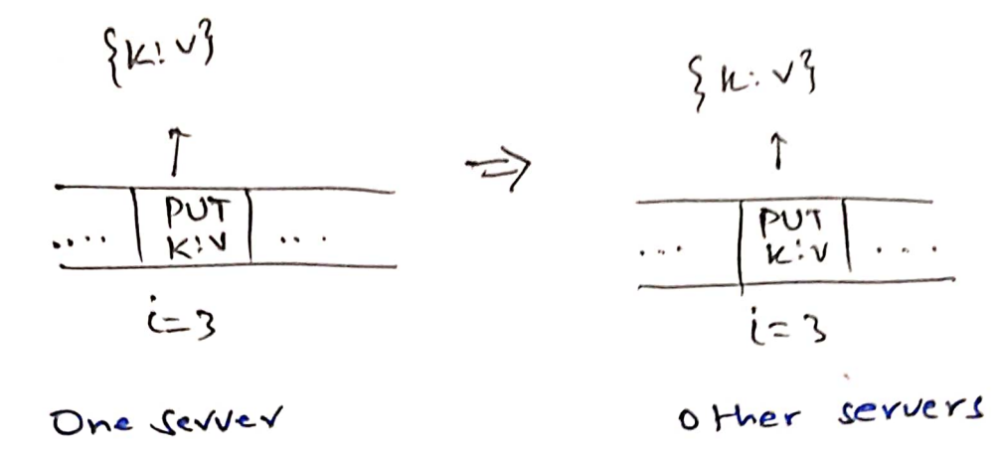

[Bayou](./storage-ec.md)'s committed state followed *exactly* the same property.
Bayou's tentative state did not follow this property; tentative log entries
could be rolled back during anti-entropy. As in Bayou, Raft also has a *prefix*
of the log that is *committed*. The log may have extra entries that are not yet
committed. Raft servers do not maintain a separate tentative state. Tentative
entries may get rolled back. Like Bayou, committed entries shall *never* get
rolled back.

A replicated log with state machine safety can be used to easily realize a
*linearizable* storage system by putting all reads and writes in the replicated
log. Therefore, Raft is also an auto FT linearizable key-value storage system.

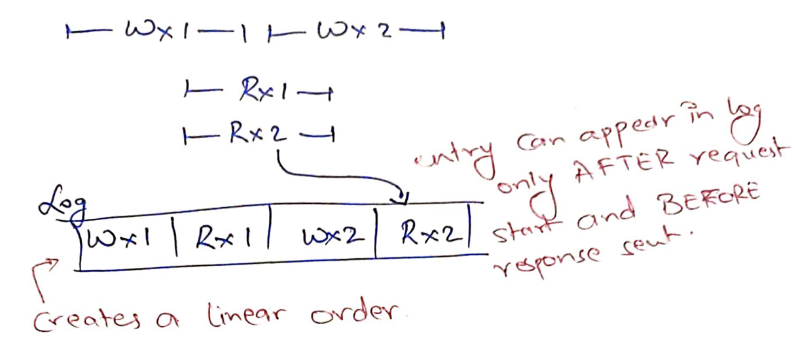

Bayou *statically* designated a primary. If the primary goes down, the system
cannot commit writes. This makes Bayou not self-sufficient for FT: a third-party
(like an administrator) will have to designate another replica as primary. In
Raft, we would like to design a *symmetric* system for self-sufficient FT: any
replica can be *elected* as the primary. 

Unlike Bayou, all reads and writes are served by the primary. In normal
operation (without failures), primary decides a global order of the log entries
and appends them to the followers. It also tells a *commitIndex*: a prefix of
the log that can be committed by the replicas.

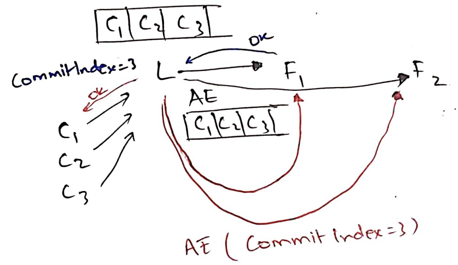

## Electing a primary

How to elect a primary (a leader)? We must avoid a *split-brain situation*
similar to [GFS](./storage-gfs.md). If there are two leaders in the system and
both of them are able to commit two different log entries at the same log index,
it *will break* state machine safety. 

To avoid split-brain situations, Raft would like to uphold 
***election safety***: at most one leader can be elected in a given **term**. 
Term is similar to the version number in GFS. New leaders are assigned in a new
term to let servers distinguish new leader's messages from old leaders'
messages.

In GFS, a special master was assigning primaries for chunks. Master failures had
to be handled by another system that replaces master. We want Raft to be
self-sufficient, i.e., no special master. 

How to elect leaders without any special servers? Consider two replicas S1 and
S2. Both of them are alive but partitioned. From the point of view of S1, S2 is
down. Should it make itself leader? If yes, S2 might also similarly make itself
the leader breaking election safety. 

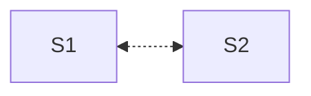

We created replicas for fault tolerance. When leader crashes, the system will be
unable to progress since the other server can not *know* if the leader has crashed
or is it only partitioned?  This was thought insurmountable for a long time. It
was believed that auto FT is not possible, i.e, we always need external
intervention to distinguish between the two situations (partitions or faults).

The **big idea**, also used in Raft, is to add another server. Now, the side
with the majority of the servers (S2, S3) can proceed. Adding another server
lets us distinguish between the two sides; both sides cannot simultaneously have
majority. 

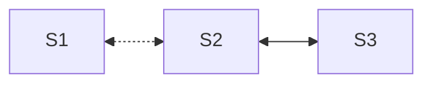

This gives us the **liveness property** of Raft: as long as a *majority* of
servers are able to talk to each other within a bounded delay (say 100ms), the
system shall make progress. To handle `F` faults, Raft needs `2F+1` replicas;
`F+1` live servers will be able to form a majority given `2F+1` servers. This is
the price we are paying for automatic FT; CR/CRAQ could handle `F` faults with
just `F+1` servers.

To detect crash of the leader, the leader keeps heartbeating with everyone. If a
server does not receive the heartbeat of the leader within an *election
timeout*, it increases the term number, makes itself a *candidate*,  and starts
an election. Since multiple servers can simultaneously become candidates, 
electing a leader is the *classic consensus problem*. We need three properties
in consensus/leader election:

1. **Termination**: Every non-faulty server should eventually (after all network
partitions heal) learn about the leader.
2. **Agreement**: All non-faulty servers should agree on one leader.
3. **Validity**: The agreed-upon leader must be one of the candidates requesting
for votes.

Termination and agreement makes sense. Validity is added to remove non-sensical
solutions like "Always makes S1 the leader". There is a famous FLP impossibility
result that says if the network delays were unbounded then consensus is
impossible. Raft is only live if majority has *bounded delays* betwen them.

Doing an election is simple: candidates vote for themselves and then request
votes from all the servers. Each server just votes *once* in a given term. When
a candidate has received votes from a majority, it can make itself leader. This
trivially upholds election safety. Since in a given term, each server votes only
once, there can never be two majorities and hence two leaders.

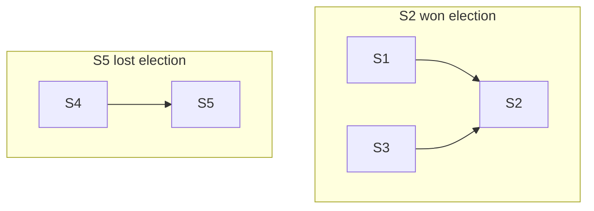

But what about liveness? If no candidate is able to form a majority due to
split-votes, there will be another election timeout. (Potentially new)
Candidates will ask for votes in a new term. Can we not split votes forever? 

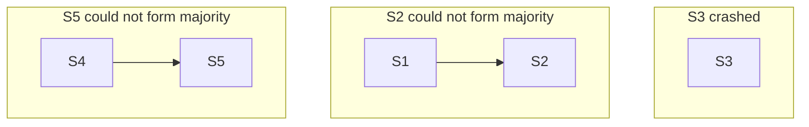

The idea is to *randomize* election timeouts. Hopefully, two servers will become
candidates at two different times. What is a good election timeout? Raft chooses
150-300ms. To summarize, Raft servers follow this state machine:

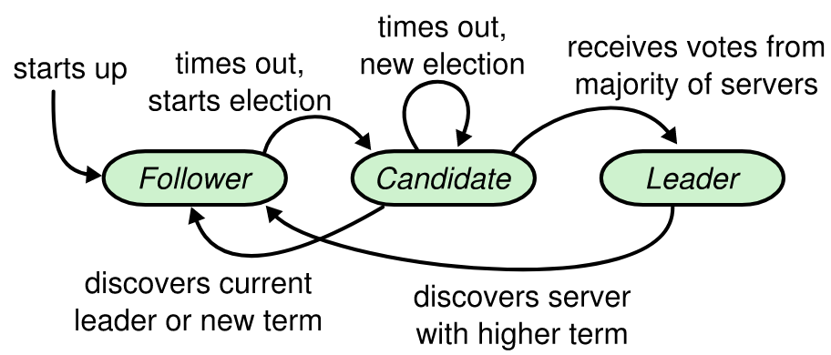

## How to commit?

All reads and writes are handled by the leader. Followers just tell clients to 
(1) send their requests to the leader. The leader (2) appends the entry into the
log and (3) sends AppendEntries request to all the followers. If a (4) majority
of servers (including the leader) append the log successfully, (5) leader
increments the commitIndex, applies the log entry on its state machine, and 
responds success to the client.

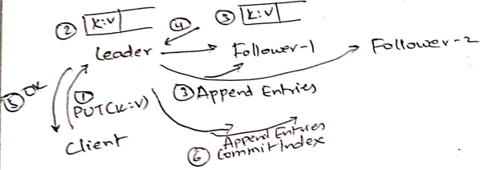

What if follower-2 is partitioned? Leader separately maintains `nextIndex` for
each server. Leader keeps attempting appends after `nextIndex` to each server.
`nextIndex` is incremented when the server successfully appends the sent log
entries. It is ok if follower-2 is partitioned, leader can increase
`commitIndex` (i.e, commit) given majority `nextIndex` are beyond `commitIndex`.

What if follower-2 was partitioned/dead for a long time? Wouldn't the log grow
too large? Once in a while, each server can independently snapshot the state and
purge the log older than what is applied to the state machine. When follower-2
finally comes up, leader can first send the snapshot and then start appending
the remaining log entries.

Election safety only guaranteed one leader *in a given term*, i.e, there can
simultaneously be two leaders in two different terms. Why is this not a problem?

Since a majority of the servers have elected the new leader, they know about the
new term. The old leader will not be able to form majority (servers reject
append entries from old term) and therefore will not be able to commit.

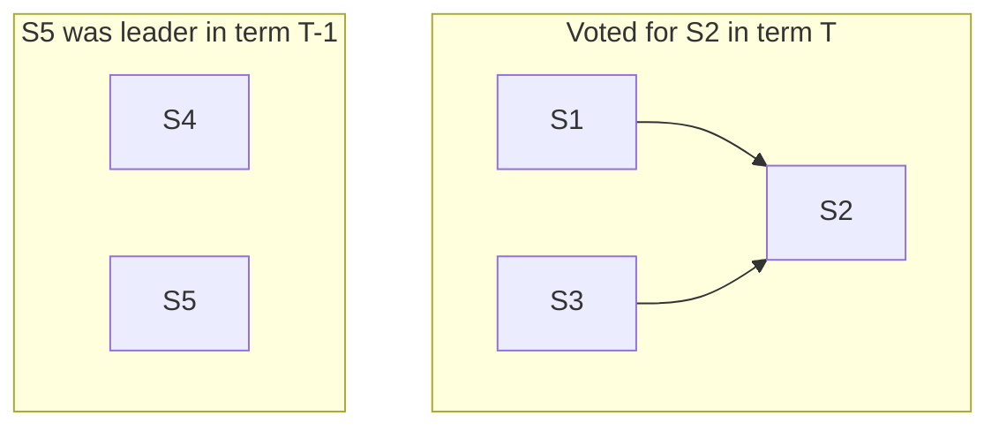

## Leader replacement

Can we miss committed entries during leader replacement? For example, in the
following figure, S1 was the leader in term 1 who committed three entries. After
S1 crashes, S3 finishes rebooting and becomes the leader in term 2. If it starts
appending term 2 entries into the log, we might break state machine safety.

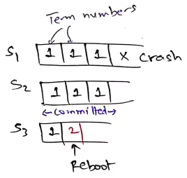

If instead S2 becomes the leader, we don't have the same problem. We can do this
if S2 refuses to vote for S3 but S3 votes for S2. Therefore, at the time of
elections, Raft also wants to guarantee a *leader completeness* safety property
that says: if a log entry is committed in a given term, then that entry *will be
present* in the logs of the leaders of all higher terms.

How should we decide S2 should not vote for S3?

Idea 1: Servers with the longest log do not vote for servers with shorter logs.
This works for the original example. But in the following example, S3 will end
up becoming the leader for term 4 breaking the leader completeness property: S3
does not know about the committed entry in term 3!

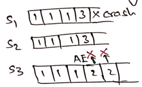

Idea 2: Server with a higher commitIndex do not vote for servers with a lower
commitIndex. In the previous example, S2's commitIndex might be 4 (all of its
entries are committed) and S3's commitIndex might be 3 (only first three entries
are committed).

But S1 may have crashed *before* it could tell S2 about commitIndex=4. In that
case, both S2 and S3 will have a commitIndex=3.

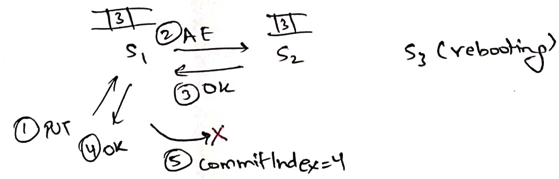

We could avoid this situation if leader acks clients after advancing commitIndex
of majority. We don't want to do this since it is slower as requires two round
trips, one for original append and one for commitIndex. It might also complicate
the protocol: what if someone in the earlier majority crashes before knowing
about the commitIndex?

Raft idea: I am more caught up if 
* for my last log entry, my term number > their term number; and
* if last log entry term numbers are equal, my log length > their log length.

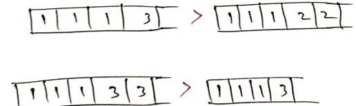

Therefore, candidates send (log length, term number of last log entry) while
requesting votes. Servers vote for candidates after applying the above rule.

One can try to prove using induction that the approach above, together with the
majority-based commit upholds leader completeness. Instead of looking at the
proof, we can just look at an example. Here, we have a random trace of 7 terms
with 6 servers. The trace upheld leader completeness property for the 7 terms.
The following shows leaders for each term:

For term 1, anyone.
For term 2 and 3, f.
For term 4, e.
For term 5, anyone in a, b, c.
For term 6, c.
For term 7, d.

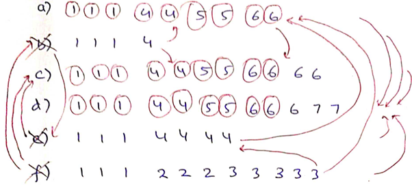

We are looking to elect a leader in term 8 by seeing who can vote for who. We 
see that only a, c, and d can become leaders since they are able to gather
majority and they *are* the ones who have all the committed entries!

## What to do about diverging logs?

Because of arbitrary crashes and reboots, we may end up with diverging logs
as follows:

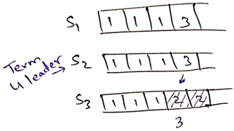

Raft has a *strong leader* who forces its logs onto others. After S2 is elected
leader for term 4, it forces its logs on to S3. In each append entry request,
leaders also send the (previous log index, previous term number). Append entries
are accepted only if the (previous log index, previous term number) matches.
Otherwise, leader keeps going backwards in the log trying to append the previous
log entry until appends can be accepted.

Why is this ok? Because of leader completeness property! Because the leader has
all the committed entries, it can safely force its logs! It knows that it will
only change uncommitted entries. 

Forcing logs would be bad in following situations. If S1 forces its logs of term
3 on S2 it will rollback a committed entry of term 2. However, this situation is
not possible. If "2" was a committed entry, S1 could not have become leader for 
term 3.

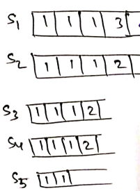

Why is checking only the last log entry sufficient? Can the following happen? The
last log entry matches but an earlier entry did not match?

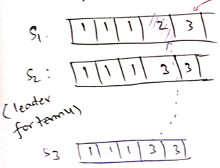

No! We could not have appended the last entry (term 3), if the second last entry
did not match (term 2 vs term 3). This is what the paper calls the *log matching
property*.

Why is checking only the term number sufficient? Can the actual operations be 
different?

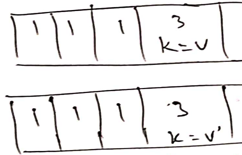

No! Term 3 leader decides the operation for each log entry. What if
AppendEntries came out-of-order to the followers? When appending (k=v) and
(k=v'), the previous log index sent by the term-3 leader must have been
different.

## Subtletly

Leader completeness property only says that the leader has *all* the committed
entries.  But, the leader may have *extra* log entries from an older term. 

Consider the following scenario. In (b) S1 is leader for term 2, it replicates
the entry to S2 and crashes. S5 becomes leader for term 3, it takes a log entry
and crashes. In (c) S1 again becomes leader for term 4, takes a log entry and
starts forcing its logs. 

If an older term log entry (term 2) is *committed* by S1, we may have a problem.
In (d), S5 again becomes leader for term 5 and forces its logs. This overwrites
a committed entry and breaks the state machine safety!

Therefore, leaders must not commit entries from an older term! S1 can just
append entries of term 2 but it advances commitIndex only after building
majority for some entries in the latest term, as in (e). In (c), S1 *does not*
increment commitIndex.

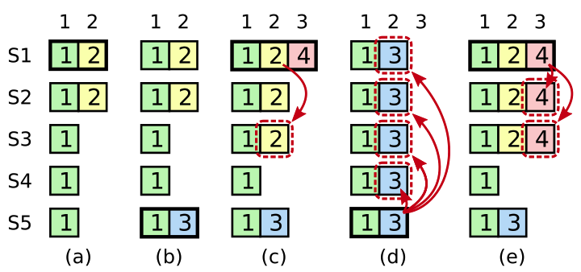

## State and persistence

Each server must persistently remember

1. Log: I might become the leader after I restart and may need to catch up followers.
2. currentTerm: I must reject AppendEntries and RequestVotes from old leaders.
Otherwise, they will be able to build a majority and commit leading to split-brain
situations!
3. votedFor: I must remember that I already voted in the current term so I don't 
vote again after a restart.

# Summary

Raft is a self-sufficient consensus protocol for building replicated state
machines using a replicated log. The main property that we need to uphold is
state machine safety. This is the same property also upheld by chain replication
and committed state of Bayou. 

Replicated state machines can be used to build linearizable key-value stores.
Raft is now used by many real-world systems like
[Redis](https://redis.io/blog/redisraft-new-strong-consistency-deployment-option/)
and  [etcd](https://github.com/etcd-io/raft): a key-value store used by
Kubernetes.

To become self-sufficient, Raft holds elections to replace a crashed leader.
The idea of majority provides election safety: only one election in a given
term. Since logs can diverge, Raft leaders force their logs. Forcing is safe to
do as it is guaranteed to never overwrite committed entries due to the leader
completeness property.

But automated FT does not come for free. Raft needs `2F+1` servers to
accommodate `F` faults. Therefore, a typical setup nowadays is to only keep the
"control layer" in Raft and the "data layer" in chain replication. Raft (or a
similar system like Zookeeper) manages the chain configuration.