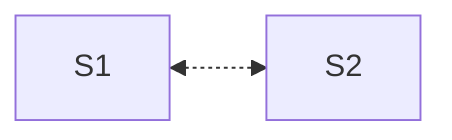
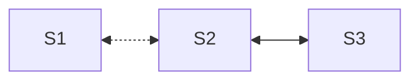
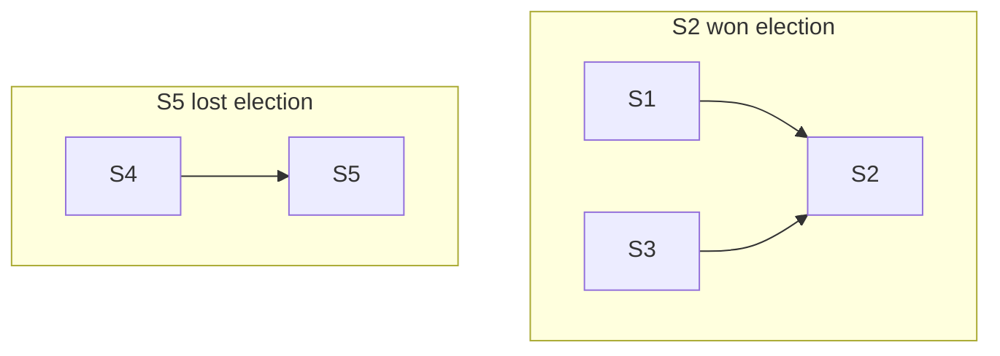
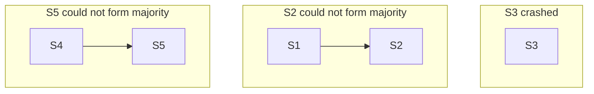

# Raft
[CR/CRAQ](./storage-craq.md) depended on an external FT system to manage the
chain configuration. How is this external system made FT? Does it need yet
another FT system? :-o

## Raft setup
Raft is a *self-sufficient* system that does not depend on any other system for
its FT. It realizes *replicated state machines* which as we saw in Bayou and CR
can be realized using *replicated log*. This brings us to the primary safety
property that Raft wants to uphold. 

***State machine safety:*** If a server has applied a log entry at a given index
to its state machine, no other server will ever apply a different log entry for
the same index.

[Bayou](./storage-ec.md)'s committed state followed *exactly* the same property.
Bayou's tentative state did not follow this property; tentative log entries
could be rolled back during anti-entropy. As in Bayou, Raft also has a *prefix*
of the log that is *committed*. The log may have extra entries that are not yet
committed. Raft servers do not maintain a separate tentative state. Tentative
entries may get rolled back. Like Bayou, Committed entries shall *never* get
rolled back.

A replicated log with state machine safety can be used to easily realize a
*linearizable* storage system by putting all reads and writes in the replicated
log. Therefore, Raft is also an auto FT linearizable key-value storage system.

Bayou *statically* designated a primary. If the primary goes down, the system
cannot commit writes. This makes Bayou not self-sufficient for FT: a third-party
(like an administrator) will have to designate another replica as primary. In
Raft, we would like to design a *symmetric* system for self-sufficient FT: any
replica can be *elected* as the primary. 

Unlike Bayou, all reads and writes are served by the primary. In normal
operation (without failures), primary decides a global order of the log entries
and appends them to the followers. It also tells a *commitIndex*: a prefix of
the log that can be committed by the replicas.

## Electing a primary

How to elect a primary (a leader)? We must avoid a *split-brain situation*
similar to [GFS](./storage-gfs.md). If there are two leaders in the system and
both of them are able to commit two different log entries at the same log index,
it *will* break state machine safety. 

To avoid split-brain situations, Raft would like to uphold 
***election safety***: at most one leader can be elected in a given **term**. 
Term is similar to the version number in GFS. New leaders are assigned in a new
term to let servers distinguish their messages from old leaders' messages.

In GFS, a special master was assigning primaries for chunks. Master failures had
to be handled by another system that replaces master. We want Raft to be
self-sufficient, i.e., no special master. 

How to elect leaders without any special servers? Consider two replicas S1 and
S2. Both of them are alive but partitioned. From the point of view of S1, S2 is
down. Should it make itself leader? If yes, S2 might also similarly make itself
the leader breaking election safety. 

We created replicas for fault tolerance. When leader crashes, the system will be
unable to progress since the other server can not *know* if the leader has crashed
or is it only partitioned?  This was thought insurmountable for a long time. It
was believed that auto FT is not possible, i.e, we always need external
intervention to distinguish between the two situations (partitions or faults).

The **big idea**, also used in Raft, is to add another server. Now, the side
with the majority of the servers (S2, S3) can proceed. Adding another server
lets us distinguish between the two sides; both sides cannot simultaneously have
majority. 

This gives us the **liveness property** of Raft: as long as a *majority* of
servers are able to talk to each other within a bounded delay (say 100ms), the
system shall make progress. To handle `F` faults, Raft needs `2F+1` replicas;
`F+1` live servers will be able to form a majority given `2F+1` servers. This is
the price we are paying for automatic FT; CR/CRAQ could handle `F` faults with
just `F+1` servers.

To detect crash of the leader, the leader keeps heartbeating with everyone. If a
server does not receive the heartbeat of the leader within an *election
timeout*, it increases the term number, makes itself a *candidate*,  and starts
an election. Since multiple servers can simultaneously become candidates, 
electing a leader is the *classic consensus problem*. We need three properties
in consensus/leader election:

1. **Termination**: Every non-faulty server should eventually (after all network
partitions heal) learn about the leader.
2. **Agreement**: All non-faulty servers should agree on one leader.
3. **Validity**: The agreed-upon leader must be one of the candidates requesting
for votes.

Termination and agreement makes sense. Validity is added to remove non-sensical
solutions like "Always makes S1 the leader". There is a famous FLP impossibility
result that says if the network delays were unbounded then consensus is
impossible. Raft is only live if majority has bounded delays betwen them.

Doing an election is simple: candidates vote for themselves and then request
votes from all the servers. Each server just votes *once* in a given term. When
a candidate has received votes from a majority, it can make itself leader. This
trivially upholds election safety. Since in a given term, each server votes only
once, there can never be two majorities and hence two leaders.

But what about liveness? If no candidate is able to form a majority due to
split-votes, there will be another election timeout. (Potentially new)
Candidates will ask for votes in a new term. Can we not split votes forever? 

The idea is to *randomize* election timeouts. Hopefully, two servers will become
candidates at two different times. What is a good election timeout? Raft chooses
150-300ms.

