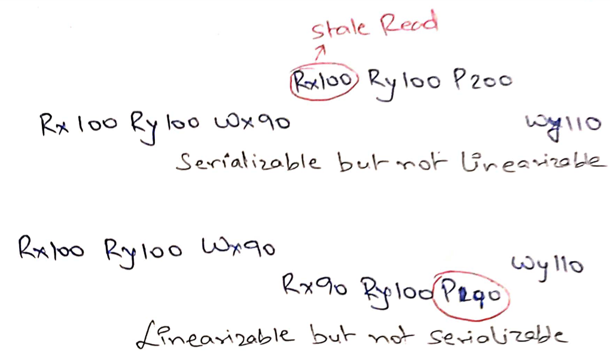
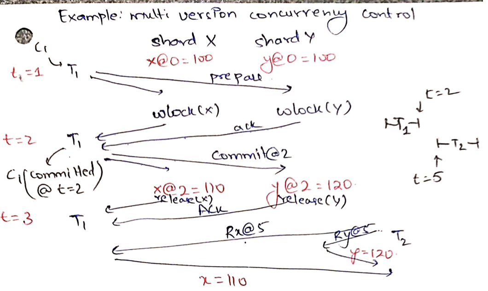

# Spanner

## Strict serializability / external consistency
In Zookeeper, Raft, CR/CRAQ, we have been assuming that the entire-key value
store fits within the memory/storage of a single machine. In Dynamo, we sharded
the objects, but there we assumed that all keys are being read/written
independently.

These storage systems cannot service applications such as banking.  Here, all
bank account information cannot fit into a single machine, therefore requiring
sharding of accounts. We might want to modify multiple bank account balances
together in *transactions*.

We focus on two ACID properties: 
* Atomicity: Either all writes happen or none of them happen
* Isolation: Execute like no other transactions were running

Assume x=y=$100 and we are doing the following two transactions:

| T1: transfer | T2: audit   |
| ------------ | ----------- |
| x = get_x()  | x = get_x() |
| y = get_y()  | y = get_y() |
| put_x(x+10)  | print(x+y)  |
| put_y(y-10)  |

Atomicity is broken if T1 crashes after put_x(x+10). We magically created $10 in
our bank. Isolation is broken if T2 executes between T1's `put_x(x+10)` and
`put_y(y-10)`. T2 will then print 210. If T1 executes between T2's `get_x()` and
`get_y()`, T2 will print 190.

To get isolation, what we want is *serializabilty*. Observed effect of
transaction executions can be rearranged in a serial order: T1 before T2 or T2
before T1.  For the example above, in both rearrangements, x=90, y=110, and 200
is printed.

Note that serializability is different from linearizability. Linearizability
only talks about operations on a single object whereas serializability is about
transactions: multiple operations on multiple objects.

Serializability does not say anything about real-time order. For example, no
matter when T2 is run, let us say if it just reads initial values of `x` and
`y`, we can still arrange transactions into a serial order. *Strict
serializability* additionally enforces *real-time order*: if T2 started after T1
committed, only T1 before T2 is strictly serializable.

If a system can realize strict serializability, it can easily realize
linearizability: make all transactions do just one operation (read or write) on
just one object. Strict serializability is easy to realize in Raft/chain
replication by throwing entire transactions into the replicated log. Systems
ensure that they will run one transaction at a time; the log forces the
real-time order.

However, this may not perform very well. Non-conflicting transactions, such as a
bank transfer from x to y, is unnecessarily serialized with another bank
transfer from p to q. Moreover, all bank accounts do not fit in a single
machine; e.g. x and y bank accounts can be sharded on two different machines.

### Optimistic concurrency control

OCC assumes most transactions do not conflict with each other. Transactions
setup watch for different variables. If any variable changes before transaction
could commit, the transaction is aborted. For example in the following, if T1
gets to exec first, T2 is aborted. If T2 gets to exec first, T1 is *not* aborted
since T2 did not change x, y.

| T1: transfer | T2: audit   |
| ------------ | ----------- |
| watch x      | watch x     |
| watch y      | watch y     |
| multi        | multi       |
| x = get_x()  | x = get_x() |
| y = get_y()  | y = get_y() |
| put_x(x+10)  | exec        |
| put_y(y-10)  | print(x+y)  |
| exec         |

### Pessimistic concurrency control

PCC assumes most transactions conflict with each other, so they upfront lock
variables. If transactions were not conflicting, we unnecessarily pay the
locking overhead.

| T1: transfer | T2: audit   |
| ------------ | ----------- |
| rlock(x)     | rlock(x)    |
| rlock(y)     | rlock(y)    |
| x = get_x()  | x = get_x() |
| y = get_y()  | y = get_y() |
| wlock(x)     | release(x)  |
| wlock(y)     | release(y)  |
| put_x(x+10)  | print(x+y)  |
| put_y(y-10)  |
| release(x)   |
| release(y)   |

We can easily get into deadlocks with multiple ongoing transactions. For
example, if one transaction is transfering from x to y and another is
transfering from y to x then both of them may have taken read locks and no-one
is able to take the write locks.

PCC typically have some mechanisms for breaking deadlocks. For example, in
wound-wait deadlock avoidance scheme, the transaction that reaches wlock first
aborts the other transaction that is deadlocking with it.

Now let us see how to do PCC when x and y are distributed on multiple machines.

#### Two-phase commit

In two-phase commits, RW transaction is executed in two phases. Transaction
coordinator (TC) asks all shards to return all relevant values and *prepare* to write
by taking the write locks. The values are sent back to the client.  The client
sends back the new values to write. TC asks all shards to commit the values and
release all locks.

How does it give atomicity? TC says prepare is complete iff *all* shards said
YES to prepare phase. If shard B couldn't get the lock, for example, it replies
NO. TC will abort the transaction.

What if B crashes *before* it could send YES? TC will timeout the prepare and
abort the transaction. It will send abort to A, A will release the locks without
writing anything.

What if B crashes *after* it already sent YES? TC may have sent commit to A!
TC will keep retrying commit(T1) forever with B.  When B reboots, it must
*remember* that it was in the middle of transaction T1, and must re-acquire
wlock(y). It must not say YES to another conflicting transaction! Therefore,
shards must do write-ahead-logging of prepare(YES) messages before replying to
TC. 

What if TC crashes? If participants replied YES, they are blocked. They must
keep waiting for commit/abort! After restart, TC must commit/abort all pending
transactions. Therefore, TC does write-ahead logging of 
* transaction details,
* sent prepare message for transaction T to shard X, 
* sent commit/abort message for transaction T to shard X, 
* received second phase ACK for transaction T from shard X.

Why is it ok to not log prepare responses from shards? TC can unilaterally abort
if it has not committed/aborted a transaction. 

Spanner does two-phase commits of RW transactions. However, each shard is a
Paxos group (like a Raft group). Instead of doing write-ahead logging to
disk, to handle restarts, the write-ahead logging is done in the replicated log
so that majority within a given shard knows which transactions have we prepared
for.

## Snapshot reads

Pessimistic concurrency control is not great for large read-only transactions.
For example, if we are auditting all bank accounts, we will have to
simultaneously acquire read locks on all bank accounts! It may take a long time
to take these locks and further, it prevents all writes while the locks are
held! We would like to execute such read-only transactions without taking any
locks.

| T0: transfer | T1: transfer | T2: audit   |
| ------------ | ------------ | ----------- |
| rlock(x)     | rlock(x)     | x = get_x() |
| rlock(y)     | rlock(y)     | y = get_y() |
| x = get_x()  | x = get_x()  | print(x+y)  |
| y = get_y()  | y = get_y()  |
| wlock(x)     | wlock(x)     |
| wlock(y)     | wlock(y)     |
| put_x(x-3)   | put_x(x+10)  |
| put_y(y+3)   | put_y(y-10)  |
| release(x)   | release(x)   |
| release(y)   | release(y)   |

Even though, read-only transactions are executed without locks, we still want to
uphold strict serializability! It is unacceptable to run T2 in between `put_x`
and `put_y` of T1 thereby getting wrong total account balance!

### Multi-version concurrency control

The idea to support snapshot isolation is to keep multiple *versions* of each
value. Each RW transaction is given a *commit timestamp* and all the values
written by it are written at this timestamp version. Each RO transaction is
given a *start timestamp*, it reads the latest value at this timestamp. Now even
though, there may be other ongoing RW transactions, their writes do not
interfere with what an earlier RO transaction is reading! This allows lock-free
reads in RO transactions without giving up strict serializability.

For example in the following, T1 is committed at time 2, T2 starts at time 5 and
reads the values written by T1. If T0 was ongoing, it does not affect the
execution of T2.

