# Zookeeper

- [Zookeeper](#zookeeper)
  - [Relaxed consistency](#relaxed-consistency)
  - [Zookeeper implementation in terms of Raft](#zookeeper-implementation-in-terms-of-raft)
  - [Zookeeper APIs and usecases](#zookeeper-apis-and-usecases)
  - [Distributed locking](#distributed-locking)
  - [Ephemeral znodes, watches, and failovers](#ephemeral-znodes-watches-and-failovers)
- [Summary](#summary)


## Relaxed consistency
We saw that linearizability can be easily realized via Raft's replicated log by
throwing all reads and writes into the log.


To recover from more failures, we have to increase servers; `2f+1` servers are
required to handle `f` faults. However, adding servers slows down reads and
writes. More server => More network chit-chat. Each log entry can be applied as
fast as the fastest `f+1` servers.

Can we skip putting reads in the logs as reads do not modify the state machine?
Replicating entries in the log is a *heavy* operation requiring persistence and
consensus. Skipping putting reads into the log will help performance since
typical workloads tend to be read-heavy. Following shows the read/write
operations done by a Yahoo's crawler service (Figure 2 of the paper).

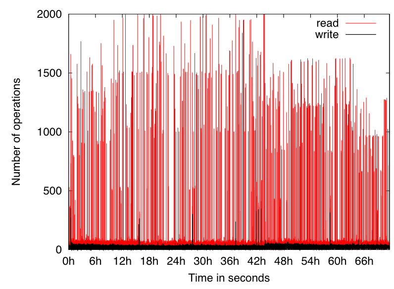

Can we allow reads directly from followers without breaking linearizability?
No. The follower may be in the minority and may not know about the latest write.

Can we allow reads from leader directly? Without replicating read in the log and
without breaking linearizability? No! What if the new leader accepted a write
and the old leader serviced the read.

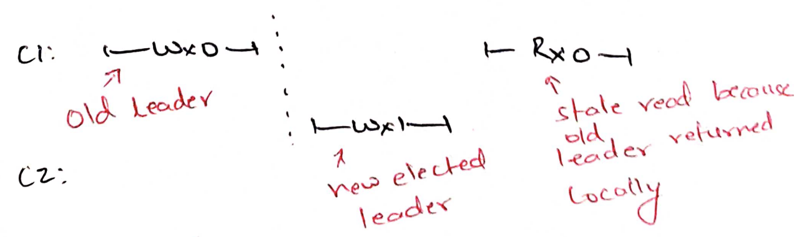

One way to fix the above situation is by using *leases*. Old leader keeps
renewing its lease via building majority quorum in every heartbeat. New leader
cannot be elected until the lease expires: any given server does not vote until
the lease extension it allowed to the old leader has expired. Therefore, the
above situation cannot happen. Old leader safely services local reads until
lease timeout. New leader cannot apply the problematic Wx1 above within the
lease timeout.  Therefore, we *can* service reads without replicating reads in
the log!

Can we further improve read throughput by sending reads to followers? Ideally,
Nx servers should give Nx throughput. Zookeeper does this by relaxing
consistency. Stale reads shown above are allowed! A useless storage system shows
all reads as initial values (say 0). Zookeeper places restrictions on how stale
can reads be:

1. Writes are linearizable, i.e, they follow a total order. Reads are
*monotonic*. In the below history, if a client has read `y=4`, then it must read
`x=2`. If another client has only read `y=3`, then it is ok for it to read
`x=1`. In other words, stale reads are allowed but by reading a write, all
previous writes become *visible*.
   
   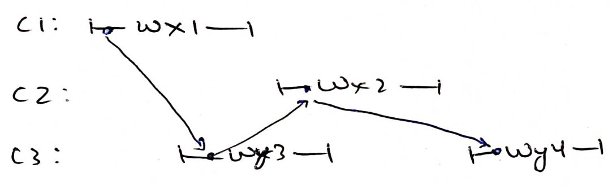

2. Clients always see their own writes. When reading after a write, all previous
   writes become visible.

   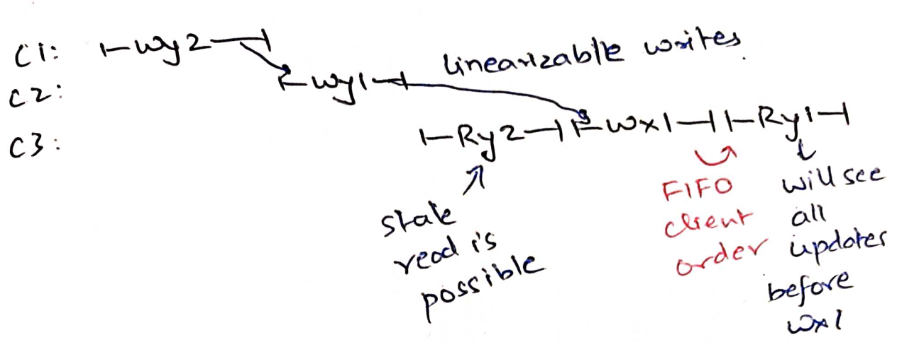

Zookeeper uses another consensus protocol called Zab, but we can see how it
can work on top of Raft.

## Zookeeper implementation in terms of Raft

In Zookeeper, clients are talking to the closest server. Writes are forwarded to
the leader as they have to go through the log for replicated state machine, i.e,
build consensus. Reads are served locally by the server without forming a
consensus. Let us say a client C4 is connected to a follower S3 doing Wx1
followed by Rx. C4 must read back Rx1 if there is no other Wx from other
clients. 

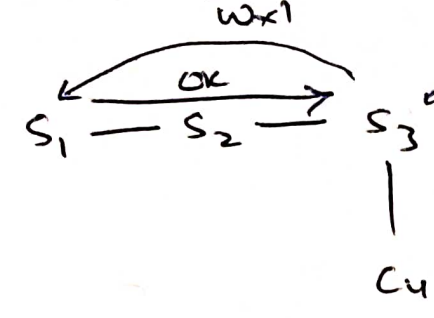

When should S3 service the read? It cannot allow the read *as soon as* it sees
ok for Wx1. S1 may have formed majority with S2; S3 may not have applied Wx1 in
its local state machine and may therefore read an old value of x. S3 should
service the read after it has *applied* Wx1.

How to maintain the consistency guarantee across failovers? Let us say C4 sent
the write to Wx1 and got back ok => S1 and S3 have committed Wx1. Before it
sends Rx, S3 crashes. So client sends Rx to S2. When should S2 service this
read? S2 can only service it after it has also *applied* Wx1.

In Zookeeper, each read request and each write response contains `commitIndex`
(that they call zxid). Reads can be serviced only if `lastApplied` is greater
than the request's `commitIndex`. Therefore, Zookeeper is also unavailable
during partitions. Servers in the minority partition will not be able to apply
new writes. They may continue to serve stale reads as long as the client does
not invoke a write.

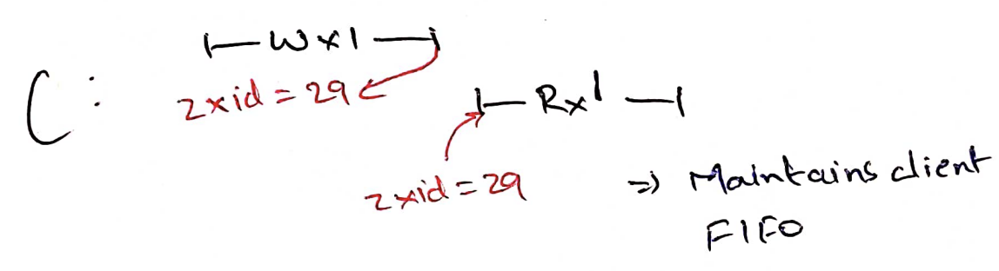

Do read responses also need to return zxid? Yes! Reads are *monotonic*: all
previous writes need to become visible after a read. In the following example,
if Rx2 does not return a zxid, Ry may go to another server after a failover.
That server needs to become as caught up as Rx otherwise it might service a
stale value of y.

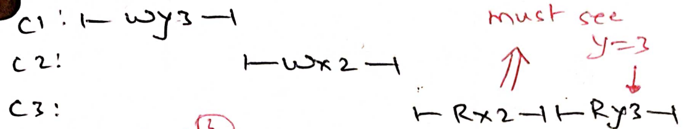

With this, Zookeeper is able to scale the read throughput as we increase
servers. Writes become slower as we increase servers. More servers => more
network chit chat. Writes are as fast as the fastest `f+1` servers.

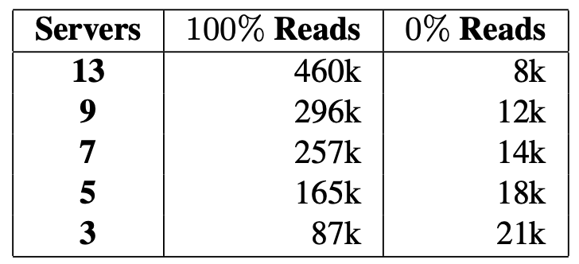

Read performance improvement is welcome. But is this storage system useful? How?

## Zookeeper APIs and usecases

Before we see some usecases of Zookeeper, let us see its APIs and how they are
implemented. Zookeeper provides hierarchical "znodes". Unlike typical
filesystems, intermediate znodes in the hierarchy can also store data. Again
unlike filesystems, clients directly send a write to a znode by specifying their
full path in each request; there are no open/close/chdir APIs.

* create(path, data, flags)

The most interesting flag is EPHEMERAL. It means auto-delete this path if client
session is disconnected. We will see later how it helps us realize group
membership, distributed locks, etc.

Just like CRAQ, each znode has a version number that is incremented at every
write to the znode. This allows us to implement test-and-set: perform this
operation iff the version of znode is xyz.

* delete(path, version)
* setData(path, data, version)

Clients can "watch" changes to a path; Zookeeper notifies the client upon a
change. This turns out to be a powerful pattern in decoupling writers from
readers. Writers need not send separate messages to readers for updating their
configuration; they just write to Zookeeper. Zookeeper will notify readers about
the change.

* exists(path, watch)
* getData(path, watch)
* getChildren(path, watch)

Configuration management: An administrator can write a new configuration (such 
as who is GFS master, what is the chain layout in chain replication) to a znode
like `/gfs/config`. Other servers can watch this znode and get notified whenever
configuration changes. The admin need not tell each server *individually* about
this change.

Rendezvous: When data center reboots, workers like GFS chunkservers may boot up
*before* the master. Master can create an ephemeral `/gfs/config` znode that
gets deleted whenever master dies. Chunkservers can put an exists watch on the
`/gfs/config` znode after reboot. Upon rebooting, master recovers itself by
playing its WAL, then writes `/gfs/config`. Chunkservers will get a watch
notification from `/gfs/config` that master is ready.

What if master needs to share many separate details or make many changes to
`/gfs/config`? Master can create a `/gfs/ready` file after it is done making all
the changes to `/gfs/config`. Chunkservers can watch `/gfs/ready`. Upon 
receiving a notification from `/gfs/ready`, they can read `/gfs/config`. Due to 
Zookeeper's *monotonic reads*, they will definitely see (at least) the latest
`/gfs/config` written before `/gfs/ready`. 

Note that if `/gfs/config` was changed again, then they may see a later
`/gfs/config/`. getData also returns a version number to let clients discover
such scenarios. Master can write the version of `/gfs/config` to `/gfs/ready`
znode. Client would know that config is changing again and wait for another 
ready notification.

Group membership: Chunkservers can create ephemeral child znodes `/gfs/cs/1`,
`/gfs/cs/2`, etc. with their IP and port information. A Sequential flag in
create API ensures that a znode gets the next ID. Any administrator (maybe
including master) can easily get to know the chunkservers by just doing
`getChildren(/gfs/cs`). They can set a watch on `getChildren(/gfs/cs)` to get
notified about chunkservers joining/leaving.

## Distributed locking

For coordination, it is useful to have locks. A typical lock has the following
safety and liveness properties:

* Safety: No two processes acquire the lock at the same time
* Liveness: All requesters eventually get to acquire the lock assuming all
acquirers eventually release the lock.

Since machines can crash at any point of time, a crash must be treated as a
*release*. Otherwise, if a machine crashes with the lock, the system may halt:
everyone blocks on acquire forever. 

In Zookeeper, clients just create an ephemeral znode at the time of acquire. To
release (or when client crashes), the znode is deleted. Other clients may have
an exist watch notification on the znode. When znode no longer exists, another
client creates the same ephemeral znode to acquire the lock.

But this has the problem of herd effect: all clients get the watch notification,
all of them race to create the new znode, only one of them succeeds. This is all
wasteful for the failed clients. Such locks may also not be fair. Slower
clients/clients talking to followers have lower chances of getting the lock than
faster clients/clients talking to leader.

To avoid herd effect and starvation of slow clients, clients can create
ephemeral child znodes with sequential flag. If the client has the lowest ID, it
has the lock. Otherwise, client sets a watch notification on the previous ID.

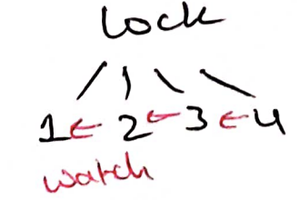

If I receive a watch notification, can I assume I have the lock? No! Previous
client may just have crashed! I need to re-check if I have the lowest ID!

How good is this lock? What if the client who had the lock had not crashed?  It
was only partitioned from Zookeeper. Now, two clients will have locks!

Let us say the clients are doing the following critical task:

```py
def critical():
   lock.acquire()
   data = storage.read(filename)
   storage.write(filename, update(data))
   lock.release()
```

Client 1 takes the lock, reads, gets partitioned from Zookeeper. Client 2 is
able to take the lock, reads, writes. Client 1 writes to the file overwriting
client 2 contents!

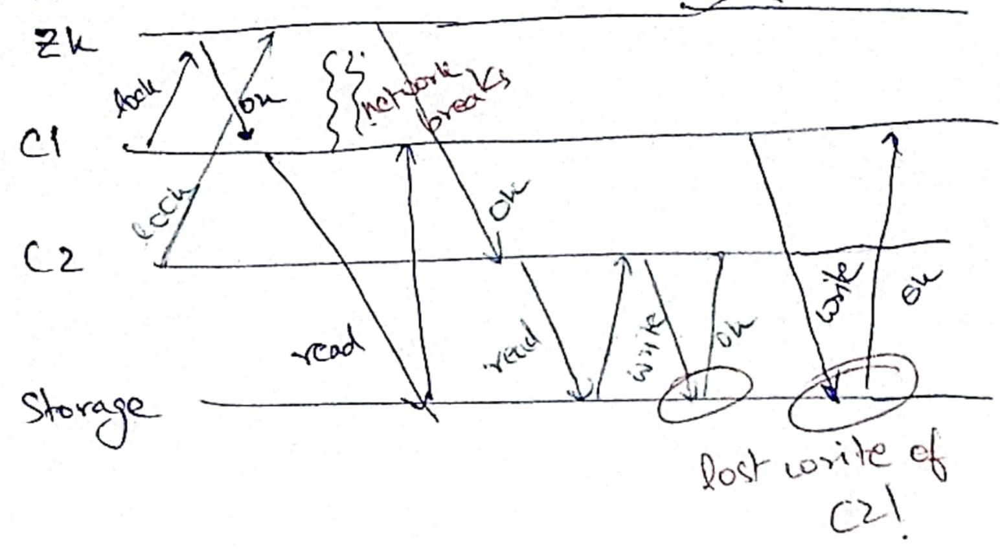

By treating crashes as lock release to bring liveness, we broke the safety
property of the locks! Clients therefore cannot assume mutual exclusion in
distributed locking and the system needs to be prepared for this situation!

To handle the above scenario, the storage system needs to play a more active
role. When client 1 got the lock, it got the lowest ID from Zookeeper (say 33).
When client 2 gets the lock, it got next ID (say 34). Storage needs to reject
the write with lock ID 33 if it has already accepted writes from lock ID 34!
These lock IDs are also called *fencing tokens*.

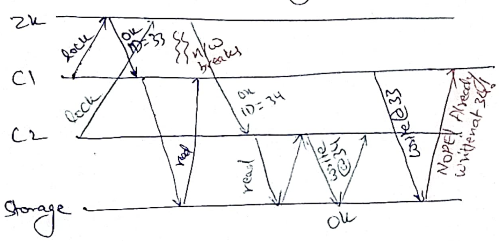

## Ephemeral znodes, watches, and failovers

Zookeeper has a session timeout of `s` ms; we assume that the client is dead if
we have not heard from the client in last `s` ms. Clients send a heartbeat to
their session server every `s/3` ms. They reconnect to a different Zookeeper
server if they could not connect in `2s/3` ms. 

Session servers tell leaders about alive clients in each heartbeat. Leader
maintains ephemeral znode timeout > session timeout. Ephemeral znodes are
deleted if we did not learn about alive client beyond ephemeral znode timeout.

What happens to the watched requests if the session server dies? Zookeeper
client library remembers all the watch requests and the version number of znode
when it was watched. Every write to znode increases its version number. When the
client connects to a new server, it sends all the watch requests to the new
server. The new server immediately sends back notifications for the watch
requests whose version numbers are now older than the version numbers of the
znode.

# Summary 
Zookeeper is a very widely used storage system for doing coordination. It 
relaxes linearizability and allows stale reads to improve read throughput.
Watches help decoupling writers from readers; writers just write to Zookeeper,
readers are notified by Zookeeper. Due to monotonic reads, when a client gets
notified, it can confidently read other znodes too without worrying about stale
reads.

Ephemeral, sequential znodes are powerful for implementing group membership and
distributed locks without the herd effect. Distributed locking can be
implemented with Zookeeper but programmers need extreme care using such locks,
since they do not provide the regular safety guarantees we are accustomed to.