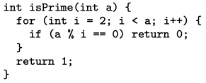
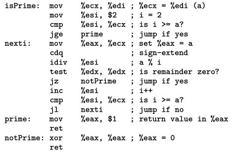
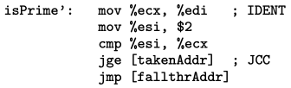

# Virtualization
Virtualization is the enabling technology for the cloud movement. Instead of
renting physical machines, cloud providers could let users rent *virtual
machines*. 

A typical view is shown on the left with multiple processes running on top of an
OS which is running on top of the hardware. VMs sit on top of hypervisors also
called virtual machine monitors (VMMs) which sits on top of the hardware. Each
VM contains its own OS and its own processes.

```
                       │ ┌───────────────────────┐┌───────────┐
┌─────────┐┌─────────┐ │ │┌─────────┐ ┌─────────┐││┌─────────┐│
│Process-1││Process-2│ │ ││Process-1│ │Process-2││││Process-2││
└─────────┘└─────────┘ │ │└─────────┘ └─────────┘││└─────────┘│
      ┌──────┐         │ │      ┌──────┐         ││    ┌────┐ │
      │  OS  │         │ │      │ OS-1 │   VM1   ││VM2 │OS-2│ │
      └──────┘         │ │      └──────┘         ││    └────┘ │
      ┌────────┐       │ └───────────────────────┘└───────────┘
      │Hardware│       │     ┌──────────────────┐      
      └────────┘       │     │  Hypervisor/VMM  │      
                       │     └──────────────────┘      
                       │     ┌──────────────────┐      
                       │     │     Hardware     │      
                       │     └──────────────────┘      
```                    
                       
By renting VMs, cloud providers' physical machines are not *locked up* with
customers.  Cloud providers can snapshot VMs and restore them elsewhere to do
maintenance on physical machines. VMs can also be *live migrated*, i.e, moved to
another machine with minimal downtime. Further, cloud providers can profit by
overprovisioning their physical machines by renting out more VMs than physical
machines. They can snapshot idle VMs and run them as required.

Users get good isolation both in terms of security and performance. Two
competing cloud customers, e.g, Uber and Ola, could be running VMs
simultaneously on the same physical machine in AWS with peace-of-mind of
security. This isolation is stronger than the isolation processes receive from
the OS. If Uber and Ola start with one process each, but then Uber's process
forks many more processes, OS' (default) scheduling will start giving more CPU
time to Uber than to Ola.

Further, because operating systems are typically complex and large, bugs in the
OS can accidentally break isolation. Hypervisors are comparatively much smaller
thereby reducing the *trusted computing base* (TCB). [Research
efforts](https://www.cs.columbia.edu/~nieh/pubs/ieeesp2021_kvm.pdf) are formally
verifying correctness of commodity hypervisors.

## CPU virtualization 

Let us briefly review relevant OS background and then talk about the history of
CPU virtualization, all-the-way to the present hardware-assisted virtualization.
We will focus our discussion on x86-32 bit which was the dominant architecture
when cloud revolution started.

### OS background
Virtualization is magic. OS lets processes *believe* that they *own* the
hardware but keeps the control with itself at all times. For virtualizing CPU,
OS does *limited direct execution*. It presets a hardware timer to generate an
interrupt after a scheduling quantum (~10ms) and gives the control of CPU to the
process. It also fills an interrupt descriptor table (IDT) and registers it
with the CPU by running LIDT instruction. IDT tells CPU where to jump the
instruction pointer when an interrupt happens.

Processes can *directly* run instructions to manipulate CPU registers like eax,
ebx, eip, esp, etc. without any involvement of the OS. When the timer (or any 
other device) raises an interrupt, CPU saves the old eip and changes eip based
on the IDT entry. OS code at this eip saves the process *context* that contains
the values of all the CPU registers. It can then invoke its scheduler to pick
another process to run. It restores CPU registers of this other process and
finally gives control to the process by restoring the process' instruction
pointer.

Clearly, processes are not allowed to directly talk to devices. What if a
process is allowed to disable/modify timer interrupt? What if a process is
allowed to run LIDT such that interrupts make instruction pointer jump inside
the process and not inside the OS? If we allow such behaviors, OS may not get
the control of the CPU back.

Therefore, such changes need to "privileged". But, CPU has no understanding of
what is a process and what is an OS. CPU is just doing fetch-decode-execute:
running one instruction after another. CPU exposes two bits in a "code segment"
(cs) register that tells the CPU which "ring" (privilege level) are we currently
running in. OS typically runs in ring-0 (most privileged, also called kernel
mode) and processes are made to run in ring-3 (least privileged, also called
user mode).

When OS gives control to the process, it also changes the two bits in cs to 3.
When interrupt occurs, hardware changes the two bits in cs back to 0 before
jumping into the OS code. If a process (running in ring 3) tries to do
privileged instructions like configuring the timer device or running LIDT, CPU
will raise a trap into the OS; OS will typically kill the process.

But if processes are not allowed to talk to devices, how will they do IO such as
reading/writing files? OS exposes *system calls* which are handled very much
like interrupts. Processes run the INT instruction, to invoke a system call,
which traps into the OS. OS goes through the whole procedure of saving process
context, services the system call, and finally restores the process context. It
may write to memory and registers of the process, such as putting file contents
when process wants to read a file and providing the return value of the system
call.

## Trap and emulate hypervisor
Hypervisors/VMMs want to play the same trick on the OS that the OS plays on its
processes. VMM wants to let the OS *believe* that it *owns* the hardware while
keeping the control with itself. However, things are more difficult here because
OS believes that it is allowed to run privileged instructions like changing the
IDT and configuring devices. Processes were simply killed if they ran such
privileged instructions; VMM cannot kill the OS for such instructions.

To keep control of the hardware, we must run the VMM at a higher privilege level
than the OS. Let us say we move the OS to ring 1 (typically unused) and keep the
VMM in ring 0. VMM lets the OS maintain its IDT but the IDT is not registered
with the CPU; VMM registers its own IDT with the CPU.

So now all the traps, including hardware interrupts, like expired timer,
software interrupts, like system calls, and attempts to run privileged
instructions, like configuring timer device, come to VMM. When OS tries to
configure its IDT using LIDT instruction, it is also trapped into the VMM. VMM
just takes note of where the OS is keeping its IDT, but does not register this
IDT with the CPU.

VMM handles traps and *emulates* them. For example, if a process makes a system
call, hardware makes the eip jump into the VMM code as per VMM's IDT registered
with the hardware. VMM then jumps into the OS code as per the OS' IDT. The OS
handles the system call and returns back into VMM, VMM returns back to the
process. OS continues to think that it owns the hardware. But VMM is emulating
hardware for the OS.

### x86 breaks Popek-Goldberg Theorem

Whenever OS is trying to do something *sensitive* like enabling/disabling
interrupts, changing IDT, reconfiguring timer, etc. if CPU traps it to ring 0
where VMM is running, then we can effectively build a trap-and-emulate
hypervisor.

**Popek-Goldberg theorem**: Trap-and-emulate hypervisors work if all sensitive
instructions are privileged instructions. 

This theorem was known since 1972! People were thinking about virtualization
when researchers shared computers. However, in 1980s, personal computing
revolution happened and the need for virtualization diminished as everyone could
just get their own computer. Again in mid 1990s, interest in virtualization was
renewed and by then we realize that the dominant architecture of the time x86-32
bit does not follow Popek Goldberg theorem!

17 problematic x86 instructions were identified that were sensitive but
unprivileged :o. Let's look at one example instruction: `popf`. `popf` restores
EFLAGS register from the top of the stack which contains the interrupt
enable/disable (IF) bit. If `popf` is run in ring 0, it restores the EFLAGS
register correctly. If `popf` is run in ring 1, it restores the EFLAGS register
but silently skips restoring the IF flag without trapping into ring 0! So if an
OS wants to disable interrupts, it might run `popf`. But VMM does not get to
know that the OS does not want to be served interrupts because `popf` didn't
trap into the VMM!

### Getting around broken Popek-goldberg theorem

Because x86 did not follow Popek-Goldberg theorem, it was largely believed that
x86 cannot be virtualized. But, there was a research group at Stanford working
on emulators, e.g. running x86 code on ARM architecture, that showed that
emulation techniques can be used to get around the broken Popek-Goldberg theorem
in x86. The group later founded VMWare!

#### Full virtualization 
The main trick is to do Dynamic Binary Translation (DBT). As an analogy we can
think of VMM as an interpreter interpreting the OS program. However, the OS
program is not presented in an interpreted language (e.g., Python) but as a
binary containing raw x86 instructions. However, the idea of DBT and interpreter
is similar; DBT is interpreting the binary.

Let us say the OS we want to interpret is this program written in C:



Upon compilation, the C program generates the following assembly:



Which is finally available to us as a binary:


VMM does not have the OS source code in C or in assembly available for its use. 
The goal of DBT is to execute this binary. The binary may have the problematic
17 instructions: sensitive but unprivileged. We can't easily know from the
binary where those problematic instructions are located. 

The idea is similar to an interpreter. The Python interpreter can *never* point
the CPU's instruction pointer directly on the Python code. CPU has no idea about
Python syntax. Similarly, VMM *never* points the instruction pointer directly on
the OS binary. When it has to run a new basic block, it translates the
instructions into a *compiled code fragment* and keeps them in a *translation
cache*.

For example, when the above program needs to be run, the DBT compiles just the
first basic block. Since, the original basic block does not contain the
problematic 17 instructions, they are just copied identically. At the end of the
basic block, the translator adds a jump back into the translator for translating
the next basic block.



If the original basic block had problematic instructions, the translator
replaces it with an explicit INT instruction to trap into the VMM.

#### Paravirtualization 
Full virtualization can cause slowdowns due to runtime
overheads of dynamic binary translation. Paravirtualization, popularized by the
Xen hypervisor, assumes access to the OS source code. The idea is to directly
modify the OS and make it virtualization-friendly. We can (1) remove the
problematic 17 instructions from the OS source code, and (2) reduce OS to VMM
traps, also called VM exits, by rewriting OS code.

For example, if the OS is doing multiple `out` instructions to configure a
device (each of which will individually cause a trap into the VMM), the code can
be re-written to ship all the configurations to the VMM through a single
*hypercall*. Hypercalls are similar to syscalls. Under paravirtualization, OS
*knows* that it is being virtualized, so it can directly ask hypervisor for some
services.

Clearly, such paravirtualization does not work for arbitrary closed-source OS
since we need to modify the OS source code.

### Hardware-assisted virtualization
Once the cloud business started booming, Intel started an effort to make x86
follow Popek-Goldberg Theorem using its virtualization extensions (VT-x). They
did not want to change the semantics of existing instructions for backward
compatibility, so they introduce a new *mode* called VMX mode. CPU boots up in
*root mode* containing our usual 4 rings. Ring 0 in root mode is the most
powerful; here is where hypervisor runs. VM is run in VMX mode: the OS is run in
ring 0 and processes are run in VMX mode ring 3.

```
        Root mode                   VMX mode             
       ┌─────────┐┌─────────┐  ┌─────────┐┌─────────┐
Ring 3 │Process 1││Processs2│  │Process 1││Process 2│
       └─────────┘└─────────┘  └─────────┘└─────────┘
       ┌────────────────────┐  ┌────────────────────┐            
Ring 0 │Hypervisor/Host OS  │  │     Guest OS       │            
       └────────────────────┘  └────────────────────┘            
```

Intel added special commands like VMLAUNCH/VMRESUME to go from root mode to VMX
mode and VMEXIT to go from VMX mode to root mode. Running VMEXIT or running a
sensitive/privileged instruction, in VMX mode exits to root mode. The VM context
(CPU registers) are saved by the hardware into a VM control structure (VMCS);
hypervisor can read VMCS to see why VM exitted and then emulate. VMRESUME
resumes VM from VMCS.

The common design pattern nowadays is that of *type-2* hypervisors: where the
hypervisor is just part of an OS. This is beneficial since the hypervisor
anyways needs to manage physical devices which the OS already has drivers for.
Otherwise, if hypervisor is a standalone ring-0 software, we will again need to 
rewrite all the drivers. Therefore, hypervisor is also called *host OS* and the
OS running inside VM is called the *guest OS*. Linux has the KVM kernel module
that uses hardware-assisted virtualization.