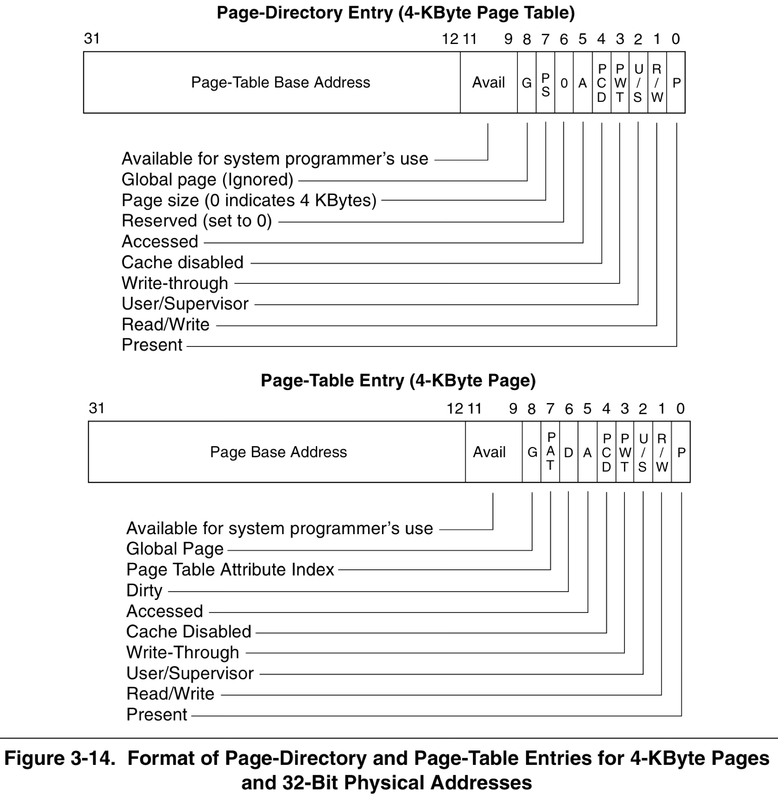
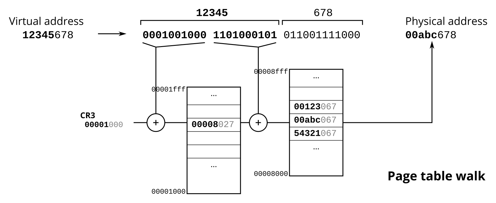
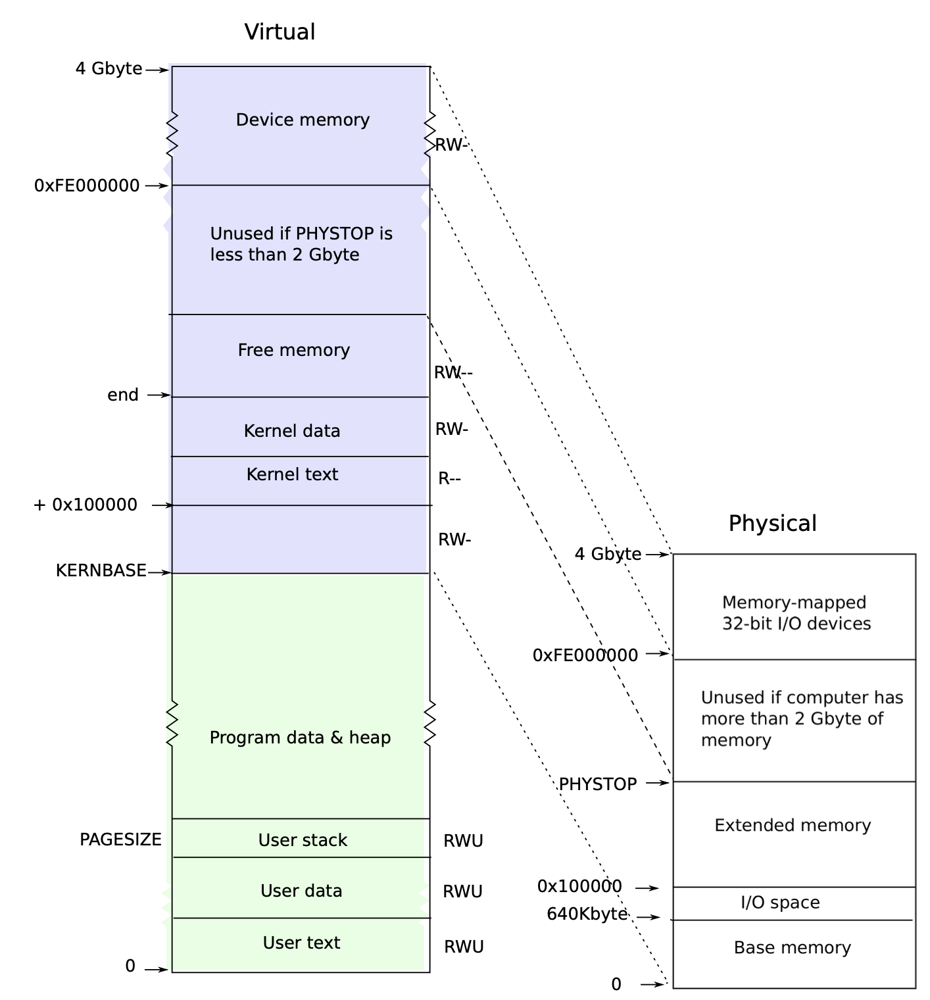
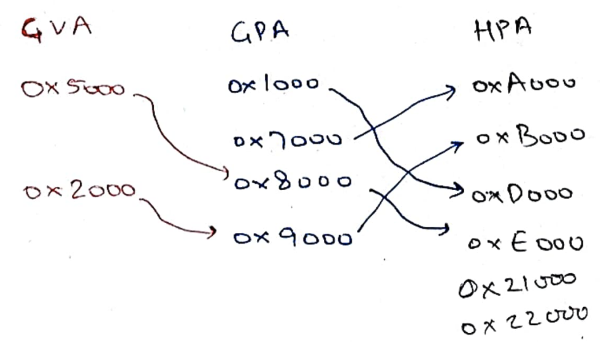
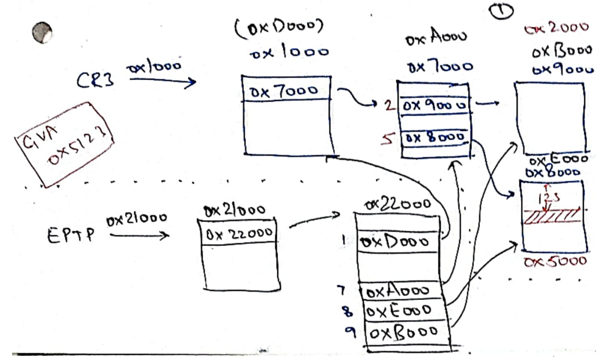
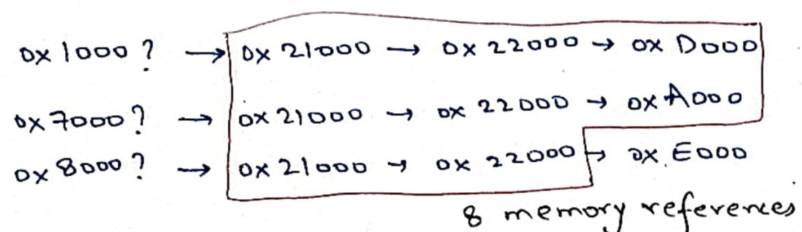
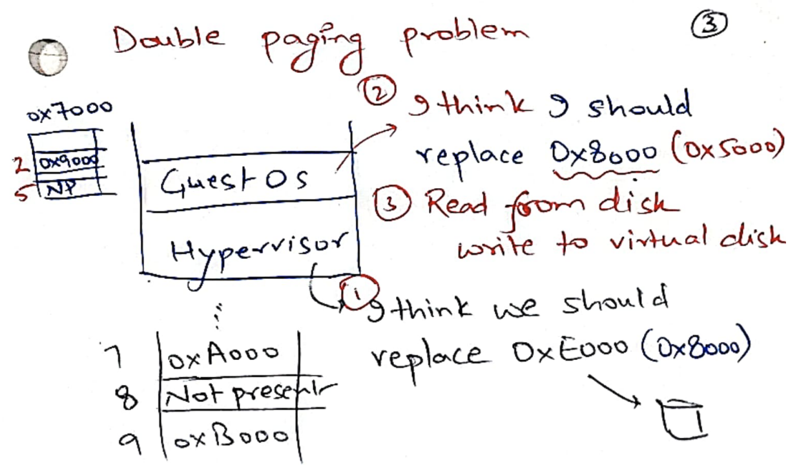

# Memory virtualization
To virtualize memory, hypervisor needs to play the same trick on the OS that OS
plays on its processes. Processes are made to believe that they *own* the
memory; they can read/write any memory address while being unaffected by other
processes simultaneously reading/writing memory in the system. 

The memory addresses are virtualized together by OS+hardware. Processes only
read/write to virtual addresses. Unless they explicitly share memory, different
processes have completely different virtual address space, providing strong
memory isolation to processes.

The hypervisor wants to play the same trick on the OS. OS is made to think that
it *owns* the physical memory. It can read/write any memory address. However,
again, the hypervisor will provide a virtual address space to the OS. The grand
challenge was to support *two dimensions* of address translation using a
*one dimension* page table: process address, also called Guest Virtual
Address (GVA), to OS address, also called Guest Physical Address (GPA), to the
real physical address, also called Host Physical Address (HPA).

We will briefly review relevant OS+paging hardware background on how the OS
virtualizes memory. Then, we look at the solutions for the grand challenge with
its history in shadow paging to the new hardware support for two-dimensional
page tables. 

## OS background

To read or write memory, CPU generates a *virtual address*. This virtual address
is translated into a physical address by the memory management unit (MMU).  MMU
hardware is told the physical address of page table base using the CR3 CPU
register. On x86, a virtual address is 32-bit. To save space spent in storing
page table pages, the page table is two-level. CR3 points to a page directory
page containing page directory entries (PDEs). Valid page directory entry points
to a page table page holding page table entries (PTE). Each page table entry and
page directory entry is 32 bits.

Since PTE/PDE are 4 bytes, a page table page and a page directory page
(size=4KB) can hold 1024 ($2^{10}$) entries. The first 10 bits of the 32-bit
virtual address are used to index into the $2^{10}$ PDEs to find the appropriate
page-table page. The next 10 bits are used to index into the $2^{10}$ PTEs to
find the appropriate page. The last 12 bits of the address form the offset
within the 4KB (=$2^{12}$) page. 

This address translation is done by the hardware itself. The role of the OS is
to manage the page tables. When OS switches between processes, it changes CR3 to
point to the process' page table. Due to the hardware enforced address
translation, a process can only access its own *virtual address space*, i.e,
whatever addresses are mapped into the process' page table. Page table pages are
of course not in the process' virtual address space. Changing CR3 is a privileged
instruction requires CPU to be running in ring 0.

However, now every load/store requires 3 memory accesses: 2 in page table + 1
actual access. Hardware therefore caches virtual page number to physical page
number mapping in TLB. Whenever the OS changes CR3, TLB is flushed (modern
tagged TLBs avoid these flushes).

PTEs/PDEs have flags such as 
1. Present: Is this page table entry currently present in memory?
2. Read/write: Can the page be written?
3. Accessed: Has the page been accessed (read or written)?
4. Dirty: Has the page been written to?
5. User/Supervisor: If CPU is running in ring 3, can the page be accessed?

OS manages and uses these flags. One example is to do demand paging. If we are
about to run out of physical memory, the OS may swap some pages out to disk. The
OS marks the corresponding page table entry as not present. Later when the
process tries to access the page, the hardware will raise a page fault which
jumps into the OS page fault handler. OS copies the page back from disk into a
free location in memory; updates the page table entry and its present flag; and
retries the faulting instruction.

To make hardware jump during faults and traps into the OS code, OS needs to map
(at least) its instruction service routines and the interrupt descriptor table
in each process' virtual address space. This is because the CPU just sees the
interrupt descriptor table entry corresponding to the trap/fault vector and
updates to ring 0 before jumping the instruction pointer. OS protects IDT and OS
code from the process by not setting the User/supervisor bit. For example, the
following shows the virtual address space layout of xv6 processes. OS kernel is
mapped at `KERNBASE + 0x100000` without the user flag.

Due to demand paging, OS can overprovision memory. It can start many more
processes than possible without demand paging. OS can transparently throw out 
unused pages to disk to improve memory utilization.

## Two-dimensional page tables

Hypervisor wants to play the same trick on the OS that the OS played on its
processes. OS relied on hardware to respect the page table and do the address
translation. However, the hardware was only capable of working with one page
table at a given time. But, here we are interested in two-dimensional address
translations: from guest virtual address (GVA) to guest physical address (GPA)
to host physical address (HPA). There was an ingenious approach of using *shadow 
page tables*. We will instead just look at the modern hardware support for 
two-dimensional page tables.

### Extended page tables 

Let us say we are interested in doing the following translation from Guest
Virtual Address (GVA) to Guest Physical Address (GPA) to Host Physical Address
(HPA):

Modern x86 hardware added support for two-dimensional page table. The CR3 points
to the first dimension page table, completely managed by the (guest) OS. The
second dimension page table is maintained by VMM to fool the OS. It looks
similar to the first dimension; now EPTP (extended page table pointer) register
points to the base of second dimension page table. The following shows how the
address above will be mapped in the 2-D page tables:

To resolve GVA=0x5123, the hardware learns GPA using first page table which it
needs to resolve into HPA using the second page table. It needs to do this
recursively.

## Memory management

Now that we have two level page tables, VMM can manage and isolate multiple
Guest OSes. Guest OS switches CR3 on context switching between processes. VMM 
switches EPTP on switching between Guest VMs. VMM can advertise a certain
physical memory to the Guest VM at the time of its boot up. Just like OS does
with processes, VMM might overprovision memory. For example, it may advertise
that 2 GB of physical memory is available to each of the 5 VMs when there is a
total of only 8GB of physical memory.

### Demand paging with memory ballooning

Overprovisioning improves utilization, but we may now run out of physical
memory. How to reclaim memory if we are running out of overall physical memory?
One approach is to let both the VMM and the OS to decide independently. However,
this leads to a *double paging problem* where the OS tries to swap out a page
that VMM has already swapped out. This is completely wasteful. It unnecessarily
reads in a page from disk and writes it back to the disk without saving any
physical memory.

VMM would like to decide *when* it wants to swap out pages since it has the
visibility into the real physical memory usage. But it would like the OS to
decide *which* page to swap out since the OS has better visibility into which
page is holding what and can better make such policy decisions. 

VMMs follow a paravirtualization approach to achieve this. They install a
*memory balloon driver* in the Guest OS. Whenever VMM wants memory, it "inflates
the ballon", i.e, the driver asks for pages from the OS; the OS may have to swap
out some pages to disk to give to the driver. Using memory balloon, VMM is able
to trigger requirement of pages, OS can decide which pages to swap out.

### Same page merging
Multiple guest VMs may have identical pages, for example, the OS code is
identical. VMMs do content-based page sharing. They randomly scan a page and
note down its hash. If the hashes of two pages match then VMM matches the page
contents to avoid hash collisions. If the page matches fully, the page is marked
as read-only (for doing copy-on-write) and is backed up by the same physical
page. This could save 7-32% of physical memory, depending on the Guest VM OS.

Interesting trivia: Content based merging was described in a paper by VMWare in
2002. Linux implemented it using a similar hash-table based implementation in
Nov'08 but got a VMWare patent infringement notice. Linux reimplemented it using
a red-black tree implementation in Apr'09 to avoid patent infringement. :-)

# Summary
Hypervisors fool the OS in the same manner as OS fools processes into believing 
that they *own* the memory. Modern hardware supports 2D translations using
extended page tables. 2D translations was done over 1D page table hardware using
shadow paging (not covered here). Shadow paging remains relevant if two-level
page tables are not available, such as on embedded devices, or if we want to do
nested hypervisors: Hardware -> VMM -> VMM -> OS, where we have to do 3D
translations on a 2D page table hardware support. OS memory management services
have to be redesigned in the VMM. VMM lets the OS decide which pages to swap by
installing a memory balloon driver.